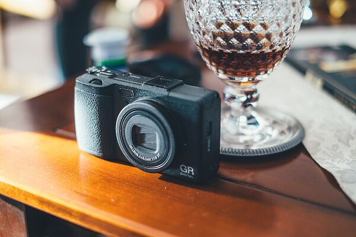
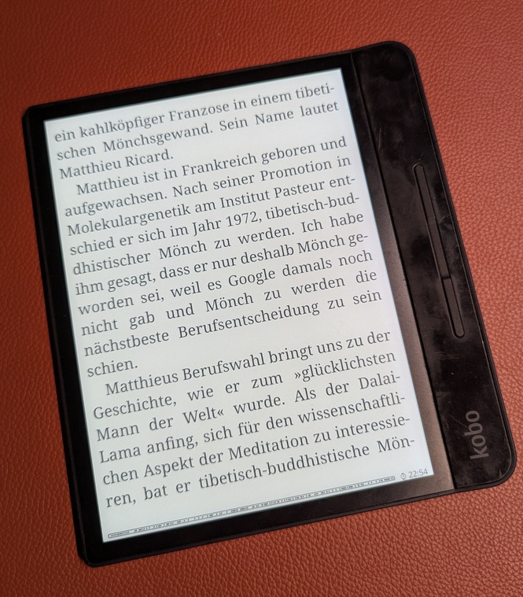
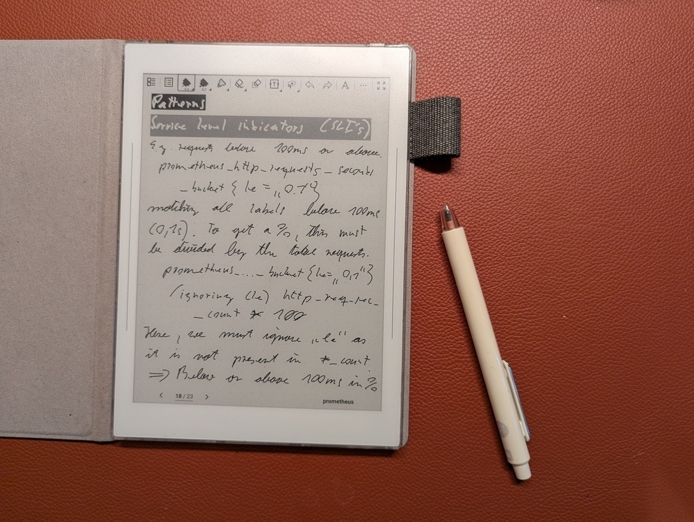
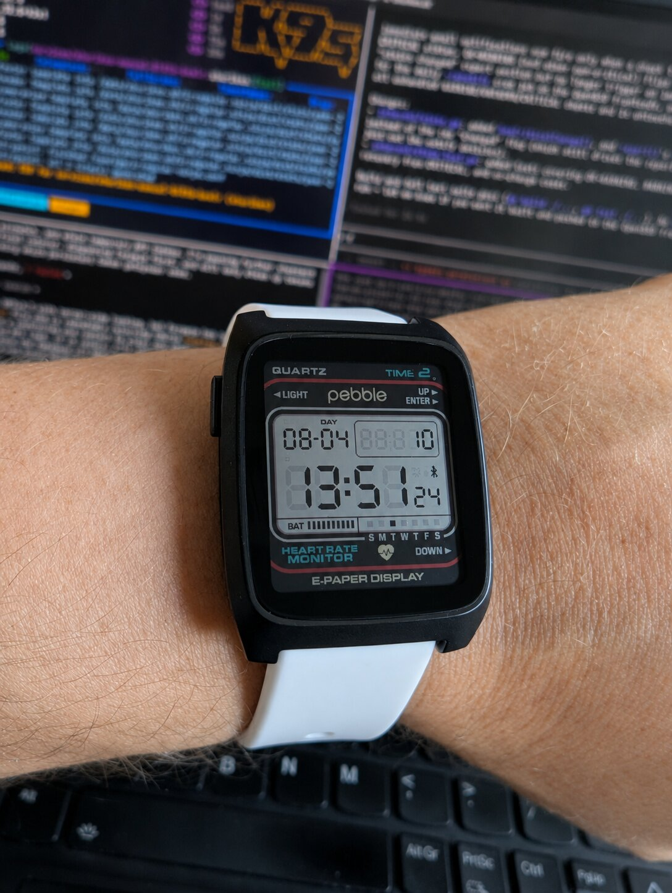
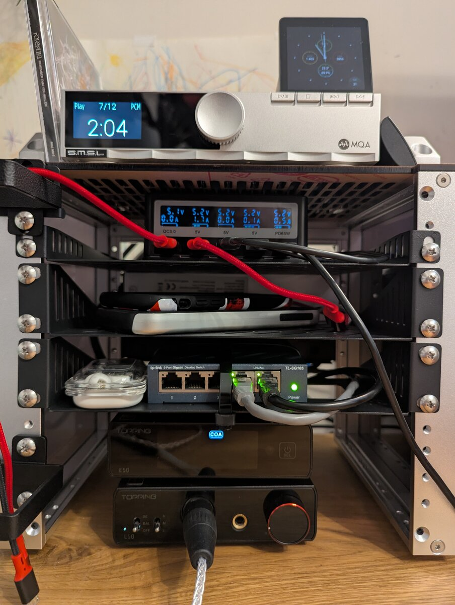
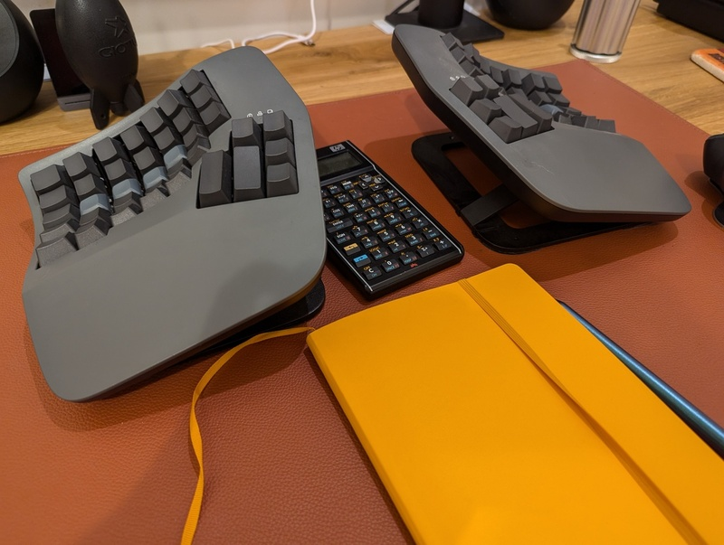
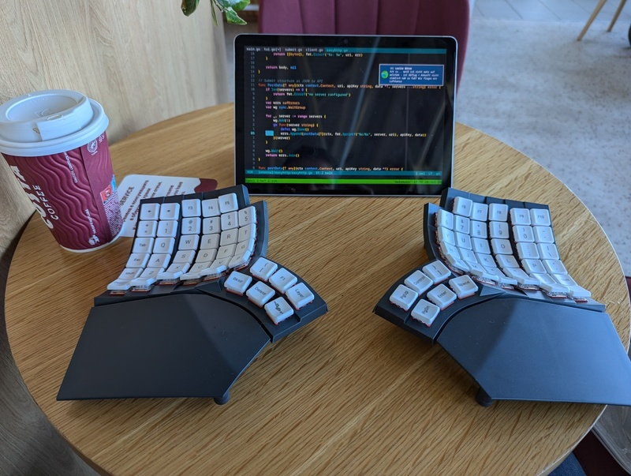

# Gadgets

## Table of Contents

* [⇢ Gadgets](#gadgets)
* [⇢ ⇢ Introduction](#introduction)
* [⇢ ⇢ Ricoh GR IV](#ricoh-gr-iv)
* [⇢ ⇢ Kobo Forma](#kobo-forma)
* [⇢ ⇢ Supernote Nomad](#supernote-nomad)
* [⇢ ⇢ Pebble Time 2](#pebble-time-2)
* [⇢ ⇢ Desk audio rack](#desk-audio-rack)
* [⇢ ⇢ Kinesis Advantage 360 Pro](#kinesis-advantage-360-pro)
* [⇢ ⇢ Glove80](#glove80)
* [⇢ ⇢ Looking for more?](#looking-for-more)

## Introduction

This page is the counterpart to my wishlist — it's the gadgets I already own and actually use, rather than the ones I still want. If you're after the "not yet mine" list, that's over here:

[My wishlist — gadgets I don't have (yet)](./wishlist.md)  

## Ricoh GR IV

  
[Official product page](https://www.ricoh-imaging.co.jp/english/products/gr-4/)  

I had a Ricoh GR III before this one, but it gave up on me. The GR IV is now my always-with-me camera. There's nothing else quite like a GR for fitting in a jacket pocket and disappearing into a crowd — the phone is fine for snapshots but it's not the same thing.

## Kobo Forma

  
[Kobo Forma](https://gl.kobobooks.com/products/kobo-forma)  
[Cloudless Kobo Forma with KOReader](../gemfeed/2026-01-01-cloudless-kobo-forma-with-koreader.md)  

Found this device 7 years ago and it's still my go-to for reading PDFs and ePubs. It's so old Kobo doesn't even sell it anymore, but the 7" screen and light form factor beat the newer Kobo Sage. I run it completely disconnected from Kobo's cloud, using KOReader instead of the stock firmware — no sync, no tracking, just reading.

## Supernote Nomad

  
[Official product page](https://supernote.com/pages/supernote-nomad)  
[Using the Supernote Nomad offline](../gemfeed/2026-01-01-using-supernote-nomad-offline.md)  

My always-with-me note taker and e-ink reader. I use it purely offline — no cloud sync, no account beyond what's strictly needed. It doubles as an ePub reader via KOReader, so between this and the Kobo Forma I've got most of my reading and note-taking covered without a laptop in front of me.

## Pebble Time 2

  
[Official product page](https://repebble.com/products/pebble-time-2)  

My favourite watch right now. It runs entirely on open-source software (PebbleOS), which means I can build any app I want for it — I've already made two: FastForge for intermittent fasting tracking, and RESTForge for calling self-describing Siren REST backends.

[FastForge on GitHub](https://github.com/snonux/fastforge)  
[RESTForge on GitHub](https://github.com/snonux/restforge)  

## Desk audio rack

  
[DeskPi RackMate T0](https://deskpi.com/products/deskpi-rackmate-t1-rackmount-10-inch-4u-server-cabinet-for-network-servers-audio-and-video-equipment)  
[My desk rack: DeskPi RackMate T0](../gemfeed/2026-02-22-my-desk-rack.md)  

A 4U DeskPi RackMate T0 on my desk keeps the listening setup tidy: S.M.S.L PL200T CD transport up top (coaxial into the DAC), PinePower Desktop for charging, a small switch for wired LAN, and Topping E50 plus L50 at the bottom driving my Hifiman Sundara headphones. USB from the desktop feeds the same DAC for streaming. CDs still get played start to finish — no algorithm required.

[S.M.S.L PL200T](https://www.smsl-audio.com/portal/product/detail/id/908.html)  
[Topping E50 / L50](https://www.tpdz.net)  
[Hifiman Sundara](https://hifiman.com/products/detail/sundara)  

## Kinesis Advantage 360 Pro

  
[Official product page](https://www.kinesis-ergo.com/advantage360-professional/)  
[Typing 127.1 words per minute](../gemfeed/2024-08-05-typing-127.1-words-per-minute.md)  

My daily-driver keyboard at the desk. Concave, ortholinear, split — it cured a bout of RSI and pushed me into proper ten-finger touch typing. Runs ZMK on the Professional model; I build firmware locally when the keymap changes. I also have a custom Adv.360 build with Gateron Baby Kangaroo switches.

## Glove80

  
[Official product page](https://www.moergo.com/glove80)  
[Typing 127.1 words per minute](../gemfeed/2024-08-05-typing-127.1-words-per-minute.md)  

The travel keyboard. Same ergonomic idea as the Kinesis — concave ortholinear split — but much lighter, with low-profile Red Pro switches. I mapped it as close to the Kinesis layout as possible so I can swap between them without relearning muscle memory. Bubble wrap beats the bulky official case in a rucksack.

## Looking for more?

If a gadget isn't on this page yet, it's probably still on my wishlist.

[My wishlist](./wishlist.md)  

[Go back](./)  
