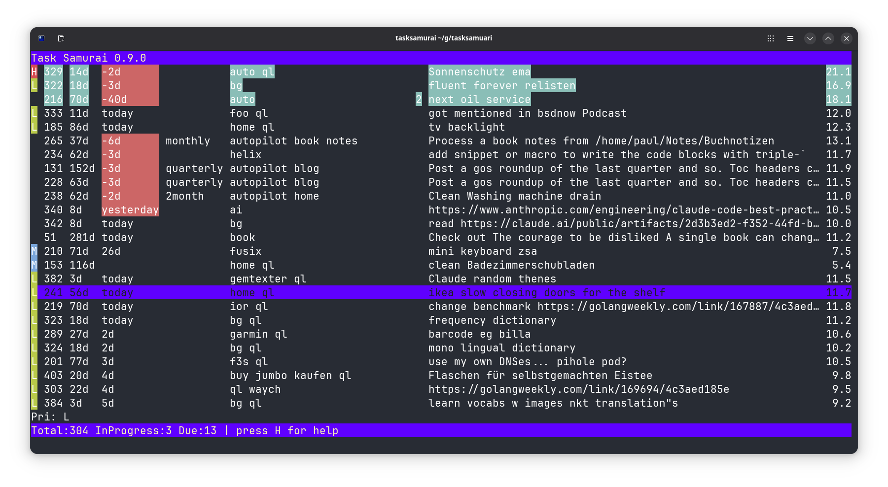
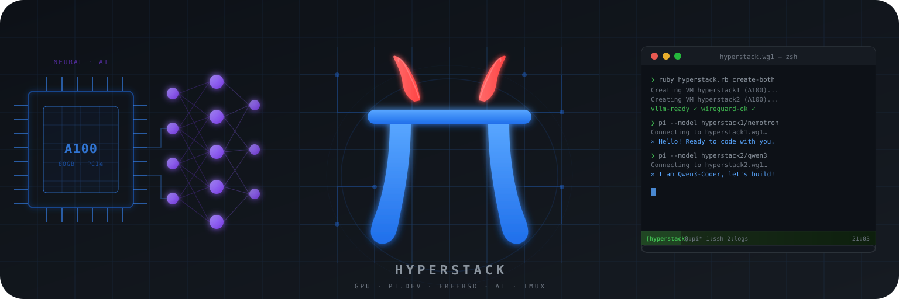
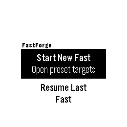
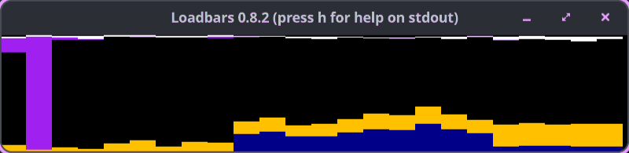
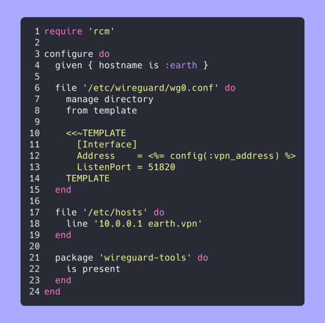
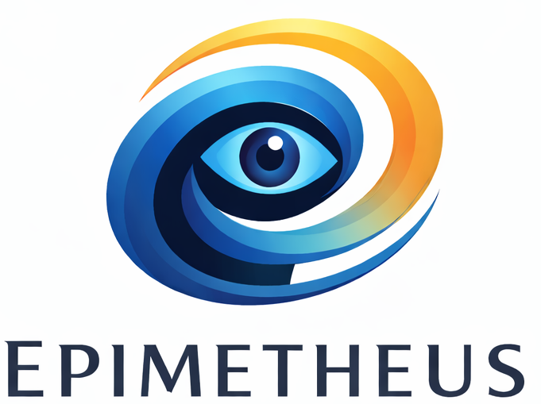
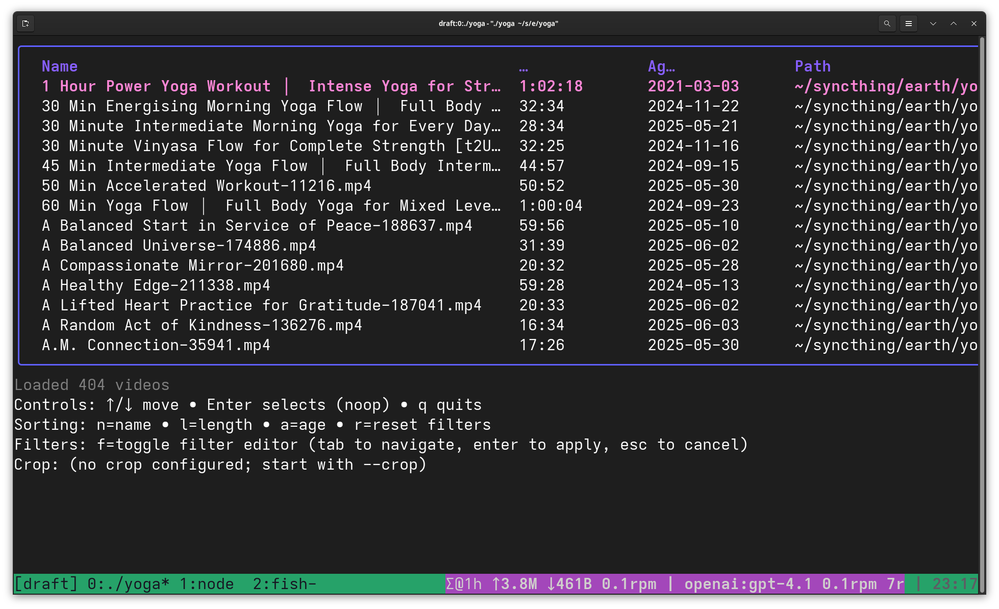
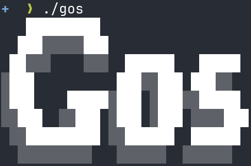
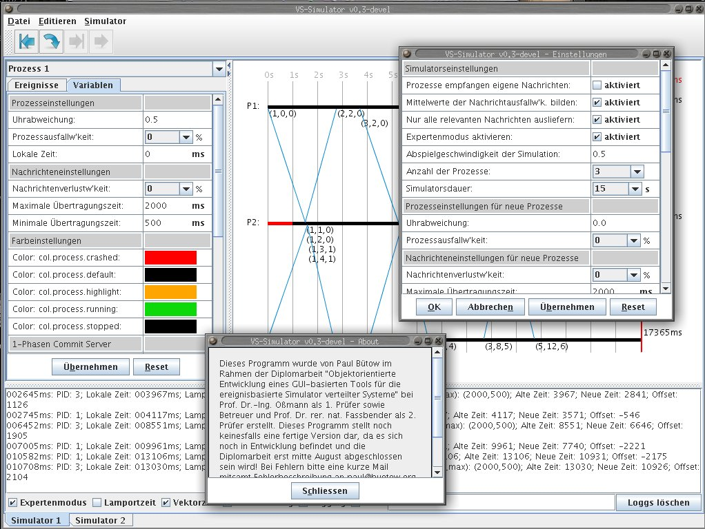

# Project Showcase

Generated on: 2026-07-08

[")](showcase-rank-history.svg)  

This page showcases my side projects, providing an overview of what each project does, its technical implementation, and key metrics. Each project summary includes information about the programming languages used, development activity, releases, and licensing. The projects are ranked by score, which combines recent activity, project size, tag history, and whether the project has shipped a release.

## Table of Contents

* [⇢ Project Showcase](#project-showcase)
* [⇢ ⇢ Overall Statistics](#overall-statistics)
* [⇢ ⇢ Projects](#projects)
* [⇢ ⇢ ⇢ 1. gonf 1](#1-gonf-1)
* [⇢ ⇢ ⇢ 2. shuriken.sh 2↙1←1←1](#2-shurikensh-2111)
* [⇢ ⇢ ⇢ 3. conf 3←3↖7←7↙6←6↙4↖5↖14↙12↙10↙7←7↖9↙7↖9←9↙7↙5](#3-conf-3377664514121077979975)
* [⇢ ⇢ ⇢ 4. tasksamurai 4↙2↖15↙14↙13←13↖14↙11↙9←9↙7↙5←5↖23↙22↙18←18↙16←16](#4-tasksamurai-4215141313141199755232218181616)
* [⇢ ⇢ ⇢ 5. hexai 5←5↙2↖5↖7←7↙6↙4↖5↙3↖8↙6←6↙4↙1←1↖3↖15↙2](#5-hexai-55257764538664113152)
* [⇢ ⇢ ⇢ 6. dotfiles 6↙4↙3↙2↖3←3↖8↙7←7←7↖9↙8←8↙6↙4↙3↖5↙3←3](#6-dotfiles-6432338777988643533)
* [⇢ ⇢ ⇢ 7. gitsyncer 7↙6↙5↙3↖10←10←10↖20←20↙19↙18←18←18↙16↙14↙11←11↖17↙15](#7-gitsyncer-7653101010202019181818161411111715)
* [⇢ ⇢ ⇢ 8. gt 8←8↙6↙4↙1←1↖28↙26←26↙25↙24←24←24↙22↙21↙17←17↙14↙13](#8-gt-88641128262625242424222117171413)
* [⇢ ⇢ ⇢ 9. irregular.ninja 9↙7↙4](#9-irregularninja-974)
* [⇢ ⇢ ⇢ 10. snonux 10←10↖11↙10↙8←8↙7↙3↙2↖4↙3←3←3↙2↖5](#10-snonux-1010111088732433325)
* [⇢ ⇢ ⇢ 11. ior 11↙9↙8←8↙5←5←5↙1↖12↖14↙13↖14←14↙12↙9↙4↙2↙1←1](#11-ior-11988555112141314141294211)
* [⇢ ⇢ ⇢ 12. hypr 12↙11↙9↙6↙2←2←2↖17↙16↙15↙14↙11←11↙7↙3](#12-hypr-12119622217161514111173)
* [⇢ ⇢ ⇢ 13. player 13↙12↙10↙9↙4←4↙3↙2↙1←1](#13-player-1312109443211)
* [⇢ ⇢ ⇢ 14. dtail 14↙13↙12↙11↙9←9←9↙6↙4↙2↙1↖10←10↙8↙6↙2↙1↖21↙20](#14-dtail-141312119996421101086212120)
* [⇢ ⇢ ⇢ 15. goprecords 15↙14←14↙12↙11←11←11↙9↙6←6↙4↙2←2↖29↙28↙24←24←24←24](#15-goprecords-15141412111111966422292824242424)
* [⇢ ⇢ ⇢ 16. totalrecall 16↙15↙13←13↙12←12←12↙10↙8←8↙6↙4←4↙1↖18↙15↖16↙13↖14](#16-totalrecall-16151313121212108864411815161314)
* [⇢ ⇢ ⇢ 17. fastforge 17↙16←16↙15←15←15←15↙12↙11↙10↙5↙1←1↖3](#17-fastforge-171616151515151211105113)
* [⇢ ⇢ ⇢ 18. foostore 18↙17←17←17←17←17←17↙15←15↙13↙12↖16←16↙14↙11↙7←7↙5↖7](#18-foostore-1817171717171715151312161614117757)
* [⇢ ⇢ ⇢ 19. rampage 19↙18←18↙16↙14←14↙13↙8↙3](#19-rampage-1918181614141383)
* [⇢ ⇢ ⇢ 20. comicforge 20↙19←19↙18↙16←16←16↙13↙10↙5↙2](#20-comicforge-20191918161616131052)
* [⇢ ⇢ ⇢ 21. timesamurai 21↙20←20↙19↙18←18←18↙16↖17↙16↙15↙12←12↙11↙10↙5↙4↙2](#21-timesamurai-212020191818181617161512121110542)
* [⇢ ⇢ ⇢ 22. loadbars 22↙21←21↙20↙19←19←19↖53←53↙51↙50↙49←49←49↙46↙6←6↙4↖47](#22-loadbars-22212120191919535351504949494666447)
* [⇢ ⇢ ⇢ 23. ds-sim 23↙22←22↙21↙20←20←20↙19←19↙18↙17↙15←15↙13↙12↖25←25←25↙21](#23-ds-sim-23222221202020191918171515131225252521)
* [⇢ ⇢ ⇢ 24. foo.zone 24↙23←23↙22↙21←21←21↙18←18↙17↙16↙13←13↙10↙8↖64←64←64↙6](#24-foozone-242323222121211818171613131086464646)
* [⇢ ⇢ ⇢ 25. rcm 25↙24←24↙23↙22←22←22↖25←25↙24↙23↙22←22↙20↙15↙12↖13↙10←10](#25-rcm-25242423222222252524232222201512131010)
* [⇢ ⇢ ⇢ 26. gogios 26↙25↖26↙25↙24←24←24↙22←22↙21←21↙20←20↙18↖19↙16↙15↙12↙11](#26-gogios-26252625242424222221212020181916151211)
* [⇢ ⇢ ⇢ 27. epimetheus 27↙26↙25↙24↙23←23←23↙21←21↙20↙19↙17←17↙15↙13↙8←8↙6↙4](#27-epimetheus-2726252423232321212019171715138864)
* [⇢ ⇢ ⇢ 28. yoga 28↙27←27↙26↙25←25←25↙24←24↙23↙22↙21←21↙19↙17↙13↖14↙11↖12](#28-yoga-28272726252525242423222121191713141112)
* [⇢ ⇢ ⇢ 29. gemtexter 29↙28←28←28↙27←27←27←27↖28↙27←27↖28←28↙27↙26↙22←22←22←22](#29-gemtexter-29282828272727272827272828272622222222)
* [⇢ ⇢ ⇢ 30. scifi 30↙29←29↙27↙26←26←26↙23←23↙22↙20↙19←19↙17↙16↙10←10↙8←8](#30-scifi-302929272626262323222019191716101088)
* [⇢ ⇢ ⇢ 31. gos 31↙30←30↙29↙28←28↖30↙29←29↙28↙26↙25←25↙24↙23↙19←19↙18←18](#31-gos-31303029282830292928262525242319191818)
* [⇢ ⇢ ⇢ 32. log4jbench 32↙31←31↙30↙29←29←29↙28↙27↙26↙25↙23←23↙21↙20↙14↙12↙9←9](#32-log4jbench-323131302929292827262523232120141299)
* [⇢ ⇢ ⇢ 33. timr 33←33←33↙32↙31←31↖32↙31←31↙30↙29↙27←27↙26↙25↙21←21↙20↙19](#33-timr-33333332313132313130292727262521212019)
* [⇢ ⇢ ⇢ 34. foostats 34↙32←32↙31↙30←30↖31↙30←30↙29↙28↙26←26↙25↙24↙20←20↙19↙17](#34-foostats-34323231303031303029282626252420201917)
* [⇢ ⇢ ⇢ 35. wireguardmeshgenerator 35↙34←34↙33↙32←32↖33↙32←32↙31↙30↙29←29↙28↙27↙23←23←23←23](#35-wireguardmeshgenerator-35343433323233323231302929282723232323)
* [⇢ ⇢ ⇢ 36. ioriot 36↙35←35↙34↙33←33↖34↙33←33↙32↙31↙30←30←30↙29↖34↖35↙34↖35](#36-ioriot-36353534333334333332313030302934353435)
* [⇢ ⇢ ⇢ 37. quicklogger 37↙36←36↙35↙34←34↖35↙34←34↙33↙32↙31←31←31↙30↙26←26←26↙25](#37-quicklogger-37363635343435343433323131313026262625)
* [⇢ ⇢ ⇢ 38. quicklog 38↙37←37↙36↙35←35↖36↙35←35](#38-quicklog-383737363535363535)
* [⇢ ⇢ ⇢ 39. sillybench 39↙38←38↙37↙36←36↖37↙36←36↙34↙33↙32←32←32↙31↙27←27←27←27](#39-sillybench-39383837363637363634333232323127272727)
* [⇢ ⇢ ⇢ 40. terraform 40↙39←39↙38↙37←37↖38↙37←37↙35↙34↙33←33←33↙32↙28←28←28↙26](#40-terraform-40393938373738373735343333333228282826)
* [⇢ ⇢ ⇢ 41. guprecords 41↙40←40↙39↙38←38↖39↙38←38↙36↙35↙34←34←34↙33↖39↙29↖40↙29](#41-guprecords-41404039383839383836353434343339294029)
* [⇢ ⇢ ⇢ 42. photoalbum 42↙41←41↙40←40←40↖42↙41←41↙40↙39↙38←38←38↙37↙32↖33↙32↖34](#42-photoalbum-42414140404042414140393838383732333234)
* [⇢ ⇢ ⇢ 43. geheim 43↙42←42↙41↙39←39↖40↙39←39↙37↙36↙35←35←35↙34↙29↖30↙29↖30](#43-geheim-43424241393940393937363535353429302930)
* [⇢ ⇢ ⇢ 44. gorum 44↙43←43↙42↙41←41←41↙40←40↙38↙37↙36←36←36↙35↙30↖31↙30↙28](#44-gorum-44434342414141404038373636363530313028)
* [⇢ ⇢ ⇢ 45. docker-radicale-server 45↙44←44↙43↙42←42↖43↙42←42↙39↙38↙37←37←37↙36↙31↖32↙31←31](#45-docker-radicale-server-45444443424243424239383737373631323131)
* [⇢ ⇢ ⇢ 46. randomjournalpage 46↙45←45↙44↙43←43↖44↙43←43↙41↙40↙39←39←39↙38↙33↖34↙33←33](#46-randomjournalpage-46454544434344434341403939393833343333)
* [⇢ ⇢ ⇢ 47. staticfarm-apache-handlers 47←47←47↙46↙45←45↖46↙45←45↙43↙42↙41←41↖42↙41↙37↖38←38↖40](#47-staticfarm-apache-handlers-47474746454546454543424141424137383840)
* [⇢ ⇢ ⇢ 48. ipv6test 48←48←48↙47↙46←46↖47↙46←46↙44↙43↙42←42↙41↙40↙36↖37←37↙36](#48-ipv6test-48484847464647464644434242414036373736)
* [⇢ ⇢ ⇢ 49. algorithms 49↙46←46↙45↙44←44↖45↙44←44↙42↙41↙40←40←40↙39↙35↖36←36↙32](#49-algorithms-49464645444445444442414040403935363632)
* [⇢ ⇢ ⇢ 50. sway-autorotate 50↙49←49↙48↙47←47↖48↙47←47↙45↙44↙43←43←43↙42↙38↖39←39↙38](#50-sway-autorotate-50494948474748474745444343434238393938)
* [⇢ ⇢ ⇢ 51. mon 51↙50←50↙49↙48←48↖49↙48←48↙46↙45↙44←44←44↙43↙40←40↖41↙39](#51-mon-51505049484849484846454444444340404139)
* [⇢ ⇢ ⇢ 52. fapi 52↙51←51↙50↙49←49↖50↙49←49↙47↙46↙45←45↖46↙44↙41←41↖42↖44](#52-fapi-52515150494950494947464545464441414244)
* [⇢ ⇢ ⇢ 53. pingdomfetch 53↙52←52↙51←51←51↖52↙51←51↙49↙48↙47←47←47↙45↙42←42↖43↙41](#53-pingdomfetch-53525251515152515149484747474542424341)
* [⇢ ⇢ ⇢ 54. playground 54←54←54↙53←53←53](#54-playground-545454535353)
* [⇢ ⇢ ⇢ 55. pwgrep 55←55←55↙54←54←54←54←54←54↙52↙51↙50←50←50↙47↙44←44↖45↖50](#55-pwgrep-55555554545454545452515050504744444550)
* [⇢ ⇢ ⇢ 56. xerl 56←56←56↙55↙50←50↖51↙50←50↙48↙47↙46←46↙45↖48↙45←45↙35↖42](#56-xerl-56565655505051505048474646454845453542)
* [⇢ ⇢ ⇢ 57. awksite 57←57←57↙56↙55←55←55←55←55↙53↙52↙51←51←51↙49↙46←46←46↖61](#57-awksite-57575756555555555553525151514946464661)
* [⇢ ⇢ ⇢ 58. gotop 58←58←58↙57↙56←56←56←56←56↙54↙53↙52←52←52↙50↙47←47←47↖48](#58-gotop-58585857565656565654535252525047474748)
* [⇢ ⇢ ⇢ 59. japi 59←59←59↙58↙57←57←57←57←57↙55↙54↙53←53←53↙51↙48←48←48↖53](#59-japi-59595958575757575755545353535148484853)
* [⇢ ⇢ ⇢ 60. perldaemon 60←60←60↙59↙58←58←58←58←58↙56↙55↙54←54←54↙52←52↙49↖52↙51](#60-perldaemon-60606059585858585856555454545252495251)
* [⇢ ⇢ ⇢ 61. rubyfy 61←61←61↙60↙59←59←59←59←59↙57↙56↙55←55←55↙53↙49↖50↙49←49](#61-rubyfy-61616160595959595957565555555349504949)
* [⇢ ⇢ ⇢ 62. netdiff 62↖63←63↙62↙61←61←61←61←61↙59↙58↙57←57←57↙55↙51↖52↙51↖56](#62-netdiff-62636362616161616159585757575551525156)
* [⇢ ⇢ ⇢ 63. perl-c-fibonacci 63↙62←62↙61↙60←60←60←60←60↙58↙57↙56←56←56↙54↙50↖51↙50↙45](#63-perl-c-fibonacci-63626261606060606058575656565450515045)
* [⇢ ⇢ ⇢ 64. muttdelay 64←64←64↙63↙62←62←62←62←62↙60↙59↙58←58←58↙56↙54←54←54↖55](#64-muttdelay-64646463626262626260595858585654545455)
* [⇢ ⇢ ⇢ 65. cpuinfo 65←65←65↙64↙63←63←63←63←63↙61↙60↙59←59←59↙57←57←57↙56↖59](#65-cpuinfo-65656564636363636361605959595757575659)
* [⇢ ⇢ ⇢ 66. dyndns 66←66←66↙65↙64←64↖65←65←65↙63↙62↙61←61←61↙59←59←59↙58↖62](#66-dyndns-66666665646465656563626161615959595862)
* [⇢ ⇢ ⇢ 67. debroid 67←67←67↙66↙65←65↖66←66←66↙64↙63↙62←62←62↙60←60←60↙59↙57](#67-debroid-67676766656566666664636262626060605957)
* [⇢ ⇢ ⇢ 68. ychat 68←68←68↙67↙66←66↖67←67←67↙65↙64↙63←63←63←63←63←63↙62↙43](#68-ychat-68686867666667676765646363636363636243)
* [⇢ ⇢ ⇢ 69. netcalendar 69←69←69↙68↙67←67↖68←68←68↙66↙65↙64←64←64↙61↙55←55←55↙46](#69-netcalendar-69696968676768686866656464646155555546)
* [⇢ ⇢ ⇢ 70. jsmstrade 70←70←70↙69↙68←68↖69←69←69↙67↙66↙65←65←65↙62↙53←53←53↙52](#70-jsmstrade-70707069686869696967666565656253535352)
* [⇢ ⇢ ⇢ 71. template 71←71←71↙70←70←70↙64←64←64↙62↙61↙60←60←60↙58←58←58↙57↖60](#71-template-71717170707064646462616060605858585760)
* [⇢ ⇢ ⇢ 72. vs-sim 72←72←72↙71↙69←69↖70←70←70↙68↙67↙66←66←66↙64↙56←56↖63←63](#72-vs-sim-72727271696970707068676666666456566363)
* [⇢ ⇢ ⇢ 73. perl-poetry 73←73←73↙72↙71←71←71←71←71↙69↙68↙67←67←67↙65↙61←61↙60↙54](#73-perl-poetry-73737372717171717169686767676561616054)
* [⇢ ⇢ ⇢ 74. fype 74↙53←53↙52←52←52↖53↙52←52↙50↙49↙48←48←48↖66↙43←43↖44↙37](#74-fype-74535352525253525250494848486643434437)
* [⇢ ⇢ ⇢ 75. hsbot 75↙74←74↙73↙72←72←72←72←72↙70↙69↙68←68←68↙67↙62←62↙61↙58](#75-hsbot-75747473727272727270696868686762626158)

## Overall Statistics

* 📦 Total Projects: 75
* 📊 Total Commits: 13,485
* 📈 Total Lines of Code: 687,545
* 📄 Total Lines of Documentation: 294,280
* 💻 Languages: Go (49.3%), Java (8.7%), Shell (7.0%), C++ (5.4%), Dart (4.6%), C (3.7%), C/C++ (3.1%), XML (3.0%), YAML (2.7%), Perl (2.3%), JavaScript (1.8%), JSON (1.7%), Ruby (1.3%), HTML (1.1%), TypeScript (1.1%), CSS (1.0%), Config (0.7%), HCL (0.4%), Python (0.4%), Make (0.3%), TOML (0.1%)
* 📚 Documentation: Text (76.2%), Markdown (22.6%), LaTeX (1.1%)
* 🚀 Release Status: 42 released, 33 experimental (56.0% with releases, 44.0% experimental)

## Projects

### 1. gonf 1

* 💻 Languages: Go (100.0%)
* 📚 Documentation: Markdown (99.2%), Text (0.8%)
* 📊 Commits: 25
* 📈 Lines of Code: 2828
* 📄 Lines of Documentation: 118
* 🏷️ Tags: 0
* 📅 Development Period: 2026-07-04 to 2026-07-07
* 🏆 Score: 81.3 (combines recent activity, code size, tags, and release status)
* ⚖️ License: No license found
* 🧪 Status: Experimental (no releases yet)

  

**gonf** is a pure-Go, KISS-style configuration-management tool in the spirit of Puppet/Chef but written entirely in Go with no external DSL or runtime. You declare desired system state directly in Go using a small, declarative API — `File`, `Dir`, `Link`, `Package` (and their `No*`/`IsAbsent` counterparts) — passing functional options like `WithContent`, `WithMode`, `WithSource`, `WithPrune`, `IsLatest`, etc. A single `api.Apply()` then reconciles every declared resource against the actual filesystem/package state.

Architecturally it's a clean three-layer design: a public `api` package exposes the resource constructors and `Apply` entry point; an `internal/resource` package provides a thread-safe **repository** that registers resources by unique ID and topologically sorts them (with circular-dependency detection) before invoking each resource's `Applier`; and per-type packages (`file`, `dir`, `link`, `pkg`) implement the concrete reconciliation logic. Options are decoupled from resources via small capability interfaces (`Moded`, `Sourced`, `Contented`, `Prunable`, `Latestable`, `Linkable`, …), so new resource types or options can be added without touching existing code. A `cmd/gonf` binary wires it together and currently runs an `examples` configuration as a demonstration.

[View on Codeberg](https://codeberg.org/snonux/gonf)  
[View on GitHub](https://github.com/snonux/gonf)  
For cgit access go to c-git dot f3s dot buetow dot org slash gonf

---

### 2. shuriken.sh 2↙1←1←1

* 💻 Languages: Shell (99.6%), Config (0.3%), Docker (0.1%)
* 📚 Documentation: Markdown (100.0%)
* 📊 Commits: 343
* 📈 Lines of Code: 23042
* 📄 Lines of Documentation: 825
* 🏷️ Tags: 31
* 📅 Development Period: 2011-11-19 to 2026-06-28
* 🏆 Score: 48.3 (combines recent activity, code size, tags, and release status)
* ⚖️ License: No license found
* 🏷️ Latest Release: 0.12.4 (2026-06-28)

  

shuriken is a Bash script for Unix like operating systems (such as Linux) to generate static web photo albums.
The resulting static photo album is pure HTML+CSS (without any JavaScript!).

[View on Codeberg](https://codeberg.org/snonux/shuriken.sh)  
[View on GitHub](https://github.com/snonux/shuriken.sh)  
For cgit access go to c-git dot f3s dot buetow dot org slash shuriken.sh

---

### 3. conf 3←3↖7←7↙6←6↙4↖5↖14↙12↙10↙7←7↖9↙7↖9←9↙7↙5

* 💻 Languages: YAML (75.7%), Shell (10.5%), Perl (8.0%), Python (2.8%), Make (1.0%), JSON (0.6%), Docker (0.5%), Config (0.3%), TOML (0.3%), Ruby (0.2%), HTML (0.1%)
* 📚 Documentation: Markdown (97.4%), Text (2.6%)
* 📊 Commits: 998
* 📈 Lines of Code: 23773
* 📄 Lines of Documentation: 7431
* 🏷️ Tags: 0
* 📅 Development Period: 2021-12-28 to 2026-07-07
* 🏆 Score: 43.8 (combines recent activity, code size, tags, and release status)
* ⚖️ License: No license found
* 🧪 Status: Experimental (no releases yet)

This is my personal config repository. Including...

[View on Codeberg](https://codeberg.org/snonux/conf)  
[View on GitHub](https://github.com/snonux/conf)  
For cgit access go to c-git dot f3s dot buetow dot org slash conf

---

### 4. tasksamurai 4↙2↖15↙14↙13←13↖14↙11↙9←9↙7↙5←5↖23↙22↙18←18↙16←16

* 💻 Languages: Go (99.9%)
* 📚 Documentation: Markdown (100.0%)
* 📊 Commits: 338
* 📈 Lines of Code: 15490
* 📄 Lines of Documentation: 264
* 🏷️ Tags: 24
* 📅 Development Period: 2025-06-19 to 2026-06-27
* 🏆 Score: 40.7 (combines recent activity, code size, tags, and release status)
* ⚖️ License: BSD-2-Clause
* 🏷️ Latest Release: v0.18.1 (2026-06-27)

  

Task Samurai invokes the `task` command to read and modify tasks. The tasks are displayed in a Bubble Tea table where each row represents a task. Hotkeys trigger Taskwarrior commands such as starting, completing or annotating tasks. The UI refreshes automatically after each action so the table is always up to date.

[View on Codeberg](https://codeberg.org/snonux/tasksamurai)  
[View on GitHub](https://github.com/snonux/tasksamurai)  
For cgit access go to c-git dot f3s dot buetow dot org slash tasksamurai

---

### 5. hexai 5←5↙2↖5↖7←7↙6↙4↖5↙3↖8↙6←6↙4↙1←1↖3↖15↙2

* 💻 Languages: Go (100.0%)
* 📚 Documentation: Markdown (100.0%)
* 📊 Commits: 557
* 📈 Lines of Code: 47443
* 📄 Lines of Documentation: 3894
* 🏷️ Tags: 105
* 📅 Development Period: 2025-08-01 to 2026-07-08
* 🏆 Score: 27.2 (combines recent activity, code size, tags, and release status)
* ⚖️ License: No license found
* 🏷️ Latest Release: v0.42.0 (2026-07-02)

  

Hexai, the AI addition for your Helix Editor (https://helix-editor.com) .. Other editors should work but weren't tested.

[View on Codeberg](https://codeberg.org/snonux/hexai)  
[View on GitHub](https://github.com/snonux/hexai)  
For cgit access go to c-git dot f3s dot buetow dot org slash hexai

---

### 6. dotfiles 6↙4↙3↙2↖3←3↖8↙7←7←7↖9↙8←8↙6↙4↙3↖5↙3←3

* 💻 Languages: Shell (72.9%), Config (7.3%), TOML (6.9%), CSS (6.4%), Python (3.5%), JSON (2.3%), Ruby (0.6%), INI (0.1%)
* 📚 Documentation: Markdown (100.0%)
* 📊 Commits: 1114
* 📈 Lines of Code: 5078
* 📄 Lines of Documentation: 16665
* 🏷️ Tags: 0
* 📅 Development Period: 2023-07-30 to 2026-07-08
* 🏆 Score: 24.8 (combines recent activity, code size, tags, and release status)
* ⚖️ License: No license found
* 🧪 Status: Experimental (no releases yet)

These are all my dotfiles. I can install them locally on my laptop and/or workstation as well as remotely on any server.

[View on Codeberg](https://codeberg.org/snonux/dotfiles)  
[View on GitHub](https://github.com/snonux/dotfiles)  
For cgit access go to c-git dot f3s dot buetow dot org slash dotfiles

---

### 7. gitsyncer 7↙6↙5↙3↖10←10←10↖20←20↙19↙18←18←18↙16↙14↙11←11↖17↙15

* 💻 Languages: Go (95.2%), Shell (4.5%), JSON (0.2%)
* 📚 Documentation: Markdown (100.0%)
* 📊 Commits: 200
* 📈 Lines of Code: 16378
* 📄 Lines of Documentation: 2497
* 🏷️ Tags: 43
* 📅 Development Period: 2025-06-23 to 2026-06-17
* 🏆 Score: 16.5 (combines recent activity, code size, tags, and release status)
* ⚖️ License: BSD-2-Clause
* 🏷️ Latest Release: v0.18.5 (2026-06-17)

GitSyncer is a tool for synchronizing git repositories between multiple organizations (e.g., GitHub and Codeberg). It automatically keeps all branches in sync across different git hosting platforms.

[View on Codeberg](https://codeberg.org/snonux/gitsyncer)  
[View on GitHub](https://github.com/snonux/gitsyncer)  
For cgit access go to c-git dot f3s dot buetow dot org slash gitsyncer

---

### 8. gt 8←8↙6↙4↙1←1↖28↙26←26↙25↙24←24←24↙22↙21↙17←17↙14↙13

* 💻 Languages: Go (97.7%), Shell (2.0%), YAML (0.3%)
* 📚 Documentation: Markdown (100.0%)
* 📊 Commits: 413
* 📈 Lines of Code: 19759
* 📄 Lines of Documentation: 4351
* 🏷️ Tags: 7
* 📅 Development Period: 2025-11-25 to 2026-05-25
* 🏆 Score: 13.1 (combines recent activity, code size, tags, and release status)
* ⚖️ License: MIT
* 🏷️ Latest Release: v0.5.1 (2026-05-25)

  

A simple AI-engineered command-line percentage calculator written in Go. No frontier AI models from Claude, OpenAI, Google, ec, were used for this project. The ones used were:

[View on Codeberg](https://codeberg.org/snonux/gt)  
[View on GitHub](https://github.com/snonux/gt)  
For cgit access go to c-git dot f3s dot buetow dot org slash gt

---

### 9. irregular.ninja 9↙7↙4

* 💻 Languages: Config (100.0%)
* 📚 Documentation: Markdown (100.0%)
* 📊 Commits: 19
* 📈 Lines of Code: 75
* 📄 Lines of Documentation: 45
* 🏷️ Tags: 0
* 📅 Development Period: 2026-06-15 to 2026-06-19
* 🏆 Score: 11.0 (combines recent activity, code size, tags, and release status)
* ⚖️ License: No license found
* 🧪 Status: Experimental (no releases yet)

The architecture is straightforward: source photos live outside the repo (referenced via symlinks), and `just` recipes invoke `shuriken.sh` to transform them into static albums. This keeps the repo lean while making builds reproducible and easy to automate—just run `just all` to regenerate both sites, or target a single album individually.

[View on Codeberg](https://codeberg.org/snonux/irregular.ninja)  
[View on GitHub](https://github.com/snonux/irregular.ninja)  
For cgit access go to c-git dot f3s dot buetow dot org slash irregular.ninja

---

### 10. snonux 10←10↖11↙10↙8←8↙7↙3↙2↖4↙3←3←3↙2↖5

* 💻 Languages: JSON (36.9%), JavaScript (26.9%), Go (23.7%), CSS (12.6%)
* 📚 Documentation: Text (79.8%), Markdown (20.2%)
* 📊 Commits: 119
* 📈 Lines of Code: 23342
* 📄 Lines of Documentation: 1139
* 🏷️ Tags: 29
* 📅 Development Period: 2026-04-06 to 2026-07-08
* 🏆 Score: 10.8 (combines recent activity, code size, tags, and release status)
* ⚖️ License: MIT
* 🏷️ Latest Release: v0.18.0 (2026-07-06)

**WIP** - A microblog generator project

[View on Codeberg](https://codeberg.org/snonux/snonux)  
[View on GitHub](https://github.com/snonux/snonux)  
For cgit access go to c-git dot f3s dot buetow dot org slash snonux

---

### 11. ior 11↙9↙8←8↙5←5←5↙1↖12↖14↙13↖14←14↙12↙9↙4↙2↙1←1

* 💻 Languages: Go (90.2%), C (8.9%), Shell (0.4%), JSON (0.2%), C/C++ (0.2%), Docker (0.1%)
* 📚 Documentation: Markdown (83.9%), Text (16.1%)
* 📊 Commits: 848
* 📈 Lines of Code: 66290
* 📄 Lines of Documentation: 3008
* 🏷️ Tags: 3
* 📅 Development Period: 2024-01-18 to 2026-05-14
* 🏆 Score: 10.6 (combines recent activity, code size, tags, and release status)
* ⚖️ License: No license found
* 🏷️ Latest Release: v1.1.0 (2026-05-14)

  

> **🚧 PRE-ALPHA SOFTWARE:** This project is in a pre-alpha state and is intended for my own personal use only. Use at your own risk.

[View on Codeberg](https://codeberg.org/snonux/ior)  
[View on GitHub](https://github.com/snonux/ior)  
For cgit access go to c-git dot f3s dot buetow dot org slash ior

---

### 12. hypr 12↙11↙9↙6↙2←2←2↖17↙16↙15↙14↙11←11↙7↙3

* 💻 Languages: TypeScript (51.7%), Ruby (33.0%), JSON (7.8%), Shell (4.1%), TOML (3.4%)
* 📚 Documentation: Markdown (100.0%)
* 📊 Commits: 143
* 📈 Lines of Code: 10829
* 📄 Lines of Documentation: 2948
* 🏷️ Tags: 0
* 📅 Development Period: 2026-03-21 to 2026-06-17
* 🏆 Score: 9.0 (combines recent activity, code size, tags, and release status)
* ⚖️ License: No license found
* 🧪 Status: Experimental (no releases yet)

  

Automates Hyperstack GPU VM lifecycle: create, bootstrap, WireGuard tunnel, and vLLM inference.
Runs two A100 VMs concurrently — each serving a different model — with [Pi](https://pi.dev) coding agents connected to each.

[View on Codeberg](https://codeberg.org/snonux/hypr)  
[View on GitHub](https://github.com/snonux/hypr)  
For cgit access go to c-git dot f3s dot buetow dot org slash hypr

---

### 13. player 13↙12↙10↙9↙4←4↙3↙2↙1←1

* 💻 Languages: Go (44.9%), Dart (41.0%), JavaScript (7.7%), TypeScript (2.4%), CSS (2.1%), HTML (0.7%), JSON (0.3%), YAML (0.3%), Shell (0.2%), XML (0.2%)
* 📚 Documentation: Markdown (100.0%)
* 📊 Commits: 319
* 📈 Lines of Code: 74887
* 📄 Lines of Documentation: 6954
* 🏷️ Tags: 0
* 📅 Development Period: 2026-04-28 to 2026-05-23
* 🏆 Score: 8.5 (combines recent activity, code size, tags, and release status)
* ⚖️ License: No license found
* 🧪 Status: Experimental (no releases yet)

Player is an opinionated KISS web media player. It is designed to be simple, lightweight, and easy to use and designed keyboard-first.

[View on Codeberg](https://codeberg.org/snonux/player)  
[View on GitHub](https://github.com/snonux/player)  
For cgit access go to c-git dot f3s dot buetow dot org slash player

---

### 14. dtail 14↙13↙12↙11↙9←9←9↙6↙4↙2↙1↖10←10↙8↙6↙2↙1↖21↙20

* 💻 Languages: Go (94.9%), Shell (2.3%), JSON (1.2%), C (0.8%), Make (0.5%), C/C++ (0.1%)
* 📚 Documentation: Text (98.1%), Markdown (1.9%)
* 📊 Commits: 734
* 📈 Lines of Code: 49273
* 📄 Lines of Documentation: 220598
* 🏷️ Tags: 27
* 📅 Development Period: 2020-01-09 to 2026-04-24
* 🏆 Score: 8.5 (combines recent activity, code size, tags, and release status)
* ⚖️ License: Apache-2.0
* 🏷️ Latest Release: v4.3.3 (2024-08-23)

  

DTail (a distributed tail program) is a DevOps tool for engineers programmed in Google Go for following (tailing), catting and grepping (including gzip and zstd decompression support) log files on many machines concurrently. An advanced feature of DTail is to execute distributed MapReduce aggregations across many devices.

[View on Codeberg](https://codeberg.org/snonux/dtail)  
[View on GitHub](https://github.com/snonux/dtail)  
For cgit access go to c-git dot f3s dot buetow dot org slash dtail

---

### 15. goprecords 15↙14←14↙12↙11←11←11↙9↙6←6↙4↙2←2↖29↙28↙24←24←24←24

* 💻 Languages: Go (97.5%), Shell (2.2%), Docker (0.3%)
* 📚 Documentation: Markdown (100.0%)
* 📊 Commits: 169
* 📈 Lines of Code: 7299
* 📄 Lines of Documentation: 1002
* 🏷️ Tags: 16
* 📅 Development Period: 2013-03-22 to 2026-06-27
* 🏆 Score: 7.7 (combines recent activity, code size, tags, and release status)
* ⚖️ License: No license found
* 🏷️ Latest Release: v0.5.2 (2026-06-07)

`goprecords` is a Go command-line program that generates uptime reports for hosts based on the input record files from `uptimed`. It supports importing records into SQLite and querying for reports, or reporting directly from a stats directory.

[View on Codeberg](https://codeberg.org/snonux/goprecords)  
[View on GitHub](https://github.com/snonux/goprecords)  
For cgit access go to c-git dot f3s dot buetow dot org slash goprecords

---

### 16. totalrecall 16↙15↙13←13↙12←12←12↙10↙8←8↙6↙4←4↙1↖18↙15↖16↙13↖14

* 💻 Languages: Go (98.8%), HTML (0.4%), CSS (0.3%), Shell (0.3%), YAML (0.2%)
* 📚 Documentation: Markdown (96.0%), Text (4.0%)
* 📊 Commits: 268
* 📈 Lines of Code: 22960
* 📄 Lines of Documentation: 400
* 🏷️ Tags: 43
* 📅 Development Period: 2025-07-14 to 2026-06-18
* 🏆 Score: 7.6 (combines recent activity, code size, tags, and release status)
* ⚖️ License: MIT
* 🏷️ Latest Release: v0.29.3 (2026-06-18)

  

`totalrecall` is a versatile tool for generating Anki flashcard materials from Bulgarian words. It offers both a command-line interface (CLI) and a graphical user interface (GUI) for creating audio pronunciation files and AI-generated images.

[View on Codeberg](https://codeberg.org/snonux/totalrecall)  
[View on GitHub](https://github.com/snonux/totalrecall)  
For cgit access go to c-git dot f3s dot buetow dot org slash totalrecall

---

### 17. fastforge 17↙16←16↙15←15←15←15↙12↙11↙10↙5↙1←1↖3

* 💻 Languages: C (92.4%), C/C++ (4.1%), JavaScript (2.6%), Make (0.8%)
* 📚 Documentation: Markdown (100.0%)
* 📊 Commits: 85
* 📈 Lines of Code: 3786
* 📄 Lines of Documentation: 232
* 🏷️ Tags: 1
* 📅 Development Period: 2026-04-06 to 2026-04-15
* 🏆 Score: 5.8 (combines recent activity, code size, tags, and release status)
* ⚖️ License: MIT
* 🏷️ Latest Release: v1.0.0 (2026-04-15)

  

FastForge is a Pebble watchapp for intermittent fasting tracking, built with the Rebble SDK.

[View on Codeberg](https://codeberg.org/snonux/fastforge)  
[View on GitHub](https://github.com/snonux/fastforge)  
For cgit access go to c-git dot f3s dot buetow dot org slash fastforge

---

### 18. foostore 18↙17←17←17←17←17←17↙15←15↙13↙12↖16←16↙14↙11↙7←7↙5↖7

* 💻 Languages: Go (100.0%)
* 📚 Documentation: Markdown (100.0%)
* 📊 Commits: 130
* 📈 Lines of Code: 10592
* 📄 Lines of Documentation: 162
* 🏷️ Tags: 12
* 📅 Development Period: 2018-05-26 to 2026-04-29
* 🏆 Score: 5.6 (combines recent activity, code size, tags, and release status)
* ⚖️ License: No license found
* 🏷️ Latest Release: v0.8.1 (2026-04-29)

> **🚧 PRE-ALPHA SOFTWARE:** This project is in active early development, unstable, and intended for personal use. Expect bugs, breaking changes, missing safeguards, and possible data loss. Backward compatibility and upgrade paths are not guaranteed. Use at your own risk.

[View on Codeberg](https://codeberg.org/snonux/foostore)  
[View on GitHub](https://github.com/snonux/foostore)  
For cgit access go to c-git dot f3s dot buetow dot org slash foostore

---

### 19. rampage 19↙18←18↙16↙14←14↙13↙8↙3

* 💻 Languages: Go (100.0%)
* 📊 Commits: 2
* 📈 Lines of Code: 736
* 🏷️ Tags: 0
* 📅 Development Period: 2026-05-03 to 2026-05-04
* 🏆 Score: 4.8 (combines recent activity, code size, tags, and release status)
* ⚖️ License: No license found
* 🧪 Status: Experimental (no releases yet)

rampage: source code repository.

[View on Codeberg](https://codeberg.org/snonux/rampage)  
[View on GitHub](https://github.com/snonux/rampage)  
For cgit access go to c-git dot f3s dot buetow dot org slash rampage

---

### 20. comicforge 20↙19←19↙18↙16←16←16↙13↙10↙5↙2

* 💻 Languages: Go (100.0%)
* 📚 Documentation: Markdown (95.9%), Text (4.1%)
* 📊 Commits: 49
* 📈 Lines of Code: 11223
* 📄 Lines of Documentation: 998
* 🏷️ Tags: 0
* 📅 Development Period: 2026-04-19 to 2026-04-23
* 🏆 Score: 4.8 (combines recent activity, code size, tags, and release status)
* ⚖️ License: No license found
* 🧪 Status: Experimental (no releases yet)

  

ComicForge turns a vocabulary file into a generated comic package. It uses Gemini-backed providers to write a story, draw comic pages, and optionally produce narration. The CLI writes comic assets into `./comics/assets/<slug>/`, gallery copies into `./comics/gallery/`, and final PDFs into `./comics/PDF/`.

[View on Codeberg](https://codeberg.org/snonux/comicforge)  
[View on GitHub](https://github.com/snonux/comicforge)  
For cgit access go to c-git dot f3s dot buetow dot org slash comicforge

---

### 21. timesamurai 21↙20←20↙19↙18←18←18↙16↖17↙16↙15↙12←12↙11↙10↙5↙4↙2

* 💻 Languages: Go (99.3%), Shell (0.6%), YAML (0.1%)
* 📚 Documentation: Markdown (100.0%)
* 📊 Commits: 96
* 📈 Lines of Code: 10363
* 📄 Lines of Documentation: 112
* 🏷️ Tags: 5
* 📅 Development Period: 2025-06-25 to 2026-03-26
* 🏆 Score: 4.6 (combines recent activity, code size, tags, and release status)
* ⚖️ License: MIT
* 🏷️ Latest Release: v0.8.0 (2026-03-26)

> **🚧 PRE-ALPHA SOFTWARE:** This project is in a pre-alpha state and is intended for my own personal use only. Use at your own risk.

[View on Codeberg](https://codeberg.org/snonux/timesamurai)  
[View on GitHub](https://github.com/snonux/timesamurai)  
For cgit access go to c-git dot f3s dot buetow dot org slash timesamurai

---

### 22. loadbars 22↙21←21↙20↙19←19←19↖53←53↙51↙50↙49←49←49↙46↙6←6↙4↖47

* 💻 Languages: Go (92.8%), Shell (7.2%)
* 📚 Documentation: Markdown (100.0%)
* 📊 Commits: 537
* 📈 Lines of Code: 6595
* 📄 Lines of Documentation: 328
* 🏷️ Tags: 38
* 📅 Development Period: 2010-11-05 to 2026-03-02
* 🏆 Score: 4.4 (combines recent activity, code size, tags, and release status)
* ⚖️ License: Custom License
* 🏷️ Latest Release: v0.11.1 (2026-02-17)

  

Loadbars is a real-time server load monitoring tool that visualizes CPU, memory, network, load average, and disk I/O statistics for multiple remote Linux servers simultaneously in an SDL2 window. It connects to hosts via SSH (using key-based auth) and runs an embedded Bash script that reads from `/proc`, parsing metrics like per-core CPU usage, RAM/swap, network throughput, and disk I/O — then renders them as vertical colored bars side by side. Unlike graphing tools that require data collection over time, Loadbars shows only the current state (like `top` or `vmstat`), making it useful for quick, at-a-glance monitoring of cluster health across many machines.

Architecturally, the Go binary embeds the remote monitoring script at build time and runs it locally or over SSH via `bash -s`, so remote hosts need only bash and `/proc` (no Go installation required). The codebase is organized into `internal/` packages: `collector` handles script execution and metric parsing, `display` manages the SDL2 rendering loop and hotkey-driven toggles (per-core vs. aggregate views, extended peak lines, memory/network/load/disk bars), `config` manages CLI flags and `~/.loadbarsrc` persistence, and `stats` defines the shared data structures. macOS is supported as a client for monitoring remote Linux hosts, though local monitoring requires Linux.

[View on Codeberg](https://codeberg.org/snonux/loadbars)  
[View on GitHub](https://github.com/snonux/loadbars)  
For cgit access go to c-git dot f3s dot buetow dot org slash loadbars

---

### 23. ds-sim 23↙22←22↙21↙20←20←20↙19←19↙18↙17↙15←15↙13↙12↖25←25←25↙21

* 💻 Languages: Java (98.6%), Shell (0.9%), CSS (0.4%)
* 📚 Documentation: Markdown (98.7%), Text (1.3%)
* 📊 Commits: 474
* 📈 Lines of Code: 28576
* 📄 Lines of Documentation: 3103
* 🏷️ Tags: 2
* 📅 Development Period: 2008-05-15 to 2026-03-30
* 🏆 Score: 4.0 (combines recent activity, code size, tags, and release status)
* ⚖️ License: Custom License
* 🏷️ Latest Release: 1.1.0 (2026-03-27)

  

DS-Sim is a open-source simulator for distributed systems, written in Java. It provides a powerful environment for simulating and learning about distributed systems concepts.

[View on Codeberg](https://codeberg.org/snonux/ds-sim)  
[View on GitHub](https://github.com/snonux/ds-sim)  
For cgit access go to c-git dot f3s dot buetow dot org slash ds-sim

---

### 24. foo.zone 24↙23←23↙22↙21←21←21↙18←18↙17↙16↙13←13↙10↙8↖64←64←64↙6

* 💻 Languages: XML (98.2%), Shell (1.5%), Go (0.3%)
* 📚 Documentation: Text (86.2%), Markdown (13.8%)
* 📊 Commits: 1766
* 📈 Lines of Code: 19910
* 📄 Lines of Documentation: 174
* 🏷️ Tags: 0
* 📅 Development Period: 2021-04-29 to 2026-04-05
* 🏆 Score: 3.5 (combines recent activity, code size, tags, and release status)
* ⚖️ License: No license found
* 🧪 Status: Experimental (no releases yet)

Each format is in it's own branch in this repository. E.g.:

[View on Codeberg](https://codeberg.org/snonux/foo.zone)  
[View on GitHub](https://github.com/snonux/foo.zone)  
For cgit access go to c-git dot f3s dot buetow dot org slash foo.zone

---

### 25. rcm 25↙24←24↙23↙22←22←22↖25←25↙24↙23↙22←22↙20↙15↙12↖13↙10←10

* 💻 Languages: Ruby (99.8%), TOML (0.2%)
* 📚 Documentation: Markdown (99.9%), Text (0.1%)
* 📊 Commits: 115
* 📈 Lines of Code: 3780
* 📄 Lines of Documentation: 989
* 🏷️ Tags: 3
* 📅 Development Period: 2024-12-05 to 2026-05-11
* 🏆 Score: 3.3 (combines recent activity, code size, tags, and release status)
* ⚖️ License: Custom License
* 🏷️ Latest Release: v0.1.1 (2026-03-01)

  

A KISS (Keep It Simple, Stupid) configuration management system written in Ruby, designed for personal use.

[View on Codeberg](https://codeberg.org/snonux/rcm)  
[View on GitHub](https://github.com/snonux/rcm)  
For cgit access go to c-git dot f3s dot buetow dot org slash rcm

---

### 26. gogios 26↙25↖26↙25↙24←24←24↙22←22↙21←21↙20←20↙18↖19↙16↙15↙12↙11

* 💻 Languages: Go (98.9%), JSON (0.7%), YAML (0.5%)
* 📚 Documentation: Markdown (94.9%), Text (5.1%)
* 📊 Commits: 112
* 📈 Lines of Code: 3845
* 📄 Lines of Documentation: 394
* 🏷️ Tags: 10
* 📅 Development Period: 2023-04-17 to 2026-03-28
* 🏆 Score: 2.6 (combines recent activity, code size, tags, and release status)
* ⚖️ License: Custom License
* 🏷️ Latest Release: v1.4.1 (2026-02-16)

  

Gogios is a lightweight and minimalistic monitoring tool not designed for large-scale monitoring. It is ideal for monitoring self-hosted servers on a tiny scale, such as only a handful of servers or virtual machines (e.g. my personal infrastructure). If you have limited resources to monitor and require a simple yet effective solution, Gogios is an excellent choice. However, for larger environments with more complex monitoring requirements, it might be necessary to consider other monitoring solutions better suited for managing and scaling with increased monitoring demands.

[View on Codeberg](https://codeberg.org/snonux/gogios)  
[View on GitHub](https://github.com/snonux/gogios)  
For cgit access go to c-git dot f3s dot buetow dot org slash gogios

---

### 27. epimetheus 27↙26↙25↙24↙23←23←23↙21←21↙20↙19↙17←17↙15↙13↙8←8↙6↙4

* 💻 Languages: Go (85.2%), Shell (14.8%)
* 📚 Documentation: Markdown (100.0%)
* 📊 Commits: 4
* 📈 Lines of Code: 5199
* 📄 Lines of Documentation: 1736
* 🏷️ Tags: 0
* 📅 Development Period: 2026-02-07 to 2026-03-07
* 🏆 Score: 2.5 (combines recent activity, code size, tags, and release status)
* ⚖️ License: No license found
* 🧪 Status: Experimental (no releases yet)

  

> **🚧 PRE-ALPHA SOFTWARE:** This project is in a pre-alpha state and is intended for my own personal use only. Use at your own risk.

[View on Codeberg](https://codeberg.org/snonux/epimetheus)  
[View on GitHub](https://github.com/snonux/epimetheus)  
For cgit access go to c-git dot f3s dot buetow dot org slash epimetheus

---

### 28. yoga 28↙27←27↙26↙25←25←25↙24←24↙23↙22↙21←21↙19↙17↙13↖14↙11↖12

* 💻 Languages: Go (69.1%), HTML (30.9%)
* 📚 Documentation: Markdown (100.0%)
* 📊 Commits: 17
* 📈 Lines of Code: 6498
* 📄 Lines of Documentation: 196
* 🏷️ Tags: 9
* 📅 Development Period: 2025-10-01 to 2026-03-07
* 🏆 Score: 2.4 (combines recent activity, code size, tags, and release status)
* ⚖️ License: No license found
* 🏷️ Latest Release: v0.4.0 (2026-01-28)

  

> **⚠️ DEPRECATED:** This project is no longer maintained. No further updates, bug fixes, or feature additions will be made. Use at your own risk.

[View on Codeberg](https://codeberg.org/snonux/yoga)  
[View on GitHub](https://github.com/snonux/yoga)  
For cgit access go to c-git dot f3s dot buetow dot org slash yoga

---

### 29. gemtexter 29↙28←28←28↙27←27←27←27↖28↙27←27↖28←28↙27↙26↙22←22←22←22

* 💻 Languages: Shell (55.9%), CSS (31.0%), HTML (11.2%), Config (1.8%)
* 📚 Documentation: Text (75.1%), Markdown (24.9%)
* 📊 Commits: 488
* 📈 Lines of Code: 3194
* 📄 Lines of Documentation: 1195
* 🏷️ Tags: 6
* 📅 Development Period: 2021-05-21 to 2026-06-03
* 🏆 Score: 2.2 (combines recent activity, code size, tags, and release status)
* ⚖️ License: GPL-3.0
* 🏷️ Latest Release: 3.0.0 (2024-10-01)

This is the source code of my personal internet site and blog engine. All content is written in Gemini Gemtext format, but the script `gemtexter` generates multiple other static output formats (with zero JavaScript) from it. You can reach the site(s)...

[View on Codeberg](https://codeberg.org/snonux/gemtexter)  
[View on GitHub](https://github.com/snonux/gemtexter)  
For cgit access go to c-git dot f3s dot buetow dot org slash gemtexter

---

### 30. scifi 30↙29←29↙27↙26←26←26↙23←23↙22↙20↙19←19↙17↙16↙10←10↙8←8

* 💻 Languages: JSON (36.6%), JavaScript (30.2%), CSS (29.6%), HTML (3.7%)
* 📚 Documentation: Markdown (100.0%)
* 📊 Commits: 27
* 📈 Lines of Code: 1724
* 📄 Lines of Documentation: 874
* 🏷️ Tags: 0
* 📅 Development Period: 2026-01-25 to 2026-03-13
* 🏆 Score: 2.1 (combines recent activity, code size, tags, and release status)
* ⚖️ License: No license found
* 🧪 Status: Experimental (no releases yet)

A static HTML page showcasing a science fiction book collection. Works fully offline with all assets stored locally.

[View on Codeberg](https://codeberg.org/snonux/scifi)  
[View on GitHub](https://github.com/snonux/scifi)  
For cgit access go to c-git dot f3s dot buetow dot org slash scifi

---

### 31. gos 31↙30←30↙29↙28←28↖30↙29←29↙28↙26↙25←25↙24↙23↙19←19↙18←18

* 💻 Languages: Go (99.6%), JSON (0.2%), Shell (0.2%)
* 📚 Documentation: Markdown (100.0%)
* 📊 Commits: 408
* 📈 Lines of Code: 4534
* 📄 Lines of Documentation: 477
* 🏷️ Tags: 17
* 📅 Development Period: 2024-05-04 to 2026-07-05
* 🏆 Score: 2.0 (combines recent activity, code size, tags, and release status)
* ⚖️ License: Custom License
* 🏷️ Latest Release: v1.3.1 (2026-07-05)

  

Gos is a Go-based replacement for Buffer.com, providing the ability to schedule and manage social media posts from the command line. It can be run, for example, every time you open a new shell or only once every N hours when you open a new shell.

[View on Codeberg](https://codeberg.org/snonux/gos)  
[View on GitHub](https://github.com/snonux/gos)  
For cgit access go to c-git dot f3s dot buetow dot org slash gos

---

### 32. log4jbench 32↙31←31↙30↙29←29←29↙28↙27↙26↙25↙23←23↙21↙20↙14↙12↙9←9

* 💻 Languages: Java (78.9%), XML (21.1%)
* 📚 Documentation: Markdown (100.0%)
* 📊 Commits: 4
* 📈 Lines of Code: 774
* 📄 Lines of Documentation: 119
* 🏷️ Tags: 0
* 📅 Development Period: 2026-01-09 to 2026-01-09
* 🏆 Score: 1.8 (combines recent activity, code size, tags, and release status)
* ⚖️ License: MIT
* 🧪 Status: Experimental (no releases yet)

A minimal Java tool to benchmark Log4j2 logging throughput with configurable concurrent threads and various logging configurations.

[View on Codeberg](https://codeberg.org/snonux/log4jbench)  
[View on GitHub](https://github.com/snonux/log4jbench)  
For cgit access go to c-git dot f3s dot buetow dot org slash log4jbench

---

### 33. timr 33←33←33↙32↙31←31↖32↙31←31↙30↙29↙27←27↙26↙25↙21←21↙20↙19

* 💻 Languages: Go (96.0%), Shell (4.0%)
* 📚 Documentation: Markdown (100.0%)
* 📊 Commits: 32
* 📈 Lines of Code: 1538
* 📄 Lines of Documentation: 99
* 🏷️ Tags: 5
* 📅 Development Period: 2025-06-25 to 2026-01-02
* 🏆 Score: 1.5 (combines recent activity, code size, tags, and release status)
* ⚖️ License: MIT
* 🏷️ Latest Release: v0.3.0 (2026-01-02)

A simple command-line tool to track time spent on tasks. It has been primarily coded using Google Gemini CLI and Claude Code CLI.

[View on Codeberg](https://codeberg.org/snonux/timr)  
[View on GitHub](https://github.com/snonux/timr)  
For cgit access go to c-git dot f3s dot buetow dot org slash timr

---

### 34. foostats 34↙32←32↙31↙30←30↖31↙30←30↙29↙28↙26←26↙25↙24↙20←20↙19↙17

* 💻 Languages: Perl (100.0%)
* 📚 Documentation: Markdown (54.6%), Text (45.4%)
* 📊 Commits: 98
* 📈 Lines of Code: 1902
* 📄 Lines of Documentation: 423
* 🏷️ Tags: 2
* 📅 Development Period: 2023-01-02 to 2025-11-01
* 🏆 Score: 1.5 (combines recent activity, code size, tags, and release status)
* ⚖️ License: Custom License
* 🏷️ Latest Release: v0.2.0 (2025-10-21)

A privacy-respecting web analytics tool for OpenBSD that processes HTTP/HTTPS and Gemini protocol logs to generate anonymous site statistics. Designed for the foo.zone ecosystem and similar sites, it provides comprehensive traffic analysis while preserving visitor privacy through SHA3-512 IP hashing.

[View on Codeberg](https://codeberg.org/snonux/foostats)  
[View on GitHub](https://github.com/snonux/foostats)  
For cgit access go to c-git dot f3s dot buetow dot org slash foostats

---

### 35. wireguardmeshgenerator 35↙34←34↙33↙32←32↖33↙32←32↙31↙30↙29←29↙28↙27↙23←23←23←23

* 💻 Languages: Ruby (64.8%), YAML (35.2%)
* 📚 Documentation: Markdown (100.0%)
* 📊 Commits: 42
* 📈 Lines of Code: 922
* 📄 Lines of Documentation: 24
* 🏷️ Tags: 1
* 📅 Development Period: 2025-04-18 to 2026-07-03
* 🏆 Score: 1.3 (combines recent activity, code size, tags, and release status)
* ⚖️ License: Custom License
* 🏷️ Latest Release: v1.0.0 (2025-05-11)

Have a look at the `wireguardmeshgenerator.yaml`

[View on Codeberg](https://codeberg.org/snonux/wireguardmeshgenerator)  
[View on GitHub](https://github.com/snonux/wireguardmeshgenerator)  
For cgit access go to c-git dot f3s dot buetow dot org slash wireguardmeshgenerator

---

### 36. ioriot 36↙35←35↙34↙33←33↖34↙33←33↙32↙31↙30←30←30↙29↖34↖35↙34↖35

* 💻 Languages: C (58.7%), C/C++ (22.5%), Config (17.9%), Make (1.0%)
* 📚 Documentation: Markdown (100.0%)
* 📊 Commits: 80
* 📈 Lines of Code: 13609
* 📄 Lines of Documentation: 899
* 🏷️ Tags: 7
* 📅 Development Period: 2018-03-01 to 2026-03-19
* 🏆 Score: 1.0 (combines recent activity, code size, tags, and release status)
* ⚖️ License: Apache-2.0
* 🏷️ Latest Release: 0.5.1 (2019-01-04)

  

...is an I/O benchmarking tool for Linux based operating systems which captures I/O operations on a (possibly production) server in order to replay the exact same I/O operations on a load test machine.

[View on Codeberg](https://codeberg.org/snonux/ioriot)  
[View on GitHub](https://github.com/snonux/ioriot)  
For cgit access go to c-git dot f3s dot buetow dot org slash ioriot

---

### 37. quicklogger 37↙36←36↙35↙34←34↖35↙34←34↙33↙32↙31←31←31↙30↙26←26←26↙25

* 💻 Languages: Go (96.3%), XML (2.3%), Shell (0.9%), TOML (0.5%)
* 📚 Documentation: Markdown (100.0%)
* 📊 Commits: 43
* 📈 Lines of Code: 1556
* 📄 Lines of Documentation: 84
* 🏷️ Tags: 6
* 📅 Development Period: 2024-01-20 to 2026-04-09
* 🏆 Score: 0.8 (combines recent activity, code size, tags, and release status)
* ⚖️ License: MIT
* 🏷️ Latest Release: v0.1.1 (2026-04-09)

  

This is a tiny GUI app written in Go using the Fyne framework to quickly log a message to a file. Read on my blog more about this: https://foo.zone/gemfeed/2024-03-03-a-fine-fyne-android-app-for-quickly-logging-ideas-programmed-in-golang.html

[View on Codeberg](https://codeberg.org/snonux/quicklogger)  
[View on GitHub](https://github.com/snonux/quicklogger)  
For cgit access go to c-git dot f3s dot buetow dot org slash quicklogger

---

### 38. quicklog 38↙37←37↙36↙35←35↖36↙35←35

* 💻 Languages: Dart (53.9%), CMake (13.5%), Kotlin (9.9%), C++ (9.2%), XML (8.0%), YAML (3.5%), C/C++ (2.0%)
* 📚 Documentation: Markdown (100.0%)
* 📊 Commits: 44
* 📈 Lines of Code: 1794
* 📄 Lines of Documentation: 97
* 🏷️ Tags: 0
* 📅 Development Period: 2024-01-20 to 2026-05-08
* 🏆 Score: 0.5 (combines recent activity, code size, tags, and release status)
* ⚖️ License: MIT
* 🧪 Status: Experimental (no releases yet)

  

Tiny GUI app to quickly jot a thought into a timestamped Markdown file.
Originally a Go/Fyne app called *Quicklogger* — this is the Flutter rewrite,
renamed to **Quicklog**, targeting Android (primary) and Linux desktop
(development).

[View on Codeberg](https://codeberg.org/snonux/quicklog)  
[View on GitHub](https://github.com/snonux/quicklog)  
For cgit access go to c-git dot f3s dot buetow dot org slash quicklog

---

### 39. sillybench 39↙38←38↙37↙36←36↖37↙36←36↙34↙33↙32←32←32↙31↙27←27←27←27

* 💻 Languages: Go (90.9%), Shell (9.1%)
* 📚 Documentation: Markdown (100.0%)
* 📊 Commits: 5
* 📈 Lines of Code: 33
* 📄 Lines of Documentation: 3
* 🏷️ Tags: 0
* 📅 Development Period: 2025-04-03 to 2025-04-03
* 🏆 Score: 0.5 (combines recent activity, code size, tags, and release status)
* ⚖️ License: No license found
* 🧪 Status: Experimental (no releases yet)

To compare how fast this runs on FreeBSD vs a Linux Bhyve VM

[View on Codeberg](https://codeberg.org/snonux/sillybench)  
[View on GitHub](https://github.com/snonux/sillybench)  
For cgit access go to c-git dot f3s dot buetow dot org slash sillybench

---

### 40. terraform 40↙39←39↙38↙37←37↖38↙37←37↙35↙34↙33←33←33↙32↙28←28←28↙26

* 💻 Languages: HCL (96.6%), Make (1.9%), YAML (1.5%)
* 📚 Documentation: Markdown (100.0%)
* 📊 Commits: 125
* 📈 Lines of Code: 2851
* 📄 Lines of Documentation: 52
* 🏷️ Tags: 0
* 📅 Development Period: 2023-08-27 to 2025-08-08
* 🏆 Score: 0.4 (combines recent activity, code size, tags, and release status)
* ⚖️ License: MIT
* 🧪 Status: Experimental (no releases yet)

⚠️  **Notice**: This project appears to be inactive or no longer maintained. The average age of its last 42 commits exceeds 2 years. Use at your own risk.

Go to AWS Secrets manager manually and create it!

[View on Codeberg](https://codeberg.org/snonux/terraform)  
[View on GitHub](https://github.com/snonux/terraform)  
For cgit access go to c-git dot f3s dot buetow dot org slash terraform

---

### 41. guprecords 41↙40←40↙39↙38←38↖39↙38←38↙36↙35↙34←34←34↙33↖39↙29↖40↙29

* 💻 Languages: Raku (100.0%)
* 📚 Documentation: Markdown (100.0%)
* 📊 Commits: 97
* 📈 Lines of Code: 383
* 📄 Lines of Documentation: 425
* 🏷️ Tags: 1
* 📅 Development Period: 2013-03-22 to 2026-03-07
* 🏆 Score: 0.4 (combines recent activity, code size, tags, and release status)
* ⚖️ License: No license found
* 🏷️ Latest Release: v1.0.0 (2023-04-29)

⚠️  **Notice**: This project appears to be inactive or no longer maintained. The average age of its last 42 commits exceeds 2 years. Use at your own risk.

guprecords: source code repository.

[View on Codeberg](https://codeberg.org/snonux/guprecords)  
[View on GitHub](https://github.com/snonux/guprecords)  
For cgit access go to c-git dot f3s dot buetow dot org slash guprecords

---

### 42. photoalbum 42↙41←41↙40←40←40↖42↙41←41↙40↙39↙38←38←38↙37↙32↖33↙32↖34

* 💻 Languages: Shell (92.5%), Make (4.6%), Config (2.9%)
* 📚 Documentation: Markdown (100.0%)
* 📊 Commits: 159
* 📈 Lines of Code: 908
* 📄 Lines of Documentation: 42
* 🏷️ Tags: 18
* 📅 Development Period: 2011-11-19 to 2026-06-09
* 🏆 Score: 0.4 (combines recent activity, code size, tags, and release status)
* ⚖️ License: No license found
* 🏷️ Latest Release: 0.8.1 (2026-06-09)

⚠️  **Notice**: This project appears to be inactive or no longer maintained. The average age of its last 42 commits exceeds 2 years. Use at your own risk.

photoalbum is a minimal Bash script for Unix like operating systems (such as Linux) to generate static web photo albums.
The resulting static photo album is pure HTML+CSS (without any JavaScript!).

[View on Codeberg](https://codeberg.org/snonux/photoalbum)  
[View on GitHub](https://github.com/snonux/photoalbum)  
For cgit access go to c-git dot f3s dot buetow dot org slash photoalbum

---

### 43. geheim 43↙42←42↙41↙39←39↖40↙39←39↙37↙36↙35←35←35↙34↙29↖30↙29↖30

* 💻 Languages: Ruby (86.7%), Shell (13.3%)
* 📚 Documentation: Markdown (100.0%)
* 📊 Commits: 75
* 📈 Lines of Code: 822
* 📄 Lines of Documentation: 108
* 🏷️ Tags: 4
* 📅 Development Period: 2018-05-26 to 2026-03-07
* 🏆 Score: 0.4 (combines recent activity, code size, tags, and release status)
* ⚖️ License: No license found
* 🏷️ Latest Release: v0.3.1 (2025-11-01)

⚠️  **Notice**: This project appears to be inactive or no longer maintained. The average age of its last 42 commits exceeds 2 years. Use at your own risk.

> **⚠️ DEPRECATED:** This project is no longer maintained. I have switched to another solution and will not be doing any further work on this project.

[View on Codeberg](https://codeberg.org/snonux/geheim)  
[View on GitHub](https://github.com/snonux/geheim)  
For cgit access go to c-git dot f3s dot buetow dot org slash geheim

---

### 44. gorum 44↙43←43↙42↙41←41←41↙40←40↙38↙37↙36←36←36↙35↙30↖31↙30↙28

* 💻 Languages: Go (91.3%), JSON (6.4%), YAML (2.3%)
* 📚 Documentation: Markdown (100.0%)
* 📊 Commits: 83
* 📈 Lines of Code: 1525
* 📄 Lines of Documentation: 17
* 🏷️ Tags: 0
* 📅 Development Period: 2023-04-17 to 2026-03-07
* 🏆 Score: 0.3 (combines recent activity, code size, tags, and release status)
* ⚖️ License: Custom License
* 🧪 Status: Experimental (no releases yet)

⚠️  **Notice**: This project appears to be inactive or no longer maintained. The average age of its last 42 commits exceeds 2 years. Use at your own risk.

Gogios is a minimalistic quorum manager.

[View on Codeberg](https://codeberg.org/snonux/gorum)  
[View on GitHub](https://github.com/snonux/gorum)  
For cgit access go to c-git dot f3s dot buetow dot org slash gorum

---

### 45. docker-radicale-server 45↙44←44↙43↙42←42↖43↙42←42↙39↙38↙37←37←37↙36↙31↖32↙31←31

* 💻 Languages: Make (57.5%), Docker (42.5%)
* 📚 Documentation: Markdown (100.0%)
* 📊 Commits: 5
* 📈 Lines of Code: 40
* 📄 Lines of Documentation: 3
* 🏷️ Tags: 0
* 📅 Development Period: 2023-12-31 to 2025-08-11
* 🏆 Score: 0.3 (combines recent activity, code size, tags, and release status)
* ⚖️ License: No license found
* 🧪 Status: Experimental (no releases yet)

⚠️  **Notice**: This project appears to be inactive or no longer maintained. The average age of its last 42 commits exceeds 2 years. Use at your own risk.

For the Radicale server https://radicale.org

[View on Codeberg](https://codeberg.org/snonux/docker-radicale-server)  
[View on GitHub](https://github.com/snonux/docker-radicale-server)  
For cgit access go to c-git dot f3s dot buetow dot org slash docker-radicale-server

---

### 46. randomjournalpage 46↙45←45↙44↙43←43↖44↙43←43↙41↙40↙39←39←39↙38↙33↖34↙33←33

* 💻 Languages: Shell (94.1%), Make (5.9%)
* 📚 Documentation: Markdown (100.0%)
* 📊 Commits: 8
* 📈 Lines of Code: 51
* 📄 Lines of Documentation: 26
* 🏷️ Tags: 0
* 📅 Development Period: 2022-06-02 to 2024-04-20
* 🏆 Score: 0.2 (combines recent activity, code size, tags, and release status)
* ⚖️ License: No license found
* 🧪 Status: Experimental (no releases yet)

⚠️  **Notice**: This project appears to be inactive or no longer maintained. The average age of its last 42 commits exceeds 2 years. Use at your own risk.

This is a quick and dirty script which I use personally to grab a random PDF file (a scanned version of one of my bullet journals) and to extract a random set of pages from it in order to reflect/read what was happening in the past. This also includes various notes of books I have read and random ideas I wrote down and my want to reconsider.

[View on Codeberg](https://codeberg.org/snonux/randomjournalpage)  
[View on GitHub](https://github.com/snonux/randomjournalpage)  
For cgit access go to c-git dot f3s dot buetow dot org slash randomjournalpage

---

### 47. staticfarm-apache-handlers 47←47←47↙46↙45←45↖46↙45←45↙43↙42↙41←41↖42↙41↙37↖38←38↖40

* 💻 Languages: Perl (96.4%), Make (3.6%)
* 📚 Documentation: Text (100.0%)
* 📊 Commits: 4
* 📈 Lines of Code: 919
* 📄 Lines of Documentation: 16
* 🏷️ Tags: 1
* 📅 Development Period: 2015-01-02 to 2026-03-07
* 🏆 Score: 0.2 (combines recent activity, code size, tags, and release status)
* ⚖️ License: No license found
* 🏷️ Latest Release: 1.1.3 (2015-01-02)

⚠️  **Notice**: This project appears to be inactive or no longer maintained. The average age of its last 42 commits exceeds 2 years. Use at your own risk.

DEPRECATED
    This project is no longer maintained. No further updates, bug fixes, or
    feature additions will be made. Use at your own risk.

[View on Codeberg](https://codeberg.org/snonux/staticfarm-apache-handlers)  
[View on GitHub](https://github.com/snonux/staticfarm-apache-handlers)  
For cgit access go to c-git dot f3s dot buetow dot org slash staticfarm-apache-handlers

---

### 48. ipv6test 48←48←48↙47↙46←46↖47↙46←46↙44↙43↙42←42↙41↙40↙36↖37←37↙36

* 💻 Languages: Perl (65.8%), Docker (34.2%)
* 📚 Documentation: Markdown (100.0%)
* 📊 Commits: 22
* 📈 Lines of Code: 149
* 📄 Lines of Documentation: 21
* 🏷️ Tags: 0
* 📅 Development Period: 2011-07-09 to 2026-02-17
* 🏆 Score: 0.2 (combines recent activity, code size, tags, and release status)
* ⚖️ License: Custom License
* 🧪 Status: Experimental (no releases yet)

⚠️  **Notice**: This project appears to be inactive or no longer maintained. The average age of its last 42 commits exceeds 2 years. Use at your own risk.

This is a quick and dirty Perl-based IPv6 test website.

[View on Codeberg](https://codeberg.org/snonux/ipv6test)  
[View on GitHub](https://github.com/snonux/ipv6test)  
For cgit access go to c-git dot f3s dot buetow dot org slash ipv6test

---

### 49. algorithms 49↙46←46↙45↙44←44↖45↙44←44↙42↙41↙40←40←40↙39↙35↖36←36↙32

* 💻 Languages: Go (99.2%), Make (0.8%)
* 📚 Documentation: Text (90.3%), Markdown (9.7%)
* 📊 Commits: 76
* 📈 Lines of Code: 1682
* 📄 Lines of Documentation: 185
* 🏷️ Tags: 0
* 📅 Development Period: 2020-07-12 to 2023-04-02
* 🏆 Score: 0.2 (combines recent activity, code size, tags, and release status)
* ⚖️ License: Custom License
* 🧪 Status: Experimental (no releases yet)

⚠️  **Notice**: This project appears to be inactive or no longer maintained. The average age of its last 42 commits exceeds 2 years. Use at your own risk.

This includes exercises from the Algorithms lecture. Well, this is just a refresher exercise.

[View on Codeberg](https://codeberg.org/snonux/algorithms)  
[View on GitHub](https://github.com/snonux/algorithms)  
For cgit access go to c-git dot f3s dot buetow dot org slash algorithms

---

### 50. sway-autorotate 50↙49←49↙48↙47←47↖48↙47←47↙45↙44↙43←43←43↙42↙38↖39←39↙38

* 💻 Languages: Shell (100.0%)
* 📚 Documentation: Markdown (100.0%)
* 📊 Commits: 8
* 📈 Lines of Code: 41
* 📄 Lines of Documentation: 17
* 🏷️ Tags: 0
* 📅 Development Period: 2020-01-30 to 2025-04-30
* 🏆 Score: 0.2 (combines recent activity, code size, tags, and release status)
* ⚖️ License: GPL-3.0
* 🧪 Status: Experimental (no releases yet)

⚠️  **Notice**: This project appears to be inactive or no longer maintained. The average age of its last 42 commits exceeds 2 years. Use at your own risk.

This is a fork of https://github.com/tedk0n/autorotate_sway_script

[View on Codeberg](https://codeberg.org/snonux/sway-autorotate)  
[View on GitHub](https://github.com/snonux/sway-autorotate)  
For cgit access go to c-git dot f3s dot buetow dot org slash sway-autorotate

---

### 51. mon 51↙50←50↙49↙48←48↖49↙48←48↙46↙45↙44←44←44↙43↙40←40↖41↙39

* 💻 Languages: Perl (96.5%), Shell (1.8%), Make (1.2%), Config (0.4%)
* 📚 Documentation: Text (100.0%)
* 📊 Commits: 8
* 📈 Lines of Code: 5360
* 📄 Lines of Documentation: 793
* 🏷️ Tags: 2
* 📅 Development Period: 2015-01-02 to 2026-03-07
* 🏆 Score: 0.2 (combines recent activity, code size, tags, and release status)
* ⚖️ License: No license found
* 🏷️ Latest Release: 1.0.1 (2015-01-02)

⚠️  **Notice**: This project appears to be inactive or no longer maintained. The average age of its last 42 commits exceeds 2 years. Use at your own risk.

DEPRECATED
    This project is no longer maintained. No further updates, bug fixes, or
    feature additions will be made. Use at your own risk.

[View on Codeberg](https://codeberg.org/snonux/mon)  
[View on GitHub](https://github.com/snonux/mon)  
For cgit access go to c-git dot f3s dot buetow dot org slash mon

---

### 52. fapi 52↙51←51↙50↙49←49↖50↙49←49↙47↙46↙45←45↖46↙44↙41←41↖42↖44

* 💻 Languages: Python (96.6%), Make (3.1%), Config (0.3%)
* 📚 Documentation: Text (98.3%), Markdown (1.7%)
* 📊 Commits: 222
* 📈 Lines of Code: 1681
* 📄 Lines of Documentation: 543
* 🏷️ Tags: 32
* 📅 Development Period: 2014-03-10 to 2026-03-07
* 🏆 Score: 0.1 (combines recent activity, code size, tags, and release status)
* ⚖️ License: No license found
* 🏷️ Latest Release: 1.0.2 (2014-11-17)

⚠️  **Notice**: This project appears to be inactive or no longer maintained. The average age of its last 42 commits exceeds 2 years. Use at your own risk.

DEPRECATED
    This project is no longer maintained. No further updates, bug fixes, or
    feature additions will be made. Use at your own risk.

[View on Codeberg](https://codeberg.org/snonux/fapi)  
[View on GitHub](https://github.com/snonux/fapi)  
For cgit access go to c-git dot f3s dot buetow dot org slash fapi

---

### 53. pingdomfetch 53↙52←52↙51←51←51↖52↙51←51↙49↙48↙47←47←47↙45↙42←42↖43↙41

* 💻 Languages: Perl (97.3%), Make (2.7%)
* 📚 Documentation: Text (100.0%)
* 📊 Commits: 10
* 📈 Lines of Code: 1839
* 📄 Lines of Documentation: 416
* 🏷️ Tags: 3
* 📅 Development Period: 2015-01-02 to 2026-03-07
* 🏆 Score: 0.1 (combines recent activity, code size, tags, and release status)
* ⚖️ License: No license found
* 🏷️ Latest Release: 1.0.2 (2015-01-02)

⚠️  **Notice**: This project appears to be inactive or no longer maintained. The average age of its last 42 commits exceeds 2 years. Use at your own risk.

DEPRECATED
    This project is no longer maintained. No further updates, bug fixes, or
    feature additions will be made. Use at your own risk.

[View on Codeberg](https://codeberg.org/snonux/pingdomfetch)  
[View on GitHub](https://github.com/snonux/pingdomfetch)  
For cgit access go to c-git dot f3s dot buetow dot org slash pingdomfetch

---

### 54. playground 54←54←54↙53←53←53

* 💻 Languages: Ruby (100.0%)
* 📊 Commits: 5
* 📈 Lines of Code: 15
* 🏷️ Tags: 0
* 📅 Development Period: 2021-01-02 to 2025-06-09
* 🏆 Score: 0.1 (combines recent activity, code size, tags, and release status)
* ⚖️ License: No license found
* 🧪 Status: Experimental (no releases yet)

⚠️  **Notice**: This project appears to be inactive or no longer maintained. The average age of its last 42 commits exceeds 2 years. Use at your own risk.

playground: source code repository.

[View on Codeberg](https://codeberg.org/snonux/playground)  
[View on GitHub](https://github.com/snonux/playground)  
For cgit access go to c-git dot f3s dot buetow dot org slash playground

---

### 55. pwgrep 55←55←55↙54←54←54←54←54←54↙52↙51↙50←50←50↙47↙44←44↖45↖50

* 💻 Languages: Shell (85.0%), Make (15.0%)
* 📚 Documentation: Text (75.0%), Markdown (25.0%)
* 📊 Commits: 115
* 📈 Lines of Code: 493
* 📄 Lines of Documentation: 28
* 🏷️ Tags: 22
* 📅 Development Period: 2009-09-27 to 2026-03-07
* 🏆 Score: 0.1 (combines recent activity, code size, tags, and release status)
* ⚖️ License: No license found
* 🏷️ Latest Release: 0.9.3 (2014-06-14)

⚠️  **Notice**: This project appears to be inactive or no longer maintained. The average age of its last 42 commits exceeds 2 years. Use at your own risk.

> **⚠️ DEPRECATED:** This project is no longer maintained. No further updates, bug fixes, or feature additions will be made. Use at your own risk.

[View on Codeberg](https://codeberg.org/snonux/pwgrep)  
[View on GitHub](https://github.com/snonux/pwgrep)  
For cgit access go to c-git dot f3s dot buetow dot org slash pwgrep

---

### 56. xerl 56←56←56↙55↙50←50↖51↙50←50↙48↙47↙46←46↙45↖48↙45←45↙35↖42

* 💻 Languages: Perl (98.3%), Config (1.2%), Make (0.5%)
* 📊 Commits: 143
* 📈 Lines of Code: 1675
* 🏷️ Tags: 1
* 📅 Development Period: 2011-03-06 to 2026-03-07
* 🏆 Score: 0.1 (combines recent activity, code size, tags, and release status)
* ⚖️ License: Custom License
* 🏷️ Latest Release: v1.0.0 (2018-12-22)

⚠️  **Notice**: This project appears to be inactive or no longer maintained. The average age of its last 42 commits exceeds 2 years. Use at your own risk.

Those are the host templates to be used with Xerl itself.

[View on Codeberg](https://codeberg.org/snonux/xerl)  
[View on GitHub](https://github.com/snonux/xerl)  
For cgit access go to c-git dot f3s dot buetow dot org slash xerl

---

### 57. awksite 57←57←57↙56↙55←55←55←55←55↙53↙52↙51←51←51↙49↙46←46←46↖61

* 💻 Languages: AWK (72.1%), HTML (16.4%), Config (11.5%)
* 📚 Documentation: Markdown (50.0%), Text (50.0%)
* 📊 Commits: 3
* 📈 Lines of Code: 122
* 📄 Lines of Documentation: 12
* 🏷️ Tags: 1
* 📅 Development Period: 2011-01-27 to 2026-03-07
* 🏆 Score: 0.1 (combines recent activity, code size, tags, and release status)
* ⚖️ License: No license found
* 🏷️ Latest Release: v0.2 (2011-01-27)

⚠️  **Notice**: This project appears to be inactive or no longer maintained. The average age of its last 42 commits exceeds 2 years. Use at your own risk.

Awksite is a minimal CGI application written entirely in GNU AWK that generates dynamic HTML pages using a simple template engine. It reads key-value pairs from a configuration file (`awksite.conf`), where values can be static strings or shell commands (prefixed with `!`), then substitutes `%%key%%` placeholders in an HTML template file with the corresponding values. It also supports a `!sort` directive to insert sorted file contents. The entire runtime is a single 88-line AWK script, making it incredibly lightweight and portable across any Unix system with GNU AWK.

It's useful for quickly standing up simple dynamic websites—like server status pages—without needing a full programming language runtime or web framework. The architecture is straightforward: `index.cgi` reads the config, emits an HTTP header, and iterates over the template line by line, recursively resolving any `%%placeholder%%` tags by looking up values (or executing shell commands) from the config.

[View on Codeberg](https://codeberg.org/snonux/awksite)  
[View on GitHub](https://github.com/snonux/awksite)  
For cgit access go to c-git dot f3s dot buetow dot org slash awksite

---

### 58. gotop 58←58←58↙57↙56←56←56←56←56↙54↙53↙52←52←52↙50↙47←47←47↖48

* 💻 Languages: Go (98.0%), Make (2.0%)
* 📚 Documentation: Markdown (60.0%), Text (40.0%)
* 📊 Commits: 58
* 📈 Lines of Code: 499
* 📄 Lines of Documentation: 10
* 🏷️ Tags: 1
* 📅 Development Period: 2015-05-24 to 2026-03-07
* 🏆 Score: 0.1 (combines recent activity, code size, tags, and release status)
* ⚖️ License: No license found
* 🏷️ Latest Release: 0.1 (2015-06-01)

⚠️  **Notice**: This project appears to be inactive or no longer maintained. The average age of its last 42 commits exceeds 2 years. Use at your own risk.

> **⚠️ DEPRECATED:** This project is no longer maintained. No further updates, bug fixes, or feature additions will be made. Use at your own risk.

[View on Codeberg](https://codeberg.org/snonux/gotop)  
[View on GitHub](https://github.com/snonux/gotop)  
For cgit access go to c-git dot f3s dot buetow dot org slash gotop

---

### 59. japi 59←59←59↙58↙57←57←57←57←57↙55↙54↙53←53←53↙51↙48←48←48↖53

* 💻 Languages: Perl (78.3%), Make (21.7%)
* 📚 Documentation: Text (100.0%)
* 📊 Commits: 42
* 📈 Lines of Code: 286
* 📄 Lines of Documentation: 148
* 🏷️ Tags: 12
* 📅 Development Period: 2013-03-22 to 2026-03-07
* 🏆 Score: 0.1 (combines recent activity, code size, tags, and release status)
* ⚖️ License: No license found
* 🏷️ Latest Release: 0.4.3 (2014-06-16)

⚠️  **Notice**: This project appears to be inactive or no longer maintained. The average age of its last 42 commits exceeds 2 years. Use at your own risk.

DEPRECATED
    This project is no longer maintained. No further updates, bug fixes, or
    feature additions will be made. Use at your own risk.

[View on Codeberg](https://codeberg.org/snonux/japi)  
[View on GitHub](https://github.com/snonux/japi)  
For cgit access go to c-git dot f3s dot buetow dot org slash japi

---

### 60. perldaemon 60←60←60↙59↙58←58←58←58←58↙56↙55↙54←54←54↙52←52↙49↖52↙51

* 💻 Languages: Perl (72.7%), Shell (23.9%), Config (3.4%)
* 📊 Commits: 111
* 📈 Lines of Code: 611
* 🏷️ Tags: 6
* 📅 Development Period: 2011-02-05 to 2026-03-07
* 🏆 Score: 0.1 (combines recent activity, code size, tags, and release status)
* ⚖️ License: Custom License
* 🏷️ Latest Release: v1.4 (2022-04-29)

⚠️  **Notice**: This project appears to be inactive or no longer maintained. The average age of its last 42 commits exceeds 2 years. Use at your own risk.

PerlDaemon is a minimal daemon for Linux and other UNIX a like operating system
programmed in Perl.  It can be extended to fit any task...

[View on Codeberg](https://codeberg.org/snonux/perldaemon)  
[View on GitHub](https://github.com/snonux/perldaemon)  
For cgit access go to c-git dot f3s dot buetow dot org slash perldaemon

---

### 61. rubyfy 61←61←61↙60↙59←59←59←59←59↙57↙56↙55←55←55↙53↙49↖50↙49←49

* 💻 Languages: Ruby (98.5%), JSON (1.5%)
* 📚 Documentation: Markdown (100.0%)
* 📊 Commits: 35
* 📈 Lines of Code: 273
* 📄 Lines of Documentation: 34
* 🏷️ Tags: 1
* 📅 Development Period: 2015-09-29 to 2026-03-07
* 🏆 Score: 0.1 (combines recent activity, code size, tags, and release status)
* ⚖️ License: Apache-2.0
* 🏷️ Latest Release: 0 (2015-10-26)

⚠️  **Notice**: This project appears to be inactive or no longer maintained. The average age of its last 42 commits exceeds 2 years. Use at your own risk.

> **⚠️ DEPRECATED:** This project is no longer maintained. No further updates, bug fixes, or feature additions will be made. Use at your own risk.

[View on Codeberg](https://codeberg.org/snonux/rubyfy)  
[View on GitHub](https://github.com/snonux/rubyfy)  
For cgit access go to c-git dot f3s dot buetow dot org slash rubyfy

---

### 62. netdiff 62↖63←63↙62↙61←61←61←61←61↙59↙58↙57←57←57↙55↙51↖52↙51↖56

* 💻 Languages: Shell (52.2%), Make (46.3%), Config (1.5%)
* 📚 Documentation: Text (100.0%)
* 📊 Commits: 43
* 📈 Lines of Code: 134
* 📄 Lines of Documentation: 110
* 🏷️ Tags: 10
* 📅 Development Period: 2013-03-22 to 2026-03-07
* 🏆 Score: 0.1 (combines recent activity, code size, tags, and release status)
* ⚖️ License: No license found
* 🏷️ Latest Release: 0.1.5 (2014-06-22)

⚠️  **Notice**: This project appears to be inactive or no longer maintained. The average age of its last 42 commits exceeds 2 years. Use at your own risk.

DEPRECATED
    This project is no longer maintained. No further updates, bug fixes, or
    feature additions will be made. Use at your own risk.

[View on Codeberg](https://codeberg.org/snonux/netdiff)  
[View on GitHub](https://github.com/snonux/netdiff)  
For cgit access go to c-git dot f3s dot buetow dot org slash netdiff

---

### 63. perl-c-fibonacci 63↙62←62↙61↙60←60←60←60←60↙58↙57↙56←56←56↙54↙50↖51↙50↙45

* 💻 Languages: C (80.4%), Make (19.6%)
* 📚 Documentation: Text (100.0%)
* 📊 Commits: 4
* 📈 Lines of Code: 51
* 📄 Lines of Documentation: 69
* 🏷️ Tags: 0
* 📅 Development Period: 2014-03-24 to 2022-04-23
* 🏆 Score: 0.1 (combines recent activity, code size, tags, and release status)
* ⚖️ License: No license found
* 🧪 Status: Experimental (no releases yet)

⚠️  **Notice**: This project appears to be inactive or no longer maintained. The average age of its last 42 commits exceeds 2 years. Use at your own risk.

perl-c-fibonacci: source code repository.

[View on Codeberg](https://codeberg.org/snonux/perl-c-fibonacci)  
[View on GitHub](https://github.com/snonux/perl-c-fibonacci)  
For cgit access go to c-git dot f3s dot buetow dot org slash perl-c-fibonacci

---

### 64. muttdelay 64←64←64↙63↙62←62←62←62←62↙60↙59↙58←58←58↙56↙54←54←54↖55

* 💻 Languages: Make (47.1%), Shell (46.3%), Vim Script (5.9%), Config (0.7%)
* 📚 Documentation: Text (100.0%)
* 📊 Commits: 42
* 📈 Lines of Code: 136
* 📄 Lines of Documentation: 100
* 🏷️ Tags: 4
* 📅 Development Period: 2013-03-22 to 2026-03-07
* 🏆 Score: 0.1 (combines recent activity, code size, tags, and release status)
* ⚖️ License: No license found
* 🏷️ Latest Release: 0.2.0 (2014-07-05)

⚠️  **Notice**: This project appears to be inactive or no longer maintained. The average age of its last 42 commits exceeds 2 years. Use at your own risk.

DEPRECATED
    This project is no longer maintained. No further updates, bug fixes, or
    feature additions will be made. Use at your own risk.

[View on Codeberg](https://codeberg.org/snonux/muttdelay)  
[View on GitHub](https://github.com/snonux/muttdelay)  
For cgit access go to c-git dot f3s dot buetow dot org slash muttdelay

---

### 65. cpuinfo 65←65←65↙64↙63←63←63←63←63↙61↙60↙59←59←59↙57←57←57↙56↖59

* 💻 Languages: Shell (53.2%), Make (46.8%)
* 📚 Documentation: Text (100.0%)
* 📊 Commits: 26
* 📈 Lines of Code: 124
* 📄 Lines of Documentation: 75
* 🏷️ Tags: 3
* 📅 Development Period: 2010-11-05 to 2021-11-05
* 🏆 Score: 0.1 (combines recent activity, code size, tags, and release status)
* ⚖️ License: No license found
* 🏷️ Latest Release: 1.0.2 (2014-06-22)

⚠️  **Notice**: This project appears to be inactive or no longer maintained. The average age of its last 42 commits exceeds 2 years. Use at your own risk.

cpuinfo - A small and humble tool to print out CPU data

[View on Codeberg](https://codeberg.org/snonux/cpuinfo)  
[View on GitHub](https://github.com/snonux/cpuinfo)  
For cgit access go to c-git dot f3s dot buetow dot org slash cpuinfo

---

### 66. dyndns 66←66←66↙65↙64←64↖65←65←65↙63↙62↙61←61←61↙59←59←59↙58↖62

* 💻 Languages: Shell (100.0%)
* 📚 Documentation: Text (100.0%)
* 📊 Commits: 4
* 📈 Lines of Code: 18
* 📄 Lines of Documentation: 53
* 🏷️ Tags: 0
* 📅 Development Period: 2014-03-24 to 2026-03-07
* 🏆 Score: 0.1 (combines recent activity, code size, tags, and release status)
* ⚖️ License: No license found
* 🧪 Status: Experimental (no releases yet)

⚠️  **Notice**: This project appears to be inactive or no longer maintained. The average age of its last 42 commits exceeds 2 years. Use at your own risk.

DEPRECATED
    This project is no longer maintained. No further updates, bug fixes, or
    feature additions will be made. Use at your own risk.

[View on Codeberg](https://codeberg.org/snonux/dyndns)  
[View on GitHub](https://github.com/snonux/dyndns)  
For cgit access go to c-git dot f3s dot buetow dot org slash dyndns

---

### 67. debroid 67←67←67↙66↙65←65↖66←66←66↙64↙63↙62←62←62↙60←60←60↙59↙57

* 💻 Languages: Shell (92.0%), Make (8.0%)
* 📚 Documentation: Markdown (100.0%)
* 📊 Commits: 17
* 📈 Lines of Code: 88
* 📄 Lines of Documentation: 150
* 🏷️ Tags: 1
* 📅 Development Period: 2015-06-18 to 2026-03-07
* 🏆 Score: 0.1 (combines recent activity, code size, tags, and release status)
* ⚖️ License: No license found
* 🧪 Status: Experimental (no releases yet)

⚠️  **Notice**: This project appears to be inactive or no longer maintained. The average age of its last 42 commits exceeds 2 years. Use at your own risk.

  

> **⚠️ DEPRECATED:** This project is no longer maintained. No further updates, bug fixes, or feature additions will be made. Use at your own risk.

[View on Codeberg](https://codeberg.org/snonux/debroid)  
[View on GitHub](https://github.com/snonux/debroid)  
For cgit access go to c-git dot f3s dot buetow dot org slash debroid

---

### 68. ychat 68←68←68↙67↙66←66↖67←67←67↙65↙64↙63←63←63←63←63←63↙62↙43

* 💻 Languages: C++ (54.9%), C/C++ (23.0%), Shell (13.8%), Perl (2.5%), HTML (2.5%), Config (2.3%), Make (0.8%), CSS (0.2%)
* 📚 Documentation: Text (100.0%)
* 📊 Commits: 21
* 📈 Lines of Code: 67884
* 📄 Lines of Documentation: 127
* 🏷️ Tags: 0
* 📅 Development Period: 2008-05-15 to 2014-06-30
* 🏆 Score: 0.1 (combines recent activity, code size, tags, and release status)
* ⚖️ License: GPL-2.0
* 🧪 Status: Experimental (no releases yet)

⚠️  **Notice**: This project appears to be inactive or no longer maintained. The average age of its last 42 commits exceeds 2 years. Use at your own risk.

ychat: source code repository.

[View on Codeberg](https://codeberg.org/snonux/ychat)  
[View on GitHub](https://github.com/snonux/ychat)  
For cgit access go to c-git dot f3s dot buetow dot org slash ychat

---

### 69. netcalendar 69←69←69↙68↙67←67↖68←68←68↙66↙65↙64←64←64↙61↙55←55←55↙46

* 💻 Languages: Java (83.0%), HTML (12.9%), XML (3.0%), CSS (0.8%), Make (0.2%)
* 📚 Documentation: Text (89.5%), Markdown (10.5%)
* 📊 Commits: 50
* 📈 Lines of Code: 17380
* 📄 Lines of Documentation: 949
* 🏷️ Tags: 0
* 📅 Development Period: 2009-02-07 to 2026-03-07
* 🏆 Score: 0.1 (combines recent activity, code size, tags, and release status)
* ⚖️ License: GPL-2.0
* 🧪 Status: Experimental (no releases yet)

⚠️  **Notice**: This project appears to be inactive or no longer maintained. The average age of its last 42 commits exceeds 2 years. Use at your own risk.

  

> **⚠️ DEPRECATED:** This project is no longer maintained. No further updates, bug fixes, or feature additions will be made. Use at your own risk.

[View on Codeberg](https://codeberg.org/snonux/netcalendar)  
[View on GitHub](https://github.com/snonux/netcalendar)  
For cgit access go to c-git dot f3s dot buetow dot org slash netcalendar

---

### 70. jsmstrade 70←70←70↙69↙68←68↖69←69←69↙67↙66↙65←65←65↙62↙53←53←53↙52

* 💻 Languages: Java (76.0%), Shell (15.4%), XML (8.6%)
* 📚 Documentation: Markdown (100.0%)
* 📊 Commits: 14
* 📈 Lines of Code: 720
* 📄 Lines of Documentation: 8
* 🏷️ Tags: 0
* 📅 Development Period: 2008-06-21 to 2026-03-07
* 🏆 Score: 0.1 (combines recent activity, code size, tags, and release status)
* ⚖️ License: Custom License
* 🧪 Status: Experimental (no releases yet)

⚠️  **Notice**: This project appears to be inactive or no longer maintained. The average age of its last 42 commits exceeds 2 years. Use at your own risk.

  

> **⚠️ DEPRECATED:** This project is no longer maintained. No further updates, bug fixes, or feature additions will be made. Use at your own risk.

[View on Codeberg](https://codeberg.org/snonux/jsmstrade)  
[View on GitHub](https://github.com/snonux/jsmstrade)  
For cgit access go to c-git dot f3s dot buetow dot org slash jsmstrade

---

### 71. template 71←71←71↙70←70←70↙64←64←64↙62↙61↙60←60←60↙58←58←58↙57↖60

* 💻 Languages: Make (89.2%), Shell (10.8%)
* 📚 Documentation: Text (100.0%)
* 📊 Commits: 23
* 📈 Lines of Code: 65
* 📄 Lines of Documentation: 232
* 🏷️ Tags: 1
* 📅 Development Period: 2013-03-22 to 2026-03-07
* 🏆 Score: 0.1 (combines recent activity, code size, tags, and release status)
* ⚖️ License: No license found
* 🧪 Status: Experimental (no releases yet)

⚠️  **Notice**: This project appears to be inactive or no longer maintained. The average age of its last 42 commits exceeds 2 years. Use at your own risk.

DEPRECATED
    This project is no longer maintained. No further updates, bug fixes, or
    feature additions will be made. Use at your own risk.

[View on Codeberg](https://codeberg.org/snonux/template)  
[View on GitHub](https://github.com/snonux/template)  
For cgit access go to c-git dot f3s dot buetow dot org slash template

---

### 72. vs-sim 72←72←72↙71↙69←69↖70←70←70↙68↙67↙66←66←66↙64↙56←56↖63←63

* 💻 Languages: Java (98.8%), Shell (0.7%), XML (0.4%)
* 📚 Documentation: LaTeX (98.3%), Text (1.4%), Markdown (0.3%)
* 📊 Commits: 396
* 📈 Lines of Code: 16303
* 📄 Lines of Documentation: 2905
* 🏷️ Tags: 0
* 📅 Development Period: 2008-05-15 to 2026-03-07
* 🏆 Score: 0.1 (combines recent activity, code size, tags, and release status)
* ⚖️ License: Custom License
* 🧪 Status: Experimental (no releases yet)

⚠️  **Notice**: This project appears to be inactive or no longer maintained. The average age of its last 42 commits exceeds 2 years. Use at your own risk.

  

VS-Sim is an open source simulator programmed in Java for distributed systems. VS-Sim stands for "Verteilte Systeme Simulator" which is the german translation for "Distributed Sytstems Simulator".

[View on Codeberg](https://codeberg.org/snonux/vs-sim)  
[View on GitHub](https://github.com/snonux/vs-sim)  
For cgit access go to c-git dot f3s dot buetow dot org slash vs-sim

---

### 73. perl-poetry 73←73←73↙72↙71←71←71←71←71↙69↙68↙67←67←67↙65↙61←61↙60↙54

* 💻 Languages: Perl (100.0%)
* 📚 Documentation: Markdown (100.0%)
* 📊 Commits: 2
* 📈 Lines of Code: 191
* 📄 Lines of Documentation: 8
* 🏷️ Tags: 0
* 📅 Development Period: 2014-03-24 to 2014-03-24
* 🏆 Score: 0.1 (combines recent activity, code size, tags, and release status)
* ⚖️ License: No license found
* 🧪 Status: Experimental (no releases yet)

⚠️  **Notice**: This project appears to be inactive or no longer maintained. The average age of its last 42 commits exceeds 2 years. Use at your own risk.

Here you find some Poetry written in Perl.

[View on Codeberg](https://codeberg.org/snonux/perl-poetry)  
[View on GitHub](https://github.com/snonux/perl-poetry)  
For cgit access go to c-git dot f3s dot buetow dot org slash perl-poetry

---

### 74. fype 74↙53←53↙52←52←52↖53↙52←52↙50↙49↙48←48←48↖66↙43←43↖44↙37

* 💻 Languages: C (72.1%), C/C++ (20.7%), HTML (5.7%), Make (1.5%)
* 📚 Documentation: Text (71.3%), LaTeX (28.7%)
* 📊 Commits: 83
* 📈 Lines of Code: 10196
* 📄 Lines of Documentation: 1741
* 🏷️ Tags: 0
* 📅 Development Period: 2008-05-15 to 2021-11-03
* 🏆 Score: 0.1 (combines recent activity, code size, tags, and release status)
* ⚖️ License: Custom License
* 🧪 Status: Experimental (no releases yet)

⚠️  **Notice**: This project appears to be inactive or no longer maintained. The average age of its last 42 commits exceeds 2 years. Use at your own risk.

**F**or **Y**our **P**rogram **E**xecution — a lightweight scripting language.

[View on Codeberg](https://codeberg.org/snonux/fype)  
[View on GitHub](https://github.com/snonux/fype)  
For cgit access go to c-git dot f3s dot buetow dot org slash fype

---

### 75. hsbot 75↙74←74↙73↙72←72←72←72←72↙70↙69↙68←68←68↙67↙62←62↙61↙58

* 💻 Languages: Haskell (98.5%), Make (1.5%)
* 📊 Commits: 81
* 📈 Lines of Code: 601
* 🏷️ Tags: 0
* 📅 Development Period: 2009-11-22 to 2026-03-07
* 🏆 Score: 0.1 (combines recent activity, code size, tags, and release status)
* ⚖️ License: Custom License
* 🧪 Status: Experimental (no releases yet)

⚠️  **Notice**: This project appears to be inactive or no longer maintained. The average age of its last 42 commits exceeds 2 years. Use at your own risk.

This project is no longer maintained. No further updates, bug fixes, or
feature additions will be made. Use at your own risk.

[View on Codeberg](https://codeberg.org/snonux/hsbot)  
[View on GitHub](https://github.com/snonux/hsbot)  
For cgit access go to c-git dot f3s dot buetow dot org slash hsbot
