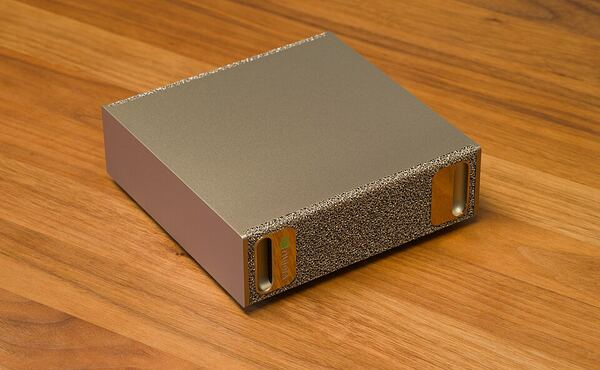
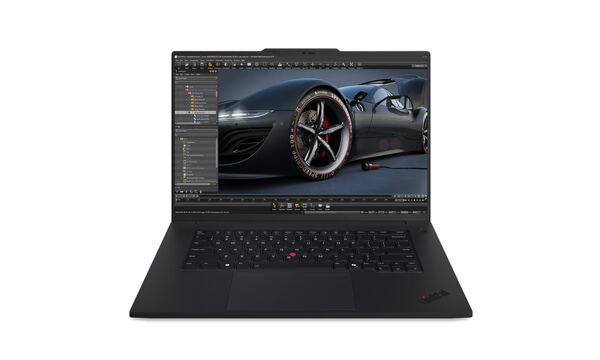
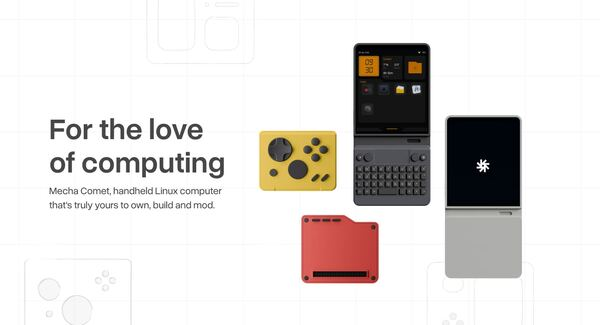
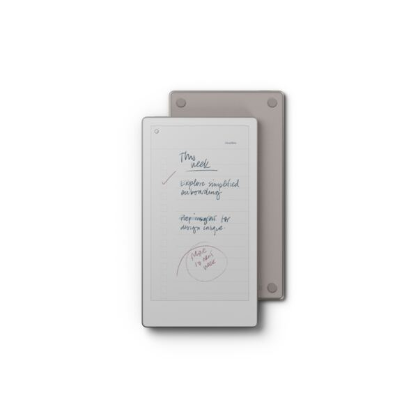
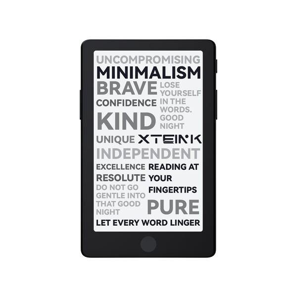
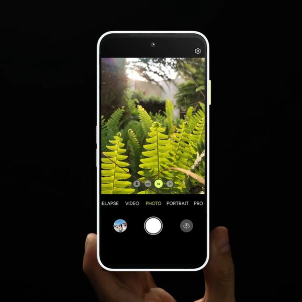
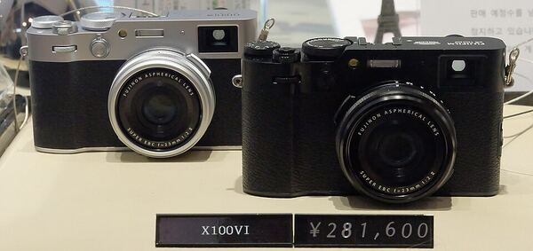
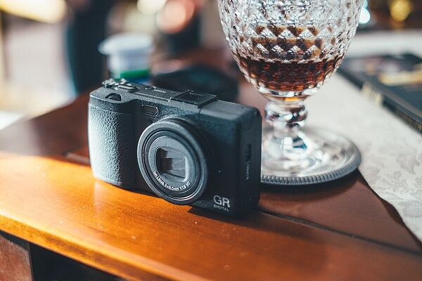

# Wishlist

## Table of Contents

* [⇢ Wishlist](#wishlist)
* [⇢ ⇢ Introduction](#introduction)
* [⇢ ⇢ Productivity](#productivity)
* [⇢ ⇢ ⇢ NVidia DGX Spark](#nvidia-dgx-spark)
* [⇢ ⇢ ⇢ ThinkPad P1](#thinkpad-p1)
* [⇢ ⇢ Gadgets](#gadgets)
* [⇢ ⇢ ⇢ Mecha Comet](#mecha-comet)
* [⇢ ⇢ ⇢ reMarkable Paper Pro Move](#remarkable-paper-pro-move)
* [⇢ ⇢ ⇢ TRMNL](#trmnl)
* [⇢ ⇢ ⇢ XTeink X4 Pro](#xteink-x4-pro)
* [⇢ ⇢ ⇢ Fairphone 6](#fairphone-6)
* [⇢ ⇢ Photography](#photography)
* [⇢ ⇢ ⇢ Fujifilm X100VI](#fujifilm-x100vi)
* [⇢ ⇢ ⇢ Ricoh GR IV](#ricoh-gr-iv)

## Introduction

This small page is my wishlist. So if you want to gift me something... Note some devices are pretty expensive and I don't expect anyone to buy them for me. This list is also for myself, so maybe I will gift one of these to myself at some point (e.g. for my Birthday) :-)

Don't take the ordering too seriously — it shifts depending on what I'm currently fiddling with. Items move up when a project of mine suddenly needs them, and down again once the urge passes.

```
⠀⠀⠀⠀⠀⠀⠀⣠⡶⢶⣤⡀⠀⠀⠀⠀⠀⠀⢀⣤⡶⢶⣄⠀⠀⠀⠀⠀⠀⠀
⠀⠀⠀⠀⠀⠀⠀⣿⡀⠀⠈⠛⢷⣄⠀⠀⣠⡾⠛⠁⠀⢀⣿⠀⠀⠀⠀⠀⠀⠀
⠀⠀⠀⠀⠀⠀⠀⠘⢿⣤⣀⠀⠀⣤⣤⣤⣤⠀⠀⣀⣤⡿⠃⠀⠀⠀⠀⠀⠀⠀
⠀⠀⠀⠀⢀⣀⣀⣀⣀⣈⣙⣛⡀⠙⣛⣛⠋⢀⣛⣋⣁⣀⣀⣀⣀⡀⠀⠀⠀⠀
⠀⠀⠀⠀⣿⣿⣿⣿⣿⣿⣿⣿⡇⢸⣿⣿⡇⢸⣿⣿⣿⣿⣿⣿⣿⣿⠀⠀⠀⠀
⠀⠀⠀⠀⠉⠉⣉⣉⣉⣉⣉⣉⡁⢸⣿⣿⡇⢈⣉⣉⣉⣉⣉⣉⠉⠉⠀⠀⠀⠀
⠀⠀⠀⠀⠀⠀⣿⣿⣿⣿⣿⣿⡇⢸⣿⣿⡇⢸⣿⣿⣿⣿⣿⣿⠀⠀⠀⠀⠀⠀
⠀⠀⠀⠀⠀⠀⣿⣿⣿⣿⣿⣿⡇⢸⣿⣿⡇⢸⣿⣿⣿⣿⣿⣿⠀⠀⠀⠀⠀⠀
⠀⠀⠀⠀⠀⠀⣿⣿⣿⣿⣿⣿⡇⢸⣿⣿⡇⢸⣿⣿⣿⣿⣿⣿⠀⠀⠀⠀⠀⠀
⠀⠀⠀⠀⠀⠀⣿⣿⣿⣿⣿⣿⡇⢸⣿⣿⡇⢸⣿⣿⣿⣿⣿⣿⠀⠀⠀⠀⠀⠀
⠀⠀⠀⠀⠀⠀⣿⣿⣿⣿⣿⣿⡇⢸⣿⣿⡇⢸⣿⣿⣿⣿⣿⣿⠀⠀⠀⠀⠀⠀
⠀⠀⠀⠀⠀⠀⠿⠿⠿⠿⠿⠿⠇⠸⠿⠿⠇⠸⠿⠿⠿⠿⠿⠿⠀⠀⠀⠀⠀⠀
```

## Productivity

### NVidia DGX Spark

[](wishlist/dgx-spark.jpg)  

... or a-like device so I can run local models like Qwen, Gemma, etc. Right now I only rent cloud GPUs when I need one or simply use Cloud API providers. A dedicated box with a sane amount of VRAM (e.g. 128GB) would let me stop renting for experiments that go nowhere and just leave something running at home.

What I'd do with it:

* Agentic coding with the smaller models — Claude Code / Codex --oss / OpenCode talking to Ollama or GPT-OSS 120b, in-editor completion via Hexai, and the odd multi-agent run where Nemotron orchestrates and another model codes. Qwen 3.6 and Gemma 4 would do most of the heavy lifting.
* Bulgarian — BG-GPT for learning, BG-TTS for voice, generating stories from my own vocab lists, and translating foo.zone articles to my level.
* Overnight creative batch jobs — ComfyUI / Flux for images and comics, continuing novel stories, Gemma 4 for OCR on scanned bills.
* A private RAG over my notes, blog and handwritten journals — RSS fetcher plus a Kagi-search summariser, summarising whole books, and spell-checking my writing.
* Background code review on every commit (SOLID, QA, Go best practices) and a nightly audit that files Taskwarrior tasks for whatever it finds.
* Letting a slow model just chew on batch jobs overnight, with two Pi agents keeping each other alive.

### ThinkPad P1

[](wishlist/thinkpad-p1.jpg)  

For a large display and good CPU performance for photo editing, coding and media content consumption. My current laptop is fine but a 16-inch workstation with a proper HX-class CPU would be a noticeable step up for the heavier stuff — and a big, colour-accurate panel doesn't hurt for culling photos either. If I spec it with an RTX GPU (or a Ryzen AI part) and it behaves on Linux, it could double as a local-LLM host too.

## Gadgets

### Mecha Comet

[](wishlist/mecha-comet.jpg)  

I've pre-ordered this already on Kickstarter. It's one of those small handheld Linux gadgets that probably won't change my life but I'm a sucker for a well-made keyboard and a pocketable terminal. 

What I'd actually use it for:

* A travel Linux station — external DisplayPort monitor, mobile VPN hotspot, WireGuard tunnel straight into my home LAN.
* Music player with an external USB DAC, ideally a Navidrome client with EQ and a visualizer.
* Retro gaming — Duke Nukem 1/2, console emulators, Pico-8, and Steam (it ran on a Pi3, so why not here).
* Podcast player fed by my own podcast downloader, unless a native one already does the job.
* Quicklog / jotting down ideas on the go, plus a Pomodoro timer and Taskwarrior (Task Samurai) when I'm away from the desk.
* The boring-but-useful bits: weather forecast, Wi-Fi analyser, document & password store, and a small Umhängetasche to carry it in.

### reMarkable Paper Pro Move

[](wishlist/remarkable-paper-pro-move.jpg)  

I'll run it purely offline — no cloud sync, no account beyond what's strictly needed. It's meant to be my always-with-me note taker, since it's even compacter than my Supernote Nomad I already have. Pen on paper feel in something that actually fits in a jacket pocket is the whole appeal.

### TRMNL

[")](wishlist/trmnl.jpg)  

An always-on e-ink info screen for the home office, and the whole thing is open-source software driven — I can self-host the backend and point it at whatever I want. I'm leaning towards the 4-color (BWRY) one, since a bit of red and yellow goes a long way on a dashboard.

What I'd put on it:

* Gogios status — a glance at whether the homelab is happy.
* A Taskwarrior dashboard, so the current task is always sitting there on the desk.
* A habit reminder, because apparently I need one.

### XTeink X4 Pro

[](wishlist/xteink-x4-pro.jpg)  

Only once the CrossPoint open-source firmware supports highlight by touch. Which it doesn't at the moment. I read a lot of ePubs and articles, and the whole point of an e-ink reader for me is marking things up without a laptop in front of me — so until that lands I'll keep waiting rather than buying something I'll be mildly annoyed by.

### Fairphone 6

[](wishlist/fairphone-6.jpg)  

A repairable, long-lived phone — and the only one I'd actually want to daily-drive is one running Ubuntu Touch. So this is conditional: I only want it once Ubuntu Touch is fully supported on the Fairphone 6. The draw is the desktop mode (plug in a monitor and it's a little Linux box), plus the usual Ubuntu Touch app wishlist — KOReader, Navidrome/Subsonic client, Syncthing, WireGuard, Wallabag, a markdown notes app, that sort of thing. Until the port is properly done, I'll keep what I have.

Not that I'm in a rush — my current phone is a Pixel 7 Pro on GrapheneOS, going on almost five years now, and it's been great. But it runs out of software updates next year, so there's a natural deadline creeping up. That's really the timing: if Ubuntu Touch on the Fairphone 6 lands around then, it'd be a clean swap.

## Photography

### Fujifilm X100VI

[](wishlist/x100vi.jpg)  

I've the X100V already, that's why I hesitate to upgrade, really. The V still takes the same photos; the VI mostly tempts me with the nicer film simulations and a bit more resolution I don't strictly need. If I ever find a good trade-in deal I'll probably cave, but it's hard to justify at full price or I will simply wait for a future X100VII or I will wait until my X100V breaks down! And if I do get one, it has to be the silver — the black one is too stealthy for my taste.

### Ricoh GR IV

[](wishlist/ricoh-gr-iv.jpg)  

I had a Ricoh GR III, but it's kaputt now. This was/will be my always-with-me-camera. There's nothing else quite like a GR for fitting in a jacket pocket and disappearing into a crowd — the phone is fine for snapshots but it's not the same thing. Whenever the IV is actually in stock and not marked up to the moon, I'll likely grab one.

[Go back](./)  
