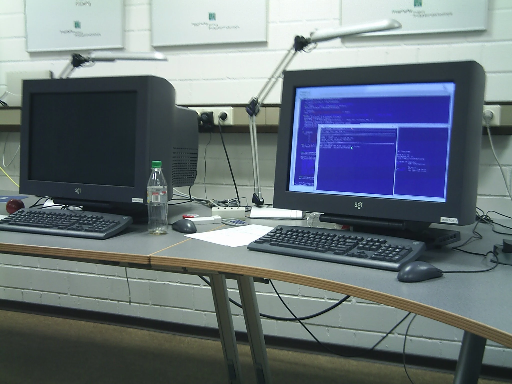
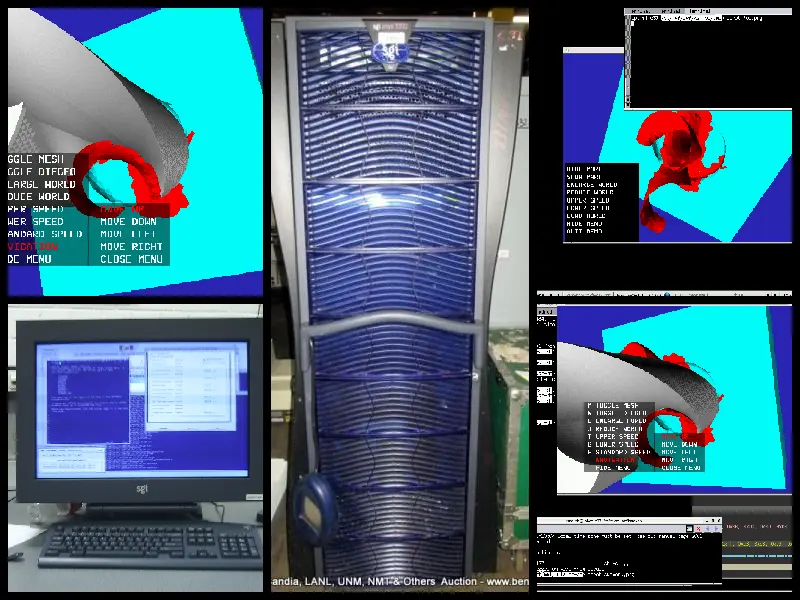

# SGI Onyx 3200

> Published at 2025-02-13T21:17:16+02:00

For nostalgia, I've kept this output of the 'dmesg' around. It's from an SGI Onyx 3200 graphics supercomputer with the following specs:

* 4 400 MHz IP35 MIPS CPUs
* 4GB of RAM

[](./sgi-onyx-3200/desk.webp)  

We used this monster when I was a student worker at the Fraunhofer Institute for Production Technology around the year 2006. It operated a walk-in 2-sided 3D cave (unfortunately, I don't have any pictures of that cave), where you could literally walk around with a set of VR glasses and see everything in 3D (that was when there wasn't any Oculus Quest yet). That was useful for running industrial simulations.

```
4 400 MHZ IP35 Processors
CPU: MIPS R12000 Processor Chip Revision: 3.5
FPU: MIPS R12010 Floating Point Chip Revision: 3.5
Main memory size: 4096 Mbytes
Instruction cache size: 32 Kbytes
Data cache size: 32 Kbytes
Secondary unified instruction/data cache size: 8 Mbytes
Integral SCSI controller 8: Version Fibre Channel QL2200A
Integral SCSI controller 6: Version QL12160, single ended
Integral SCSI controller 7: Version QL12160, low voltage differential
Integral SCSI controller 9: Version IEEE1394 SBP2
  IEEE1394 CDROM: node 1010031001a454 port 0 on SCSI controller 9
Integral SCSI controller 0: Version Fibre Channel QL2200A
  Disk drive: unit 1 on SpCSI controller 0
  Disk drive: unit 2 on SCSI controller 0
Integral SCSI controller 5: Version IEEE1394 SBP2
  IEEE1394 CDROM: node 1010031001c080 port 0 on SCSI controller 5
IOC3 serial port: tty3
IOC3 serial port: tty4
IOC3 serial port: tty10
IOC3 serial port: tty11
IOC3 serial port: tty12
IOC3 serial port: tty5
IOC3 serial port: tty6
IOC3 serial port: tty7
IOC3 serial port: tty8
IOC3 serial port: tty9
Graphics board: InfiniteReality3
Graphics board: InfiniteReality3
Gigabit Ethernet: eg0, module 001c04, pci_bus 2, pci_slot 2, firmware version 12.4.10
Fast Ethernet: ef1, version 1, module 001c07, pci 4
Integral Fast Ethernet: ef0, version 1, module 001c04, pci 4
Iris Audio Processor: version RAD revision 13.0, number 1
IOC3 external interrupts: 2
IOC3 external interrupts: 1
IEEE 1394 High performance serial bus controller 0: Type: OHCI, Version 0 0
IEEE 1394 High performance serial bus controller 1: Type: OHCI, Version 0 0
USB controller: type OHCI
USB Human Interface Device: device id 1 type keyboard
USB Human Interface Device: device id 1 type mouse
USB controller: type OHCI
USB Human Interface Device: device id 0 type keyboard
USB Human Interface Device: device id 0 type mouse
```

I was mainly working on drilling simulations on this machine. Sometimes I worked directly at one of the 2 terminal screens of the Onyx, or often I used a nearby Linux machine and forwarded the X11 windows to my local screen.

[](./sgi-onyx-3200/collage.webp)  

E-Mail your comments to `paul@nospam.buetow.org` :-)

[Back to the main site](../)  
