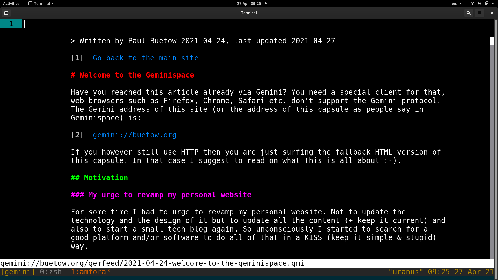
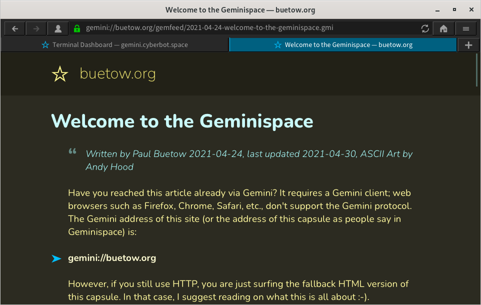

# Welcome to the Geminispace

> Published at 2021-04-24T19:28:41+01:00; Updated at 2021-06-18

ASCII Art by Andy Hood!

Have you reached this article already via Gemini? It requires a Gemini client; web browsers such as Firefox, Chrome, Safari, etc., don't support the Gemini protocol. The Gemini address of this site (or the address of this capsule as people say in Geminispace) is:

[gemini://foo.zone](gemini://foo.zone)  

However, if you still use HTTP, you are just surfing the fallback HTML version of this capsule. In that case, I suggest reading on what this is all about :-).

```

    /\
   /  \
  |    |
  |NASA|
  |    |
  |    |
  |    |
 '      `
 |Gemini|
 |      |
 |______|
  '-`'-`   .
  / . \'\ . .'
 ''( .'\.' ' .;'
'.;.;' ;'.;' ..;;' AsH

```

## Table of Contents

* [⇢ Welcome to the Geminispace](#welcome-to-the-geminispace)
* [⇢ ⇢ Motivation](#motivation)
* [⇢ ⇢ ⇢ My urge to revamp my personal website](#my-urge-to-revamp-my-personal-website)
* [⇢ ⇢ ⇢ My still great Laptop running hot](#my-still-great-laptop-running-hot)
* [⇢ ⇢ Discovering the Gemini internet protocol](#discovering-the-gemini-internet-protocol)
* [⇢ ⇢ My own Gemini capsule](#my-own-gemini-capsule)
* [⇢ ⇢ Gemini advantages summarised](#gemini-advantages-summarised)
* [⇢ ⇢ Dive into deep Gemini space](#dive-into-deep-gemini-space)

## Motivation

### My urge to revamp my personal website

For some time, I had to urge to revamp my personal website. Not to update the technology and its design but to update all the content (+ keep it current) and start a small tech blog again. So unconsciously, I began to search for an excellent platform to do all of that in a KISS (keep it simple & stupid) way.

### My still great Laptop running hot

Earlier this year (2021), I noticed that my almost seven-year-old but still great Laptop started to become hot and slowed down while surfing the web. Also, the Laptop's fan became quite noisy. This was all due to the additional bloat such as JavaScript, excessive use of CSS, tracking cookies+pixels, ads, and so on there was on the website. 

All I wanted was to read an interesting article, but after a big advertising pop-up banner appeared and made everything worse, I gave up and closed the browser tab.

## Discovering the Gemini internet protocol

Around the same time, I discovered a relatively new, more lightweight protocol named Gemini, which does not support all these CPU-intensive features like HTML, JavaScript, and CSS. Also, tracking and ads are unsupported by the Gemini protocol.

The "downside" is that due to the limited capabilities of the Gemini protocol, all sites look very old and spartan. But that is not a downside; that is, in fact, a design choice people made. It is up to the client software how your capsule looks. For example, you could use a graphical client, such as Lagrange, with nice font renderings and colours to improve the appearance. Or you could use a very minimalistic command line black-and-white Gemini client. It's your (the user's) choice.

[](./welcome-to-the-geminispace/amfora-screenshot.png)  
[](./welcome-to-the-geminispace/lagrange-screenshot.png)  

Why is there a need for a new protocol? As the modern web is a superset of Gemini, can't we use simple HTML 1.0 instead? That's a good and valid question. It is not a technical problem but a human problem. We tend to abuse the features once they are available. You can ensure that things stay efficient and straightforward as long as you are using the Gemini protocol. On the other hand, you can't force every website on the modern web to only create plain and straightforward-looking HTML pages.

## My own Gemini capsule

As it is effortless to set up and maintain your own Gemini capsule (Gemini server + content composed via the Gemtext markup language), I decided to create my own. What I like about Gemini is that I can use my favourite text editor and get typing. I don't need to worry about the style and design of the presence, and I also don't have to test anything in ten different web browsers. I can only focus on the content! As a matter of fact, I am using the Vim editor + its spellchecker + auto word completion functionality to write this. 

This site was generated with Gemtexter. You can read more about it here:

[Gemtexter - One Bash script to rule it all](./2021-06-05-gemtexter-one-bash-script-to-rule-it-all.md)  

## Gemini advantages summarised

* Supports an alternative to the modern bloated web
* Easy to operate and easy to write content
* No need to worry about various web browser compatibilities
* It's the client's responsibility how the content is designed+presented
* Lightweight (although not as lightweight as the Gopher protocol)
* Supports privacy (no cookies, no request header fingerprinting, TLS encryption)
* Fun to play with (it's a bit geeky, yes, but a lot of fun!)

## Dive into deep Gemini space

Check out one of the following links for more information about Gemini. For example, you will find a FAQ that explains why the protocol is named Gemini. Many Gemini capsules are dual-hosted via Gemini and HTTP(S) so that people new to Gemini can sneak peek at the content with a regular web browser. Some people go as far as tri-hosting all their content via HTTP(S), Gemini and Gopher.

[gemini://geminiprotocol.net/](gemini://geminiprotocol.net/)  
[https://geminiprotocol.net/](https://geminiprotocol.net/)  

E-Mail your comments to `paul@nospam.buetow.org` :-)

Other related posts are:

[2021-04-24 Welcome to the Geminispace (You are currently reading this)](./2021-04-24-welcome-to-the-geminispace.md)  
[2021-06-05 Gemtexter - One Bash script to rule it all](./2021-06-05-gemtexter-one-bash-script-to-rule-it-all.md)  
[2022-08-27 Gemtexter 1.1.0 - Let's Gemtext again](./2022-08-27-gemtexter-1.1.0-lets-gemtext-again.md)  
[2023-03-25 Gemtexter 2.0.0 - Let's Gemtext again²](./2023-03-25-gemtexter-2.0.0-lets-gemtext-again-2.md)  
[2023-07-21 Gemtexter 2.1.0 - Let's Gemtext again³](./2023-07-21-gemtexter-2.1.0-lets-gemtext-again-3.md)  

[Back to the main site](../)  
