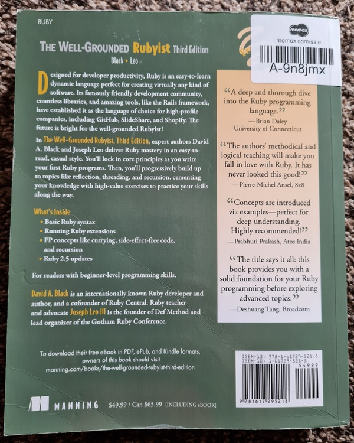

# The Well-Grounded Rubyist

> Published at 2021-07-04T10:51:23+01:00

When I was a Linux System Administrator, I have been programming in Perl for years. I still maintain some personal Perl programming projects (e.g. Xerl, guprecords, Loadbars). After switching jobs a couple of years ago (becoming a Site Reliability Engineer), I found Ruby (and some Python) widely used there. As I wanted to do something new, I decided to give Ruby a go.

You should learn or try out one new programming language once yearly anyway. If you end up not using the new language, that's not a problem. You will learn new techniques with each new programming language and this also helps you to improve your overall programming skills even for other languages. Also, having some background in a similar programming language makes it reasonably easy to get started. Besides that, learning a new programming language is kick-a** fun!

[](./the-well-grounded-rubyist/book-cover.jpg)  

Superficially, Perl seems to have many similarities to Ruby (but, of course, it is entirely different to Perl when you look closer), which pushed me towards Ruby instead of Python. I have tried Python a couple of times before, and I managed to write good code, but I never felt satisfied with the language. I didn't love the syntax, especially the indentations used; they always confused me. I don't dislike Python, but I don't prefer to program in it if I have a choice, especially when there are more propelling alternatives available. Personally, it's so much more fun to program in Ruby than in Python.

[](./the-well-grounded-rubyist/book-backside.jpg)  

Yukihiro Matsumoto, the inventor of Ruby, said: "I wanted a scripting language that was more powerful than Perl and more object-oriented than Python" - So I can see where some of the similarities come from. I personally don't believe that Ruby is more powerful than Perl, though, especially when you take CPAN and/or Perl 6 (now known as Raku) into the equation. Well, it all depends on what you mean with "more powerful". But I want to stay pragmatic and use what's already used at my workplace.

## Table of Contents

* [⇢ The Well-Grounded Rubyist](#the-well-grounded-rubyist)
* [⇢ ⇢ My Ruby problem domain](#my-ruby-problem-domain)
* [⇢ ⇢ Being stuck in Ruby-mediocrity](#being-stuck-in-ruby-mediocrity)
* [⇢ ⇢ O'Reilly Safari Books Online](#o-reilly-safari-books-online)
* [⇢ ⇢ Key takeaways](#key-takeaways)
* [⇢ ⇢ ⇢ "Everything" is an object](#everything-is-an-object)
* [⇢ ⇢ ⇢ "Normal" objects and singleton objects](#normal-objects-and-singleton-objects)
* [⇢ ⇢ ⇢ Domain specific languages](#domain-specific-languages)
* [⇢ ⇢ ⇢ Ruby is "self-ish"](#ruby-is-self-ish)
* [⇢ ⇢ ⇢ Functional programming](#functional-programming)
* [⇢ ⇢ Perl](#perl)

## My Ruby problem domain

I wrote a lot of Ruby code over the last couple of years. There were many small to medium-sized tools and other projects such as Nagios monitoring checks, even an internal monitoring & reporting site based on Sinatra. All Ruby scripts I wrote do their work well; I didn't encounter any significant problems using Ruby for any of these tasks. Of course, there's nothing that couldn't be written in Perl (or Python), though, after all, these languages are all Turing-complete and all these languages also come with a huge set of 3rd party libraries :-).

I don't use Ruby for all programming projects, though. 

* I am using Bash for small sized (usually below 500 lines of code) scripts and ad-hoc command-line automation.
* I program in Google Go for more complex tools (such as DTail) and for problem solving involving data crunching.
* Occasionally, I write some lines of Java code for minor feature enhancements and fixes to improve the reliability of some the services.
* Sometimes, I still program in good old C. This is for special projects (e.g. I/O Riot) or low-level PoCs or SystemTap guru mode scripts.

[Also have a look at my personal Bash coding style.](./2021-05-16-personal-bash-coding-style-guide.md)  
[Read here about DTail - the distributed log tail program.](./2021-04-22-dtail-the-distributed-log-tail-program.md)  
[This is a magazine article about I/O Riot I wrote.](./2018-06-01-realistic-load-testing-with-ioriot-for-linux.md)  

For all other in-between tasks I mainly use the Ruby programming language (unless I decide to give something new a shot once in a while).

## Being stuck in Ruby-mediocrity

As a Site Reliability Engineer there were many tasks and problems to be solved as efficiently and quickly as possible and, of course, without bugs. So I learned Ruby relatively fast by doing and the occasional web search for "how to do thing X". I always was eager to get the problem at hand solved and as long as the code solved the problem I usually was happy.

Until now, I never read a whole book or took a course on Ruby. As a result, I found myself writing Ruby in a Perl-ish procedural style (with Perl, you can do object-oriented programming too, but Perl wasn't designed from the ground up to be an object-oriented language). I didn't take advantage of all the specialities Ruby has to offer as I invested most of my time in the problems at hand and not in the Ruby idiomatic way of doing things.

An unexpected benefit was that most of my Ruby code (probably not all, there are always dark corners in some old code bases lurking around) was easy to follow and extend or fix, even by people who usually don't speak Ruby, as there wasn't too much magic involved in my code - However, I could have done better still. Looking at other Ruby projects, I noticed over time that there is so much more to the language I wanted to explore. For example new techniques and the Ruby best practise, and much more about how things work under the hood, I wanted to learn about.

## O'Reilly Safari Books Online

I do have an O'Reilly Safari Online subscription (thank you, employer). To my liking, I found the "The Well-Grounded Rubyist" book there (the text version and also the video version of it). I watched the video version for a couple of weeks, chunking the content into small pieces so it was able to fit into my schedule, increasing the playback speed for the topics I knew already well enough and slowed it down to actual pace when there was something new to learn and occasionally jumped back to the text book to review what I just learned. To my satisfaction, I was already familiar with over half of the language. But there was still the big chunk, especially how the magic happens under the hood in Ruby, which I missed out on, but I am happy now to be aware of it now.

I also loved the occasional dry humour in the book: "An enumerator is like a brain in a science fiction movie, sitting on a table with no connection to a body but still able to think". :-)

Will I rewrite and refactor all of my existing Ruby programs? Probably not, as they all do their work as intended. Some of these scripts will be eventually replaced or retired. But depending on the situation, I might refactor a module, class or a method or two once in a while. I already knew how to program in an object-oriented style from other languages (e.g. Java, C++, Perl Moose and plain) before I started Ruby, so my existing Ruby code is not as bad as you might assume after reading this article :-). In contrast to Java/C++, Ruby is a dynamic language, and the idiomatic ways of doing things differs from statically typed languages.

## Key takeaways

These are my key takeaways. These only point out some specific things I have learned, and represent, by far, not everything I've learned from the book.

### "Everything" is an object

In Ruby, everything is an object. However, Ruby is not Smalltalk. It depends on what you mean by "everything". Fixnums are objects. Classes also are, as instances of class Class. Methods, operators and blocks aren't but can be wrapped by objects via a "Proc". A simple assignment is not and can't. Statements like "while" also aren't and can't. Comments obviously also fall in the latter group. Ruby is more object-oriented than everything else I have ever seen, except for Smalltalk.

In Ruby, like in Java/C++, classes are classes, objects are instances of classes, and there are class inheritances. There is single inheritance in Ruby, but with the power of mixing in modules, you can extend your classes in a better way than multiple class inheritances (like in C++) would allow. It's also different to Java interfaces, as interfaces in Java only come with the method prototypes and not with the actual method implementations like Ruby modules.

### "Normal" objects and singleton objects

In Ruby, you can also have singleton objects. A singleton object can be an instance of a class but be modified after its creation (e.g. a method added to only this particular instance after its instantiation). Or, another variant of a singleton object is a class (yes, classes are also objects in Ruby). All of that is way better described in the book, so have a read by yourself if you are confused now; just remember: Rubys object system is very dynamic and flexible. At runtime, you can add and modify classes, objects of classes, singleton objects and modules. You don't need to restart the Ruby interpreter; you can change the code during runtime dynamically through Ruby code.

### Domain specific languages

Due to Ruby's flexibility through object individualization (e.g. adding methods at runtime, or changing the core behaviour of classes, catching unknown method calls and dynamically dispatch and/or generate the missing methods via the "method_missing" method), Ruby is a very good language to write your own small domain specific language (DSL) on top of Ruby syntax. I only noticed that after reading this book. Maybe, this is one of the reasons why even the configuration management system Puppet once tried to use a Ruby DSL instead of the Puppet DSL for its manifests. I am not sure why the project got abandoned though, probably it has to do with performance. Do be honest, Ruby is not the fastest language, but it is fast enough for most use cases. And, especially from Ruby 3, performance is one of the main things being worked on currently. If I want performance, I can always use another programming language.

### Ruby is "self-ish"

Ruby will fall back to the default "self" object if you don't specify an object method receiver. To give you an example, some more explanation is needed: There is the "Kernel" module mixed into almost every Ruby object. For example, "puts" is just a method of module "Kernel". When you write "puts :foo", Ruby sends the message "puts" to the current object "self". The class of object "self" is "Object". Class Object has module "Kernel" mixed in, and "Kernel" defines the method "puts". 

```
>> self
[main](main)  
>> self.class
[Object](Object)  
>> self.class.included_modules
[Kernel]]([PP::ObjectMixin,)  
>> Kernel.class
[Module](Module)  
>> Kernel.methods.grep(/puts/)
[[:puts]]([:puts])  
>> puts 'Hello Ruby'
Hello Ruby
[nil](nil)  
>> self.puts 'Hello World'
Hello World
[nil](nil)  
```

Ruby offers a lot of syntactic sugar and seemingly magic, but it all comes back to objects and messages to objects under the hood. As all is hidden in objects, you can unwrap and even change the magic and see what's happening under the hood. Then, suddenly everything makes so much sense.

### Functional programming

Ruby embraces an object-oriented programming style. But there is good news for fans of the functional programming paradigm: From immutable data (frozen objects), pure functions, lambdas and higher-order functions, lazy evaluation, tail-recursion optimization, method chaining, currying and partial function application, all of that is there. I am delighted about that, as I am a big fan of functional programming (having played with Haskell and Standard ML before).

Remember, however, that Ruby is not a pure functional programming language. You, the Rubyist, need to explicitly decide when to apply a functional style, as, by heart, Ruby is designed to be an object-oriented language. The language will not enforce side effect avoidance, and you will have to enable tail-recursion optimization (as of Ruby 2.5) explicitly, and variables/objects aren't immutable by default either. But that all does not hinder you from using these features. 

I liked this book so much so that I even bought myself a (used) paper copy of it. To my delight, there was also a free eBook version in ePub format included, which I now have on my Kobo Forma eBook reader. :-)

## Perl

Will I abandon my beloved Perl? Probably not. There are also some Perl scripts I use at work. But unfortunately I only have a limited amount of time and I have to use it wisely. I might look into Raku (formerly known as Perl 6) next year and use it for a personal pet project, who knows. :-). I also highly recommend reading the two Perl books "Modern Perl" and "Higher-Order Perl".

E-Mail your comments to `paul@nospam.buetow.org` :-)

Other Ruby-related posts:

[2025-10-11 Key Takeaways from The Well-Grounded Rubyist](./2025-10-11-the-well-grounded-rubyist-notes.md)  
[2021-07-04 The Well-Grounded Rubyist (You are currently reading this)](./2021-07-04-the-well-grounded-rubyist.md)  

[Back to the main site](../)  
