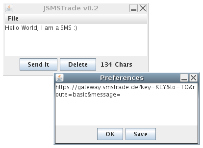

# Sweating the small stuff - Tiny projects of mine

> Published at 2022-06-15T08:47:44+01:00; Updated at 2022-06-18

```
         _
        /_/_      .'''.
     =O(_)))) ...'     `.
 jgs    \_\              `.    .'''
                           `..'
```

This blog post is a bit different from the others. It consists of multiple but smaller projects worth mentioning. I got inspired by Julia Evan's "Tiny programs" blog post and the side projects of The Sephist, so I thought I would also write a blog posts listing a couple of small projects of mine:

[Tiny programs](https://jvns.ca/blog/2022/03/08/tiny-programs/)  
[The Sephist's project list](https://thesephist.com/projects/)  

Working on tiny projects is a lot of fun as you don't need to worry about any standards or code reviews and you decide how and when you work on it. There aren't restrictions regarding technologies used. You are likely the only person working on these tiny projects and that means that there is no conflict with any other developers. This is complete freedom :-).

But before going through the tiny projects let's take a paragraph for the `1y` anniversary retrospective.

## `1y` anniversary

It has been one year since I started posting regularly (at least once monthly) on this blog again. It has been a lot of fun (and work) doing so for various reasons:

* I practice English writing (I am not a native speaker). I am far from being a novelist, but this blog helps improves my writing skills. I also tried out tools like Grammarly.com and Languagetool.org and also worked with `:spell` in Vim or the LibreOffice checker. This post was checked with the `write-better` Node application. 
* I force myself to "finish" some kind of project worth writing about every month. If its not a project, then its still a topic which requires research and deep thinking. Producing 2k words of text can actually be challenging.
* It's fun to rely on KISS (keep it simple & stupid) tools. E.g. use of Gemtexter and not WordPress, use of Vim instead of an office suite or a rich web editor.

Retrospectively, these have been the most popular blog posts of mine over the last year:

[Keep it simple and stupid](./2021-09-12-keep-it-simple-and-stupid.md)  
[Creative universe](./2022-04-10-creative-universe.md)  
[Bash Golf series](./2021-11-29-bash-golf-part-1.md)  
[How to stay sane as a DevOps person](./2021-12-26-how-to-stay-sane-as-a-devops-person.md)  
[Perl is still a great choice](./2022-05-27-perl-is-still-a-great-choice.md)  

But now, let's continue with the small projects worth mentioning :-)

## Static photo album generator

`photoalbum.sh` is a minimal static HTML photo album generator. I use it to drive "The Irregular Ninja" site and for some ad-hoc (personal) albums to share photos with the family and friends.

[https://codeberg.org/snonux/photoalbum](https://codeberg.org/snonux/photoalbum)  

### The Irregular Ninja

Photography is one of my casual hobbies. I love to capture interesting perspectives and motifs. I love to walk new streets and neighbourhoods I never walked before so I can capture those unexpected motifs, colours and moments. Unfortunately, because of time constraints (and sometime weather constraints), I do that on a pretty infrequent basis.

[](./2022-06-15-sweating-the-small-stuff/ninja.jpg)  

More than 10 years ago I wrote the bespoke small static photo album generator in Bash `photoalbum.sh` which I recently refactored to a modern Bash coding style and also freshened up the Cascading Style Sheets. Last but not least, the new domain name `irregular.ninja` has been registered.

The thumbnails are presented in a random order and there are also random CSS effects for each preview. There's also a simple background blur for each page generated. And that's all in less than 300 lines of Bash code! The script requires ImageMagick (available for all common Linux and *BSD distributions) to be installed.

As you can see, there is a lot of randomization and irregularity going on. Thus, the name "Irregular Ninja" was born.

[https://irregular.ninja](https://irregular.ninja)  

I only use a digital compact camera or a smartphone to take the photos. I don't like the idea of carrying around a big camera with me "just in case" so I keep it small and simple. The best camera is the camera you have with you. :-)

I hope you like this photo site. It's worth checking it out again around once every other month!

## Random journal page extractor

I bullet journal. I write my notes into a Leuchtturm paper notebook. Once full, I am scanning it to a PDF file and archive it. As of writing this, I am at journal #7 (each from 123 up to 251 pages in A5). It means that there is a lot of material already.

Once in a while I want to revisit older notes and ideas. For that I have written a simple Bash script `randomjournalpage.sh` which randomly picks a PDF file from a folder and extracts 42 pages from it at a random page offset and opens them in a PDF viewer (Evince in this case, as I am a GNOME user). 

[https://codeberg.org/snonux/randomjournalpage](https://codeberg.org/snonux/randomjournalpage)  

There's also a weekly `CRON` job on my servers to send me a reminder that I might want to read in my old journals again. My laptop also runs this script each time it boots and saves the output to a NextCloud folder. From there, it's synchronized to the NextCloud server so I can pick it up from there with my smartphone later when I am "on the road".

## Global uptime records statistic generator

`guprecords` is a Perl script which reads multiple `uprecord` files (produced by `uptimed` - a widely available daemon for recording server uptimes) and generates uptime statistics of multiple hosts combined. I keep all the record files of all my personal computers in a Git repository (I even keep the records of the boxes I don't own or use anymore) and there's already quite a collection of it. It looks like this:

```
❯ perl ~/git/guprecords/src/guprecords --indir=./stats/ --count=20 --all
Pos |            System |               Kernel |        Uptime |                Boot time
  1 |               sun | FreeBSD 10.1-RELEA.. | 502d 03:29:19 | Sun Aug 16 15:56:40 2015
  2 |            vulcan | Linux 3.10.0-1160... | 313d 13:19:39 | Sun Jul 25 18:32:25 2021
  3 |             uugrn | FreeBSD 10.2-RELEASE | 303d 15:19:35 | Tue Dec 22 21:33:07 2015
  4 |             uugrn | FreeBSD 11.0-RELEA.. | 281d 14:38:04 | Fri Oct 21 15:22:02 2016
  5 |         deltavega | Linux 3.10.0-957.2.. | 279d 11:15:00 | Sun Jun 30 11:42:38 2019
  6 |            vulcan | Linux 3.10.0-957.2.. | 279d 11:12:14 | Sun Jun 30 11:43:41 2019
  7 |         deltavega | Linux 3.10.0-1160... | 253d 04:42:22 | Sat Apr 24 13:34:34 2021
  8 |             host0 | FreeBSD 6.2-RELEAS.. | 240d 02:23:23 | Wed Jan 31 20:34:46 2007
  9 |             uugrn | FreeBSD 11.1-RELEA.. | 202d 21:12:41 | Sun May  6 18:06:17 2018
 10 |           tauceti |  Linux 3.2.0-4-amd64 | 197d 18:45:40 | Mon Dec 16 19:47:54 2013
 11 |             pluto | Linux 2.6.32-5-amd64 | 185d 11:53:04 | Wed Aug  1 07:34:10 2012
 12 |               sun | FreeBSD 10.3-RELEA.. | 164d 22:31:55 | Sat Jul 22 18:47:21 2017
 13 |            vulcan | Linux 3.10.0-1160... | 161d 07:08:43 | Sun Feb 14 10:05:38 2021
 14 |               sun | FreeBSD 10.3-RELEA.. | 158d 21:18:36 | Sat Jan 27 10:18:57 2018
 15 |             uugrn | FreeBSD 11.1-RELEA.. | 157d 20:57:24 | Fri Nov  3 05:02:54 2017
 16 |         tauceti-f |  Linux 3.2.0-3-amd64 | 150d 04:12:38 | Mon Sep 16 09:02:58 2013
 17 |           tauceti |  Linux 3.2.0-4-amd64 | 149d 09:21:43 | Mon Aug 11 09:47:50 2014
 18 |             pluto |  Linux 3.2.0-4-amd64 | 142d 02:57:31 | Mon Sep  8 01:59:02 2014
 19 |         tauceti-f |  Linux 3.2.0-3-amd64 | 132d 22:46:26 | Mon May  6 11:11:35 2013
 20 |       keppler-16b |        Darwin 13.4.0 | 131d 08:17:12 | Thu Jun 11 10:44:25 2015
```

It can also sum up all uptimes for each host to generate a total per host uptime top list:

```
❯ perl ~/git/guprecords/src/guprecords --indir=./stats/ --count=20 --total
Pos |            System |               Kernel |        Uptime |
  1 |            uranus | Linux 5.4.17-200.f.. | 1419d 19:05:39 |
  2 |               sun | FreeBSD 10.1-RELEA.. | 1363d 11:41:14 |
  3 |            vulcan | Linux 3.10.0-1160... | 1262d 20:27:48 |
  4 |             uugrn | FreeBSD 10.2-RELEASE | 1219d 15:10:16 |
  5 |         deltavega | Linux 3.10.0-957.2.. | 1115d 06:33:55 |
  6 |             pluto | Linux 2.6.32-5-amd64 | 1086d 10:44:05 |
  7 |           tauceti |  Linux 3.2.0-4-amd64 | 846d 12:58:21 |
  8 |         tauceti-f |  Linux 3.2.0-3-amd64 | 625d 07:16:39 |
  9 |             host0 | FreeBSD 6.2-RELEAS.. | 534d 19:50:13 |
 10 |       keppler-16b |        Darwin 13.4.0 | 448d 06:15:00 |
 11 |         tauceti-e |  Linux 3.2.0-4-amd64 | 415d 18:14:13 |
 12 |              moon |        Darwin 18.7.0 | 326d 11:21:42 |
 13 |          callisto | Linux 4.0.4-303.fc.. | 303d 12:18:24 |
 14 |     alphacentauri | FreeBSD 10.1-RELEA.. | 300d 20:15:00 |
 15 |             earth | Linux 5.13.14-200... | 289d 08:05:05 |
 16 |          makemake | Linux 5.11.9-200.f.. | 286d 21:53:03 |
 17 |            london |  Linux 3.2.0-4-amd64 | 258d 15:10:38 |
 18 |          fishbone | OpenBSD 4.1       .. | 223d 05:55:26 |
 19 |       sagittarius |        Darwin 15.6.0 | 198d 23:53:59 |
 20 |              mars |  Linux 3.2.0-4-amd64 | 190d 05:44:21 |
```

[https://codeberg.org/snonux/guprecords](https://codeberg.org/snonux/guprecords)  

This all is of no real practical use but fun!

## Server configuration management

The `rexfiles` project contains all Rex files for my (personal) server setup automation. A `Rexfile` is written in a Perl DSL run by the Rex configuration management system. It's pretty much KISS and that's why I love it. It suits my personal needs perfectly. 

[https://codeberg.org/snonux/rexfiles](https://codeberg.org/snonux/rexfiles)  
[https://www.rexify.org](https://www.rexify.org)  

This is an E-Mail I posted to the Rex mailing list:

> Hi there! I was searching for a simple way to automate my personal OpenBSD setup. I found that configuration management systems like Puppet, Salt, Chef, etc.. were too bloated for my personal needs. So for a while I was configuring everything by hand. At one point I got fed up and started writing Shell scripts. But that was not the holy grail so that I looked at Ansible. I found that Ansible had some dependencies on Python on the target machine when you want to use all the features. Furthermore, I am not really familiar with Python. But then I remembered that there was also Rex. It's written in my beloved Perl. Also, OpenBSD comes with Perl in the base system out of the box which makes it integrate better than all my scripts (automation and also scripts deployed via the automation to the system) are all in the same language. Rex may not have all the features like other configuration management systems, but its easy to work-around or extend when you know Perl. Thanks!

## Fancy SSH execution loop

`rubyfy` is a fancy SSH loop wrapper written in Ruby for running shell commands on multiple remote servers at once. I also forked this project for work (under a different name) where I added even more features such as automatic server discovery. It's used by many colleagues on a frequent basis. Here are some examples:

```
# Run command 'hostname' on server foo.example.com
./rubyfy.rb -c 'hostname' <<< foo.example.com

# Run command 'id' as root (via sudo) on all servers listed in the list file
# Do it on 10 servers in parallel
./rubyfy.rb --parallel 10 --root --command 'id' < serverlist.txt

# Run a fancy script in background on 50 servers in parallel
./rubyfy.rb -p 50 -r -b -c '/usr/local/scripts/fancy.zsh' < serverlist.txt

# Grep for specific process on both servers and write output to ./out/grep.txt
echo {foo,bar}.example.com | ./rubyfy.rb -p 10 -c 'pgrep -lf httpd' -n grep.txt

# Reboot server only if file /var/run/maintenance.lock does NOT exist!
echo foo.example.com |
./rubyfy.rb --root --command reboot --precondition /var/run/maintenance.lock
```

[https://codeberg.org/snonux/rubyfy](https://codeberg.org/snonux/rubyfy)  

## A KISS dynamic DNS solution

`dyndns` is a tiny shell script which implements "your" own DynDNS service. It relies on SSH access to the authoritative DNS server and the `nsupdate` command. There is really no need to use any of the "other" free DynDNS services out there.

Syntax (this must run from the client connecting to the DNS server through SSH): 

```
ssh dyndns@dyndnsserver /path/to/dyndns-update \
    your.host.name. TYPE new-entry TIMEOUT
```

This is a real world example: 

```
ssh dyndns@dyndnsserver /path/to/dyndns-update \
  local.buetow.org. A 137.226.50.91 30
```

[https://codeberg.org/snonux/dyndns](https://codeberg.org/snonux/dyndns)  

## CPU information gatherer for Linux

This is a tiny GNU Awk script for Linux which displays information about the CPU. All what it does is presenting `/proc/cpuinfo` in an easier to read way. The output is somewhat more compact than the standard `lscpu` command you find commonly on Linux distributions.

```
❯ ./cpuinfo
cpuinfo (c) 1.0.2 Paul Buetow

 11th Gen Intel(R) Core(TM) i7-1185G7 @ 3.00GHz GenuineIntel 12288 KB cache

p = 001 Physical processors
c = 004 Cores
s = 008 Siblings (Hyper-Threading enabled if s != c)
v = 008 [v = p*c*(s != c ? 2 : 1)] Total logical CPUs
 Hyper-Threading is enabled

0003000 MHz each core
0012000 MHz total
0005990 Bogomips each processor (including virtual)
0023961 Bogomips total
```

[https://codeberg.org/snonux/cpuinfo](https://codeberg.org/snonux/cpuinfo)  

## Show differences of two files over the network

This is a shell wrapper to use the standard diff tool over the network to compare a file between two computers. It uses NetCat for the network part and also encrypts all traffic using OpenSSL. This is how its used:

1. Open two terminal windows and login to two different hosts (you could use ClusterSSH or `tmux` here). 2. Run on the first host `netdiff otherhost.example.org /file/to/diff.txt` and run on the second host `netdiff firsthost.example.org /file/to/diff.txt`. 3. You then will see the file differences.

[https://codeberg.org/snonux/netdiff](https://codeberg.org/snonux/netdiff)  

## Delay sending out E-Mails with Mutt

This is a shell script for the Mutt email client for delaying sending out E-Mails. For example, you want to write an email on Saturday but don't want to bother the recipient earlier than Monday. It relies on CRON.

[https://codeberg.org/snonux/muttdelay](https://codeberg.org/snonux/muttdelay)  

## Graphical UI for sending text messages

`jsmstrade` is a minimalistic graphical Java swing client for sending SMS messages over the SMStrade service.

[](./2022-06-15-sweating-the-small-stuff/jsmstrade.png)  

[https://codeberg.org/snonux/jsmstrade](https://codeberg.org/snonux/jsmstrade)  
[https://smstrade.de](https://smstrade.de)  

## IPv6 and IPv4 connectivity testing site

`ipv6test` is a quick and dirty Perl CGI script for testing whether your browser connects via IPv4 or IPv6. It requires you to setup three sub-domains: One reachable only via IPv4 (e.g. `test4.ipv6.buetow.org`), another reachable only via IPv6 (e.g. `test6.ipv6.buetow.org`) and the main one reachable through both protocols (e.g. `ipv6.buetow.org`).

I don't have it running on any of my servers at the moment. This means that there is no demo to show now. Sorry!

## List open Jira tickets in the terminal

`japi` s a small Perl script for listing open Jira issues. It might be broken by now as the Jira APIs may have changed. Sorry! But feel free to fork and modernize it. :-)

[https://codeberg.org/snonux/jsmstrade](https://codeberg.org/snonux/jsmstrade)  
 
## Debian running on "your" Android phone

Debroid is a tutorial and a set of scripts to install and to run a Debian `chroot` on an Android phone.

[Check out my previous post about it](./2015-12-05-run-debian-on-your-phone-with-debroid.md)  

I am not using Debroid anymore as I have switched to Termux now.

[https://termux.com](https://termux.com)  

## Perl service framework

PerlDaemon is a minimal daemon for Linux and other Unix like operating systems programmed in Perl. It is a minimal but pretty functional and fairly generic service framework. This means that it does not do anything useful other than providing a framework for starting, stopping, configuring and logging. To do something useful, a module (written in Perl) must be provided.

[Checkout my previous post about it](./2011-05-07-perl-daemon-service-framework.md)  

## More

There are more projects on my Codeberg page but they aren't as tiny as the ones mentioned in this post or aren't finished yet so I won't bother listing them here. However, there also a few more scripts used frequently by me (not publicly accessible (yet?)) which I would like to mention here:

### Work time tracker

`worktime.rb`, for example, is a command line Ruby script I use to track my time spent working. This is to make sure that I don't overwork (in particular useful when working from home). It also generates some daily and weekly stats and carries over work time (surpluses or minuses) to the next work day, week or even year.

It has some special features such as tracking time for self-improvement/development, days off and time spent at the lunch break and time spent on Pet Projects.

An example weekly report looks like this (I often don't track my lunch time but what I do instead I stop the work timer when I go out for lunch and start the work timer once back at the desk):

```
     Mon 20211213 50: work:5.92h
     Tue 20211214 50: work:7.47h lunch:0.50h pet:0.42h
     Wed 20211215 50: work:8.86h pet:0.50h
     Thu 20211216 50: work:8.02h pet:0.50h
     Fri 20211217 50: work:9.81h
   * Sat 20211218 50: work:0.00h selfdevelopment:1.00h
   * Sun 20211219 50: work:2.08h pet:1.00h selfdevelopment:-2.08h
================================================
 balance:0.06h work:42.15h lunch:0.50h pet:2.42h selfdevelopment:-1.08h buffer:8.38h
```

All I do when I start work is to run the `wtlogin` command and after finishing work to run the `wtlogout` command. My shell will remind me when I work without having logged in. It uses a simple JSON database which is editable with `wtedit` (this opens the JSON in Vim). The report shown above can be generated with `wtreport`. Any out-of-bounds reporting can be added with the `wtadd` command.

### Password and document store

`geheim.rb` is my personal password and document store ("geheim" is the German word for secret). It's written in Ruby and heavily relies on Git, FZF (for search), Vim and standard encryption algorithms. Other than the standard `pass` Unix password manager, `geheim` also encrypts the file names and password titles.

The tool is command line driven but also provides an interactive shell when invoked with `geheim shell`. It also works on my Android phone via Termux so I have all my documents and passwords always with me. 

### Backup procedure

`backup` is a Bash script which does run once daily (or every time on boot) on my home FreeBSD NAS server and performs backup related tasks such as creating a local backup of my remote NextCloud instance, creating encrypted (incremental) ZFS snapshots of everything what's stored on the NAS and synchronizes (via `rsync`) backups to a remote cloud storage. It also can synchronize backups to a local external USB drive.

[Check out my offsite backup series](./2016-04-03-offsite-backup-with-zfs.md)  

## konpeito.media

Here's a bonus...

```
                                                           ▄ █ ▄  ▄ █ ▄  ▄ █ ▄
                                                           ▄▀█▀▄  ▄▀█▀▄  ▄▀█▀▄
  ▄▄▄▄▄▄▄▄▄▄▄▄▄▄▄                                            ▀      ▀      ▀
 █   ▄▄     ▄▄   █
 █  █  █▀▀▀█  █  █  █   ▄▀  ▄▀▀▀▀▄  █▄    █ █▀▀▀▀▀▄  ▄▀▀▀▀▄  █ ▀▀▀█▀▀▀ ▄▀▀▀▀▄
 █   ▀▀▀▀▀▀▀▀▀   █  █ ▄█   █      █ █ ▀▄  █ █▄▄▄▄▄▀ █▄▄▄▄▄▄█ █    █   █      █
 █ ▄▀▀▀▀▀▀▀▀▀▀▀▄ █  █▀  ▀▄ ▀▄    ▄▀ █   ▀▄█ █       ▀▄    ▄  █    █   ▀▄    ▄▀
 ▀▄█▄█▄▄▄▄▄▄▄█▄█▄▀  ▀     ▀  ▀▀▀▀   ▀     ▀ ▀         ▀▀▀▀   ▀    ▀     ▀▀▀
```

*THIS ISN'T MY PROJECT* but I found KONPEITO an interesting Gemini capsule. It's a quarterly released Low-Fi music mix tape distributed only through Gemini (and not the web). 

[gemini://konpeito.media](gemini://konpeito.media)  

If you wonder what Gemini is:

[Welcome to the Geminispae](./2021-04-24-welcome-to-the-geminispace.md)  

E-Mail your comments to hi@paul.cyou :-)

[More entries](./index.md)  
