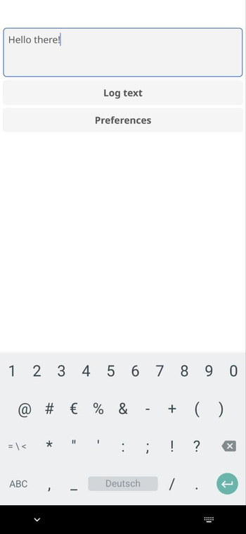

# A fine Fyne Android app for quickly logging ideas programmed in Go

> Published at 2024-03-03T00:07:21+02:00

I am an ideas person. I find myself frequently somewhere on the streets with an idea in my head but no paper journal noting it down. 

I have tried many note apps for my Android (I use GrapheneOS) phone. Most of them either don't do what I want, are proprietary software, require Google Play services (I have the main profile on my phone de-googled) or are too bloated. I was never into mobile app development, as I'm not too fond of the complexity of the developer toolchains. I don't want to use Android Studio (as a NeoVim user), and I don't want to use Java or Kotlin. I want to use a language I know (and like) for mobile app development. Go would be one of those languages.

  

## Table of Contents

* [⇢ A fine Fyne Android app for quickly logging ideas programmed in Go](#a-fine-fyne-android-app-for-quickly-logging-ideas-programmed-in-go)
* [⇢ ⇢ Enter Quick logger](#enter-quick-logger)
* [⇢ ⇢ All easy-peasy?](#all-easy-peasy)

## Enter Quick logger

Enter Quick logger – a compact GUI Android (well, cross-platform due to Fyne) app I've crafted using Go and the nifty Fyne framework. With Fyne, the app can be compiled easily into an Android APK. As of this writing, this app's whole Go source code is only 75 lines short!! This little tool is designed for spontaneous moments, allowing me to quickly log my thoughts as plain text files on my Android phone. There are no fancy file formats. Just plain text!

[https://codeberg.org/snonux/quicklogger](https://codeberg.org/snonux/quicklogger)  
[https://fyne.io](https://fyne.io)  
[https://go.dev](https://go.dev)  

There's no need to navigate complex menus or deal with sync issues. I jot down my Idea, and Quick logger saves it to a plain text file in a designated local folder on my phone. There is one text file per note (timestamp in the file name). Once logged, the file can't be edited anymore (it keeps it simple). If I want to correct or change a note, I simply write a new one. My notes are always small (usually one short sentence each), so there isn't the need for an edit functionality. I can edit them later on my actual computer if I want to.

With Syncthing, the note files are then synchronised to my home computer to my `~/Notes` directory. From there, a small glue Raku script adds them to my Taskwarrior DB so that I can process them later (e.g. take action on that one Idea I had). That then will delete the original note files from my computer and also (through Syncthing) from my phone.

[https://syncthing.net](https://syncthing.net)  
[https://raku.org](https://raku.org)  
[https://taskwarrior.org](https://taskwarrior.org)  

Quick logger's user interface is as minimal as it gets. When I launch Quick logger, I'm greeted with a simple window where I can type plain text. Hit the "Log text" button, and voilà – the input is timestamped and saved as a file in my chosen directory. If I need to change the directory, the "Preferences" button brings up a window where I can set the notes folder and get back to logging.

For the code-savvy folks out there, Quick logger is a neat example of what you can achieve with Go and Fyne. It's a testament to building functional, cross-platform apps without getting bogged down in the nitty-gritty of platform-specific details. Thanks to Fyne, I am pleased with how easy it is to make mobile Android apps in Go.

  

My Android apps will never be polished, but they will get the job done, and this is precisely how I want them to be. Minimalistic but functional. I could spend more time polishing Quick logger, but my Quick logger app then may be the same as any other notes app out there (complicated or bloated).

## All easy-peasy?

I did have some issues with the app logo for Android, though. Android always showed the default app icon and not my custom icon whenever I used a custom `AndroidManifest.xml` for custom app storage permissions. Without a custom `AndroidAmnifest.xml` the app icon would be displayed under Android, but then the app would not have the `MANAGE_EXTERNAL_STORAGE` permission, which is required for Quick logger to write to a custom directory. I found a workaround, which I commented on here at Github:

[https://github.com/fyne-io/fyne/issues/3077#issuecomment-1912697360](https://github.com/fyne-io/fyne/issues/3077#issuecomment-1912697360)  

> What worked however (app icon showing up) was to clone the fyne project, change the occurances of android.permission.INTERNET to android.permission.MANAGE_EXTERNAL_STORAGE (as these are all the changes I want in my custom android manifest) in the source tree, re-compile fyne. Now all works. I know, this is more of an hammer approach!

Hopefully, I won't need to use this workaround anymore. But for now, it is a fair tradeoff for what I am getting.

I hope this will inspire you to write your own small mobile apps in Go using the awesome Fyne framework! PS: The Quick logger logo was generated by ChatGPT.

E-Mail your comments to `paul@nospam.buetow.org` :-)

Other Go related posts are:

[2024-03-03 A fine Fyne Android app for quickly logging ideas programmed in Go (You are currently reading this)](./2024-03-03-a-fine-fyne-android-app-for-quickly-logging-ideas-programmed-in-golang.md)  

[Back to the main site](../)  
