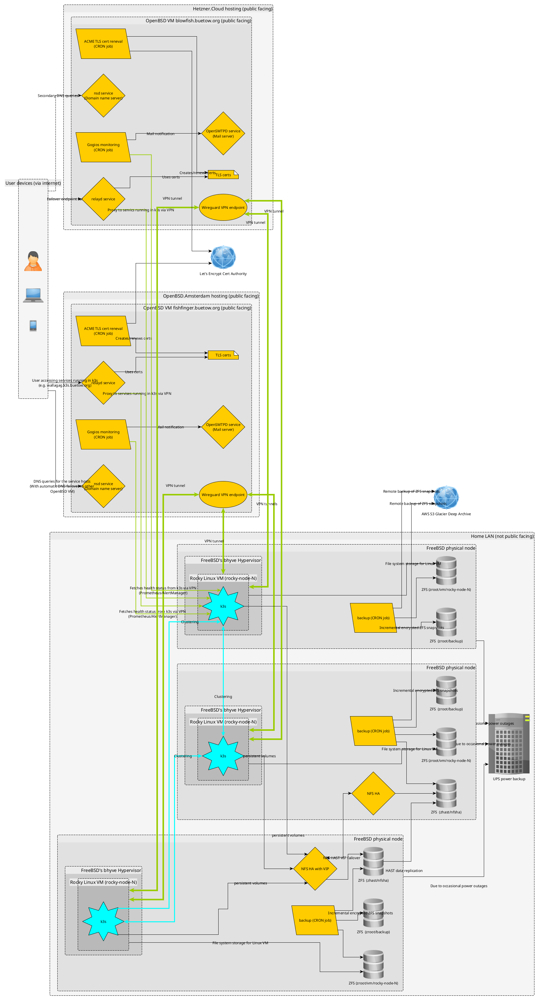

# f3s: Kubernetes with FreeBSD - Setting the stage - Part 1

> Published at 2024-11-16T23:20:14+02:00

This is the first blog post about my f3s series for my self-hosting demands in my home lab. f3s? The "f" stands for FreeBSD, and the "3s" stands for k3s, the Kubernetes distribution I will use on FreeBSD-based physical machines.

I will post a new entry every month or so (there are too many other side projects for more frequent updates—I bet you can understand).

[2024-11-17 f3s: Kubernetes with FreeBSD - Setting the stage - Part 1 (You are currently reading this)](./2024-11-17-f3s-kubernetes-with-freebsd-part-1.md)  

  

Let's begin...

## Table of Contents

* [⇢ f3s: Kubernetes with FreeBSD - Setting the stage - Part 1](#f3s-kubernetes-with-freebsd---setting-the-stage---part-1)
* [⇢ ⇢ Why this setup?](#why-this-setup)
* [⇢ ⇢ The infrastructure](#the-infrastructure)
* [⇢ ⇢ ⇢ Physical FreeBSD nodes and Linux VMs](#physical-freebsd-nodes-and-linux-vms)
* [⇢ ⇢ ⇢ Kubernetes with k3s ](#kubernetes-with-k3s-)
* [⇢ ⇢ ⇢ HA volumes for k3s with HAST/ZFS and NFS](#ha-volumes-for-k3s-with-hastzfs-and-nfs)
* [⇢ ⇢ ⇢ OpenBSD/`relayd` to the rescue for external connectivity](#openbsdrelayd-to-the-rescue-for-external-connectivity)
* [⇢ ⇢ Data integrity](#data-integrity)
* [⇢ ⇢ ⇢ Periodic backups](#periodic-backups)
* [⇢ ⇢ ⇢ Power protection](#power-protection)
* [⇢ ⇢ Monitoring: Keeping an Eye on Everything](#monitoring-keeping-an-eye-on-everything)
* [⇢ ⇢ ⇢ Prometheus and Grafana](#prometheus-and-grafana)
* [⇢ ⇢ ⇢ Gogios: My Custom Alerting System](#gogios-my-custom-alerting-system)
* [⇢ ⇢ What's after this all?](#what-s-after-this-all)

## Why this setup?

Look at my previous setup, which was great to learn Terraform and AWS, but the setup is too expensive. Costs are under control there, but only because I am shutting down all containers after use (so they are offline ninety per cent of the time and still cost around 20 bucks monthly). With the new setup, I could run all containers 24/7 at home, which would still be cheaper for electricity consumption.

[From `babylon5.buetow.org` to `.cloud`](https://foo.zone/gemfeed/2024-02-04-from-babylon5.buetow.org-to-.cloud.html)  

Migrating off all my containers from AWS ECS means I need a reliable and scalable environment to host my workloads. I wanted something:

* To self-host all my open-source apps (Docker containers).
* Fully under my control (goodbye cloud vendor lock-in).
* Secure and redundant.
* Cost-efficient (after the initial hardware investment).
* Something I can poke around with and also pick up new skills.

## The infrastructure

This is still in progress, and I need to own the hardware. But in this first part of the blog series, I will outline what I intend to do.

  

### Physical FreeBSD nodes and Linux VMs

The setup starts with three physical FreeBSD nodes. On these, I'm running Rocky Linux virtual machines with bhyve. Why Linux VMs in FreeBSD and not Linux directly? I want to leverage the great ZFS integration in FreeBSD (among other features), and I have been using FreeBSD for a while in my home lab. And with bhyve, there is a very performant hypervisor available which makes the Linux VMs de-facto run at native speed (another use case of mine would be maybe running a Windows bhyve VM on one of the nodes - but out of scope for this blog series).

[https://www.freebsd.org/](https://www.freebsd.org/)  
[https://wiki.freebsd.org/bhyve](https://wiki.freebsd.org/bhyve)  

I selected Rocky Linux because it comes with long-term support (I don't want to upgrade the VMs every 6 months). Rocky Linux 9 will reach its end of life in 2032, which is plenty of time! Of course, there will be minor upgrades, but nothing will significantly break my setup.

[https://rockylinux.org/](https://rockylinux.org/)  
[https://wiki.rockylinux.org/rocky/version/](https://wiki.rockylinux.org/rocky/version/)  

Furthermore, I am already using "RHEL-family" related distros at work and Fedora on my main personal laptop. Rocky Linux belongs to the same type of Linux distribution family, so I already feel at home here. I also used Rocky 9 before I switched to AWS ECS. Now, I am switching back in one sense or another ;-)

### Kubernetes with k3s 

These Linux VMs form a three-node k3s Kubernetes cluster, where my containers will reside moving forward. The 3-node k3s cluster will be highly available (in `etcd` mode), and all apps will probably be deployed with Helm. Prometheus will also be running in k3s, collecting time-series metrics and handling monitoring. Additionally, a private Docker registry will be deployed into the k3s cluster, where I will store some of my self-created Docker images. k3s is the perfect distribution of Kubernetes for homelabbers due to its simplicity and the inclusion of the most useful features out of the box!

[https://k3s.io/](https://k3s.io/)  

### HA volumes for k3s with HAST/ZFS and NFS

Persistent storage for the k3s cluster will be handled by highly available (HA) NFS shares backed by ZFS on the FreeBSD hosts. 

On two of the three physical FreeBSD nodes, I will add a second SSD drive to each and dedicate it to a `pool` ZFS pool. With HAST (FreeBSD's solution for highly available storage), this `pool` will be replicated at the byte level to a standby node.

A virtual IP (VIP) will point to the master node. When the master node goes down, the VIP will failover to the standby node, where the ZFS pool will be mounted. An NFS server will listen to both nodes. k3s will use the VIP to access the NFS shares.

[https://wiki.freebsd.org/HighlyAvailableStorage](https://wiki.freebsd.org/HighlyAvailableStorage)  

You can think of DRBD being the Linux equivalent to FreeBSD's HAST.

### OpenBSD/`relayd` to the rescue for external connectivity

All apps should be reachable through the internet (e.g., from my phone or computer when travelling). For external connectivity and TLS management, I've got two OpenBSD VMs (one hosted by OpenBSD Amsterdam and another hosted by Hetzner) handling public-facing services like DNS, relaying traffic, and automating Let's Encrypt certificates. 

All of this (every Linux VM to every OpenBSD box) will be connected via WireGuard tunnels, keeping everything private and secure. There will be 6 WireGuard tunnels (3 k3s nodes times two OpenBSD VMs).

[https://en.wikipedia.org/wiki/WireGuard](https://en.wikipedia.org/wiki/WireGuard)  

So, when I want to access a service running in k3s, I will hit an external DNS endpoint (with the authoritative DNS servers being the OpenBSD boxes). The DNS will resolve to the master OpenBSD VM (see my KISS highly-available with OpenBSD blog post), and from there, the `relayd` process (with a Let's Encrypt certificate—see my Let's Encrypt with OpenBSD and Rex blog post) will accept the TCP connection and forward it through the WireGuard tunnel to a reachable node port of one of the k3s nodes, thus serving the traffic.

[KISS high-availability with OpenBSD](https://foo.zone/gemfeed/2024-04-01-KISS-high-availability-with-OpenBSD.html)  
[Le's Encrypt with OpenBSD and Rex](https://foo.zone/gemfeed/2022-07-30-lets-encrypt-with-openbsd-and-rex.html)  

The OpenBSD setup described here already exists and is ready to use. The only thing that does not yet exist is the configuration of `relayd` to forward requests to k3s through the WireGuard tunnel(s).

## Data integrity

### Periodic backups

Let's face it, backups are non-negotiable. 

On the HAST master node, incremental and encrypted ZFS snapshots are created daily and automatically backed up to AWS S3 Glacier Deep Archive via CRON. I have a bunch of scripts already available, which I currently use for a similar purpose on my FreeBSD Home NAS server (an old ThinkPad T440 with an external USB drive enclosure, which I will eventually retire when the HAST setup is ready). I will copy them and slightly modify them to fit the purpose.

[https://www.freshports.org/sysutils/zfstools](https://www.freshports.org/sysutils/zfstools)  

The backup scripts also perform some zpool scrubbing now and then. A scrub once in a while keeps the trouble away.

### Power protection

Power outages are regularly in my area, so a UPS keeps the infrastructure running during short outages and protects the hardware. I'm still trying to decide which hardware to get, and I still need one, as my previous NAS is simply an older laptop that already has a battery for power outages. However, there are plenty of options to choose from. My main criterion is that the UPS should be silent, as the whole setup will be installed in an upper shelf unit in my daughter's room. ;-)

## Monitoring: Keeping an Eye on Everything

Robust monitoring is vital to any infrastructure, especially one as distributed as mine. I've thought about a setup that ensures I'll always be aware of what's happening in my environment.

### Prometheus and Grafana

Inside the k3s cluster, Prometheus will be deployed to handle metrics collection. It will be configured to scrape data from my Kubernetes workloads, nodes, and any services I monitor. Prometheus also integrates with Alertmanager to generate alerts based on predefined thresholds or conditions.

[https://prometheus.io](https://prometheus.io)  

For visualization, Grafana will be deployed alongside Prometheus. Grafana lets me build dynamic, customizable dashboards that provide a real-time view of everything from resource utilization to application performance. Whether it's keeping track of CPU load, memory usage, or the health of Kubernetes pods, Grafana has it covered. This will also make troubleshooting easier, as I can quickly pinpoint where issues are arising.

[https://grafana.com](https://grafana.com)  

### Gogios: My Custom Alerting System

Alerts generated by Prometheus are forwarded to Alertmanager, which I will configure to work with Gogios, a lightweight monitoring and alerting system I wrote myself. Gogios runs on one of my OpenBSD VMs. At regular intervals, Gogios scrapes the alerts generated in the k3s cluster and notifies me via Email.

[KISS server monitoring with Gogios](https://foo.zone/gemfeed/2023-06-01-kiss-server-monitoring-with-gogios.html)  

Ironically, I implemented Gogios to avoid using more complex alerting systems like Prometheus, but here we go—it integrates well now.

## What's after this all?

This setup is just the beginning. Some ideas I'm thinking about for the future:

* Adding more FreeBSD nodes (in different physical locations, maybe at my wider family's places?) for better redundancy. (HA storage then might be trickier)
* Deploying more Docker apps (data-intensive ones, like a picture gallery, my entire audiobook catalogue, or even a music server) to k3s.

For now, though, I'm focused on completing the migration from AWS ECS and getting all my Docker containers running smoothly in k3s.

What's your take on self-hosting? Are you planning to move away from managed cloud services? Stay tuned for the second part of this series, where I will likely write about the hardware and the OS setups.

Other *BSD-related posts:

[2016-04-09 Jails and ZFS with Puppet on FreeBSD](./2016-04-09-jails-and-zfs-on-freebsd-with-puppet.md)  
[2022-07-30 Let's Encrypt with OpenBSD and Rex](./2022-07-30-lets-encrypt-with-openbsd-and-rex.md)  
[2022-10-30 Installing DTail on OpenBSD](./2022-10-30-installing-dtail-on-openbsd.md)  
[2024-01-13 One reason why I love OpenBSD](./2024-01-13-one-reason-why-i-love-openbsd.md)  
[2024-04-01 KISS high-availability with OpenBSD](./2024-04-01-KISS-high-availability-with-OpenBSD.md)  
[2024-11-17 f3s: Kubernetes with FreeBSD - Setting the stage - Part 1 (You are currently reading this)](./2024-11-17-f3s-kubernetes-with-freebsd-part-1.md)  

E-Mail your comments to `paul@nospam.buetow.org` :-)

[Back to the main site](../)  
