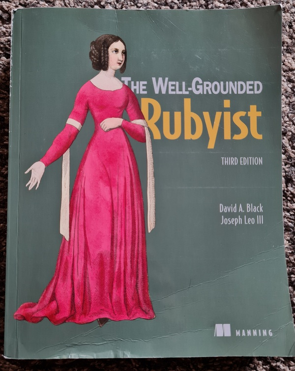

# Key Takeaways from The Well-Grounded Rubyist

> Published at 2025-10-11T15:25:14+03:00

Some time ago, I wrote about my journey into Ruby and how "The Well-Grounded Rubyist" helped me to get a better understanding of the language. I took a lot of notes while reading the book, and I think it's time to share some of them. This is not a comprehensive review, but rather a collection of interesting tidbits and concepts that stuck with me.

## Table of Contents

* [⇢ Key Takeaways from The Well-Grounded Rubyist](#key-takeaways-from-the-well-grounded-rubyist)
* [⇢ ⇢ The Object Model](#the-object-model)
* [⇢ ⇢ ⇢ Everything is an object (almost)](#everything-is-an-object-almost)
* [⇢ ⇢ ⇢ The `self` keyword](#the-self-keyword)
* [⇢ ⇢ ⇢ Singleton Methods](#singleton-methods)
* [⇢ ⇢ ⇢ Classes are Objects](#classes-are-objects)
* [⇢ ⇢ Control Flow and Methods](#control-flow-and-methods)
* [⇢ ⇢ ⇢ `case` and the `===` operator](#case-and-the--operator)
* [⇢ ⇢ ⇢ Blocks and `yield`](#blocks-and-yield)
* [⇢ ⇢ Fun with Data Types](#fun-with-data-types)
* [⇢ ⇢ ⇢ Symbols](#symbols)
* [⇢ ⇢ ⇢ Arrays and Hashes](#arrays-and-hashes)
* [⇢ ⇢ Final Thoughts](#final-thoughts)

[My first post about the book.](./2021-07-04-the-well-grounded-rubyist.md)  

[](./the-well-grounded-rubyist/book-cover.jpg)  

## The Object Model

One of the most fascinating aspects of Ruby is its object model. The book does a great job of explaining the details.

### Everything is an object (almost)

In Ruby, most things are objects. This includes numbers, strings, and even classes themselves. This has some interesting consequences. For example, you can't use `i++` like in C or Java. Integers are immutable objects. `1` is always the same object. `1 + 1` returns a new object, `2`.

### The `self` keyword

There is always a current object, `self`. If you call a method without an explicit receiver, it's called on `self`. For example, `puts "hello"` is actually `self.puts "hello"`.

```ruby
# At the top level, self is the main object
p self
# => main
p self.class
# => Object

def foo
  # Inside a method, self is the object that received the call
  p self
end

foo
# => main
```

This code demonstrates how `self` changes depending on the context. At the top level, it's `main`, an instance of `Object`. When `foo` is called without a receiver, it's called on `main`.

### Singleton Methods

You can add methods to individual objects. These are called singleton methods.

```ruby
obj = "a string"

def obj.shout
  self.upcase + "!"
end

p obj.shout
# => "A STRING!"

obj2 = "another string"
# obj2.shout would raise a NoMethodError
```

Here, the `shout` method is only available on the `obj` object. This is a powerful feature for adding behavior to specific instances.

### Classes are Objects

Classes themselves are objects, instances of the `Class` class. This means you can create classes dynamically.

```ruby
MyClass = Class.new do
  def say_hello
    puts "Hello from a dynamically created class!"
  end
end

instance = MyClass.new
instance.say_hello
# => Hello from a dynamically created class!
```

This shows how to create a new class and assign it to a constant. This is what happens behind the scenes when you use the `class` keyword.

## Control Flow and Methods

The book clarified many things about how methods and control flow work in Ruby.

### `case` and the `===` operator

The `case` statement is more powerful than I thought. It uses the `===` (threequals or case equality) operator for comparison, not `==`. Different classes can implement `===` in their own way.

```ruby
# For ranges, it checks for inclusion
p (1..5) === 3 # => true

# For classes, it checks if the object is an instance of the class
p String === "hello" # => true

# For regexes, it checks for a match
p /llo/ === "hello" # => true

def check(value)
  case value
  when String
    "It's a string"
  when (1..10)
    "It's a number between 1 and 10"
  else
    "Something else"
  end
end

p check(5) # => "It's a number between 1 and 10"
```

### Blocks and `yield`

Blocks are a cornerstone of Ruby. You can pass them to methods to customize their behavior. The `yield` keyword is used to call the block.

```ruby
def my_iterator
  puts "Entering the method"
  yield
  puts "Back in the method"
  yield
end

my_iterator { puts "Inside the block" }
# Entering the method
# Inside the block
# Back in the method
# Inside the block
```

This simple iterator shows how `yield` transfers control to the block. You can also pass arguments to `yield` and get a return value from the block.

```ruby
def with_return
  result = yield(5)
  puts "The block returned #{result}"
end

with_return { |n| n * 2 }
# => The block returned 10
```

This demonstrates passing an argument to the block and using its return value.

## Fun with Data Types

Ruby's core data types are full of nice little features.

### Symbols

Symbols are like immutable strings. They are great for keys in hashes because they are unique and memory-efficient.

```ruby
# Two strings with the same content are different objects
p "foo".object_id
p "foo".object_id

# Two symbols with the same content are the same object
p :foo.object_id
p :foo.object_id

# Modern hash syntax uses symbols as keys
my_hash = { name: "Paul", language: "Ruby" }
p my_hash[:name] # => "Paul"
```

This code highlights the difference between strings and symbols and shows the convenient hash syntax.

### Arrays and Hashes

Arrays and hashes have a rich API. The `%w` and `%i` shortcuts for creating arrays of strings and symbols are very handy.

```ruby
# Array of strings
p %w[one two three]
# => ["one", "two", "three"]

# Array of symbols
p %i[one two three]
# => [:one, :two, :three]
```

A quick way to create arrays. You can also retrieve multiple values at once.

```ruby
arr = [10, 20, 30, 40, 50]
p arr.values_at(0, 2, 4)
# => [10, 30, 50]

hash = { a: 1, b: 2, c: 3 }
p hash.values_at(:a, :c)
# => [1, 3]
```

The `values_at` method is a concise way to get multiple elements.

## Final Thoughts

These are just a few of the many things I learned from "The Well-Grounded Rubyist". The book gave me a much deeper appreciation for the language and its design. If you are a Ruby programmer, I highly recommend it. Meanwhile, I also read the book "Programming Ruby 3.3", just I didn't have time to process my notes there yet. 

E-Mail your comments to `paul@nospam.buetow.org` :-)

Other Ruby-related posts:

[2025-10-11 Key kakeaways from The Well-Grounded Rubyist (You are currently reading this)](./2025-10-11-key-takeaways-from-the-well-grounded-rubyist.md)  
[2021-07-04 The Well-Grounded Rubyist](./2021-07-04-the-well-grounded-rubyist.md)  

[Back to the main site](../)  
