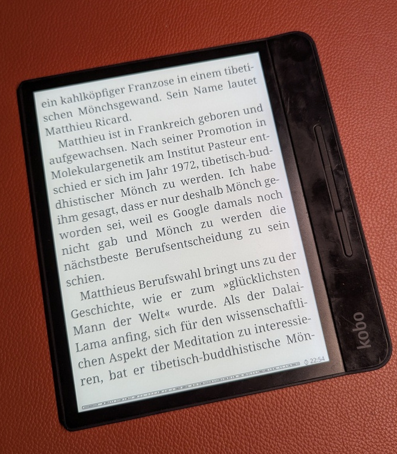
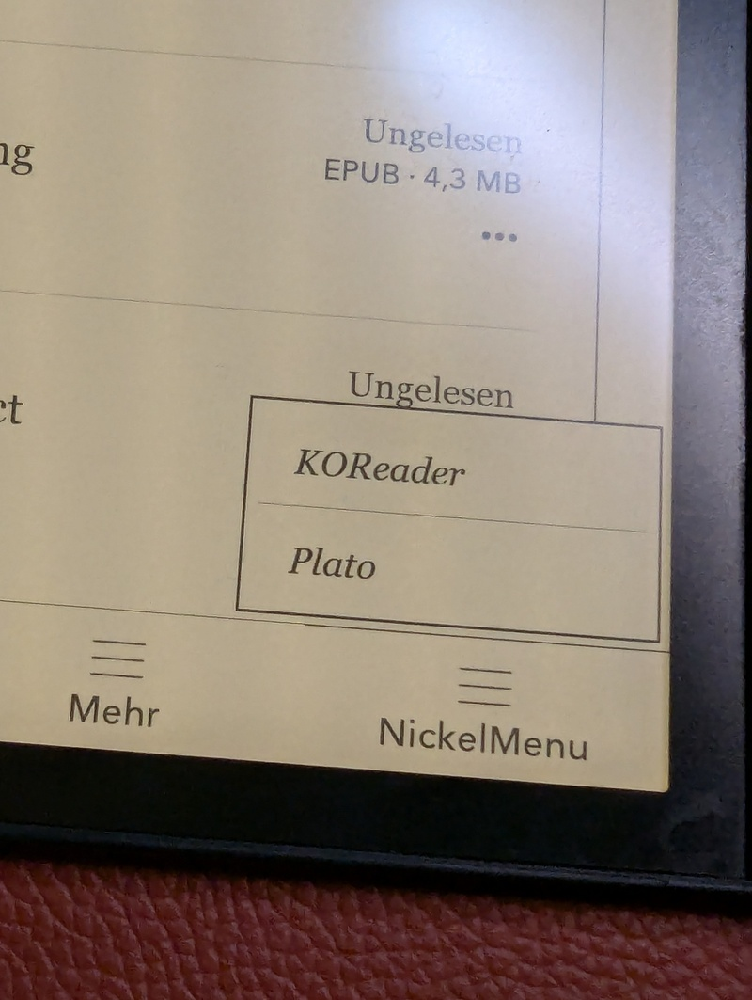
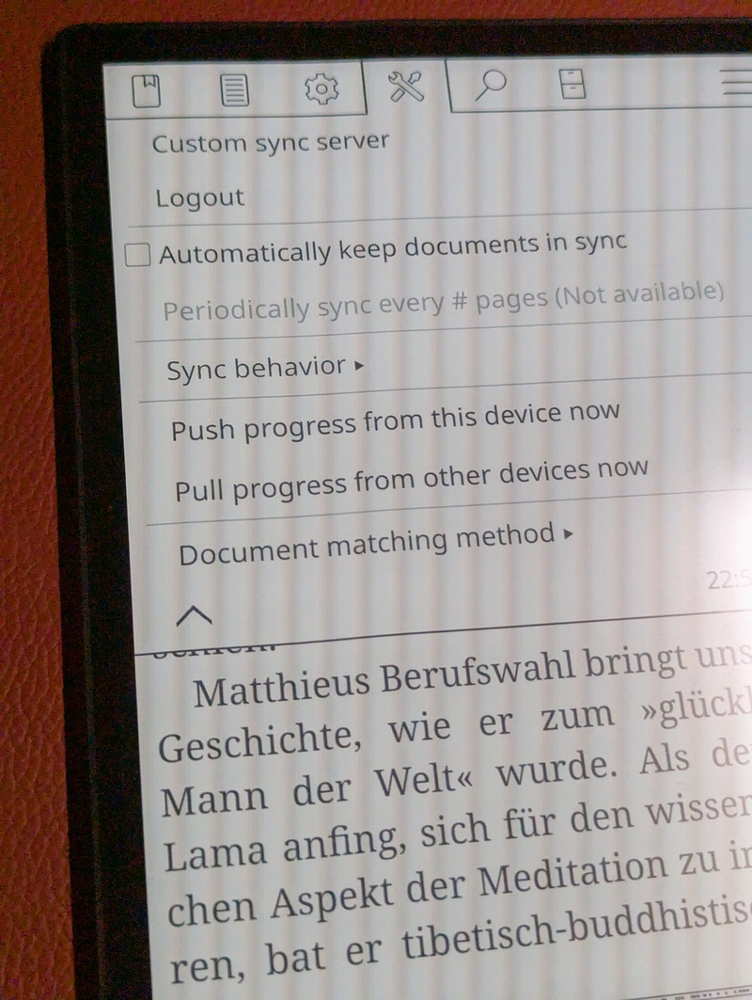

# Cloudless Kobo Forma with KOReader

> Published at 2025-12-31T16:08:33+02:00

I am an reader, and for years I've been searching for a good digital e-reader to complement my paper books. I advocate for privacy-first and prefer open-source or self-hosted solutions. If that is not possible, I opt for offline solutions. Even if I don't have anything to hide, the tinkerer in me wants those things anyway. I found my ideal device in the Kobo Forma 7 years ago. Now, I use it without Kobo's cloud sync, and in this post, I'll show you how.

```
Art by Donovan Bake

      __...--~~~~~-._   _.-~~~~~--...__
    //               `V'               \\ 
   //                 |                 \\ 
  //__...--~~~~~~-._  |  _.-~~~~~~--...__\\ 
 //__.....----~~~~._\ | /_.~~~~----.....__\\
====================\\|//====================
                dwb `---`
```

## Table of Contents

* [⇢ Cloudless Kobo Forma with KOReader](#cloudless-kobo-forma-with-koreader)
* [⇢ ⇢ KOReader to the Rescue](#koreader-to-the-rescue)
* [⇢ ⇢ ⇢ Installation](#installation)
* [⇢ ⇢ Sideloaded Mode](#sideloaded-mode)
* [⇢ ⇢ My Workflow](#my-workflow)
* [⇢ ⇢ ⇢ Sideloading Books](#sideloading-books)
* [⇢ ⇢ ⇢ KOReader Sync Server](#koreader-sync-server)
* [⇢ ⇢ ⇢ Exporting Book Notes and Highlights](#exporting-book-notes-and-highlights)
* [⇢ ⇢ ⇢ Wallabag Integration](#wallabag-integration)
* [⇢ ⇢ ⇢ Purchasing e-books](#purchasing-e-books)
* [⇢ ⇢ Conclusion](#conclusion)


I initially bought the Kobo Forma because I wanted a device with a large screen for reading PDFs and ePubs. However, as time went on, I became more concerned about the privacy implications of having all my reading data synced to the Kobo cloud. So, I looked into alternative ways to use this device.

[](./cloudless-kobo-forma-with-koreader/forma.jpg)  

The Kobo Forma is so old that it can't be purchased from Kobo directly anymore. But I love the form factor; it's much lighter than the Kobo Sage and still has a 7" screen. It's just that the stock firmware is becoming too slow and sluggish.

[Kobo Forma](https://gl.kobobooks.com/products/kobo-forma)  

## KOReader to the Rescue

In a world of constant connectivity, the Kobo Forma with the KOReader software offers a way out. By keeping it disconnected from the cloud, I can focus on my reading without compromising my privacy. KOReader is a versatile, open-source document and image viewer which can also be installed on some E Ink reader devices like the Kobo Forma.

[KOReader](https://koreader.rocks/)  

By not syncing my reading progress and library to Kobo's cloud service, I retain full ownership and control over my data. There's no risk of my personal reading habits being accessed or mined by third parties. 

### Installation

Installing KOReader is straightforward. You can follow the official guide for that. I used the Linux one: 

[https://github.com/koreader/koreader/wiki/Installation-on-desktop-linux](https://github.com/koreader/koreader/wiki/Installation-on-desktop-linux)  

Basically, what I had to do is to download a .zip file of the KOReader binary and an `install.sh` script. Then, I plugged in the Kobo Forma via USB and ran the install script, which did the rest for me.

After the initial install, KOReader can update itself through its menus.

It is worth noting that after the KOReader install, the Kobo Forma still boots into the proprietary window manager. To start KOReader, you have to select it from the new "Nickel Menu". KOReader will then stay open until you reboot the device. It's a small annoyance, but it's well worth it!

[](./cloudless-kobo-forma-with-koreader/nickel-menu.jpg)  

## Sideloaded Mode

To use the Kobo Forma completely without a Kobo account, you can enable "Sideloaded Mode". This mode allows you to use the device without being signed in to a Kobo account, which is perfect for a cloudless setup. When enabled, the home screen will default to your library instead of showing Kobo recommendations, and the sync button will disappear. This prevents the device from trying to sync with the Kobo cloud.

To enable it, you need to edit the configuration file. Connect your Kobo device to your computer via USB. Open the file `.kobo/Kobo/Kobo eReader.conf` and add the following lines:

```
[ApplicationPreferences]
SideloadedMode=true
```

After saving the file, eject the device. You might need to restart it for the changes to take effect.

KOReader is much faster than the stock firmware; it feels about three times as fast. Before trying out KOReader, I was thinking about selling the Forma as it felt too sluggish. But now there is new life in this 7-year-old device! It also offers a night mode (inverted colors), a feature that the stock firmware on the Forma is lacking.

## My Workflow

My workflow is simple and efficient, relying on a direct USB connection to my Linux laptop for sideloading books and a self-hosted sync server for progress synchronization.

### Sideloading Books

I connect my Kobo Forma to my Linux laptop via a USB-C cable. The device is automatically recognized as a storage device, and I can directly access its storage to copy over ePubs, PDFs, and other supported formats.

### KOReader Sync Server

To keep my reading progress synchronized across multiple devices (my Kobo, my phone, and my Linux laptop), I run a `koreader-sync-server` instance in my k3s cluster. This allows me to pick up reading where I left off, no matter which device I'm using.

[https://codeberg.org/snonux/conf/src/branch/master/f3s/kobo-sync-server](https://codeberg.org/snonux/conf/src/branch/master/f3s/kobo-sync-server)  

To configure the sync server in KOReader, open a document, go to "Settings" -> "Progress Sync", and select "Custom sync server". There you can enter the URL of your server and your credentials.

[](./cloudless-kobo-forma-with-koreader/koreader-sync.jpg)  

### Exporting Book Notes and Highlights

KOReader allows you to export book notes and highlights directly from the device in various formats, including plain text and Markdown. Unfortunately, these are not automatically synced to the sync server. I have an offline backup procedure where I regularly sync them via USB to my backup server. There's a 3rd party plugin available for KOReader, which seems to be able to do this kind of sync, though.

### Wallabag Integration

KOReader has built-in Wallabag support. This allows me to save articles from the web to my self-hosted Wallabag instance and then read them comfortably on my Kobo.

[https://wallabag.org/](https://wallabag.org/)  

I haven't tried it out yet, though. I may will and will update this blog post here after done so.

### Purchasing e-books

If you search a little bit you also find stores which sell digital rights management (DRM) free e-books (in EPUB format), for example buecher.de does, they sell german and english books. Before purchasing, just make sure that the book is DRM-free (not all their books are that.)

All the books I read you can see here:

[Novels I've read](../about/novels.md)  
[Resources, Technical Books, Podcasts, Courses and Guides I recommend](../about/resources.md)  

## Conclusion

The Kobo Forma with KOReader has become an indispensable tool for me. By using it offline and with self-hosted services, I've created a distraction-free and private reading environment. The simple, manual workflow for transferring books gives me full control over my data, and the reading experience is second to none. If you're looking for a digital e-reader that respects your privacy and helps you focus, I highly recommend giving the Kobo a try with an offline-first approach using KOReader.

Other related posts:

[2026-01-01 Cloudless Kobo Forma with KOReader (You are currently reading this)](./2026-01-01-cloudless-kobo-forma-with-koreader.md)  

E-Mail your comments to `paul@nospam.buetow.org` :-)

[Back to the main site](../)  
