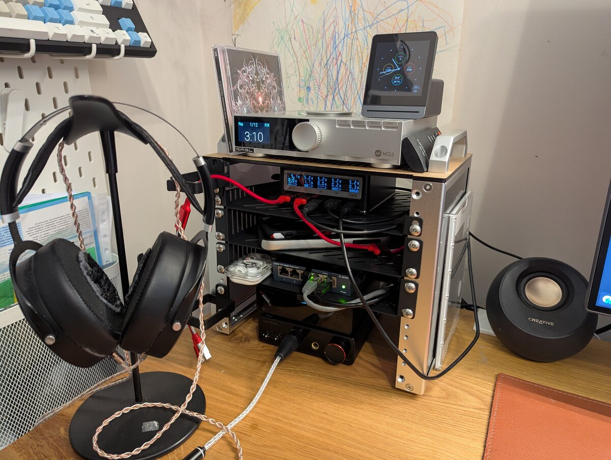
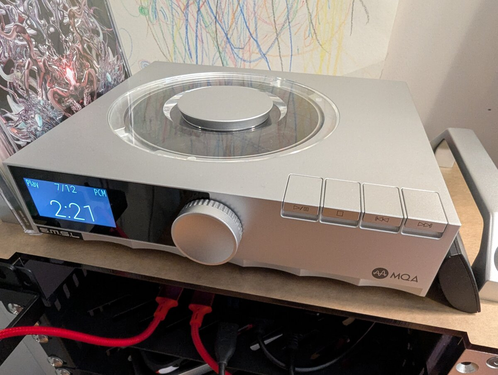
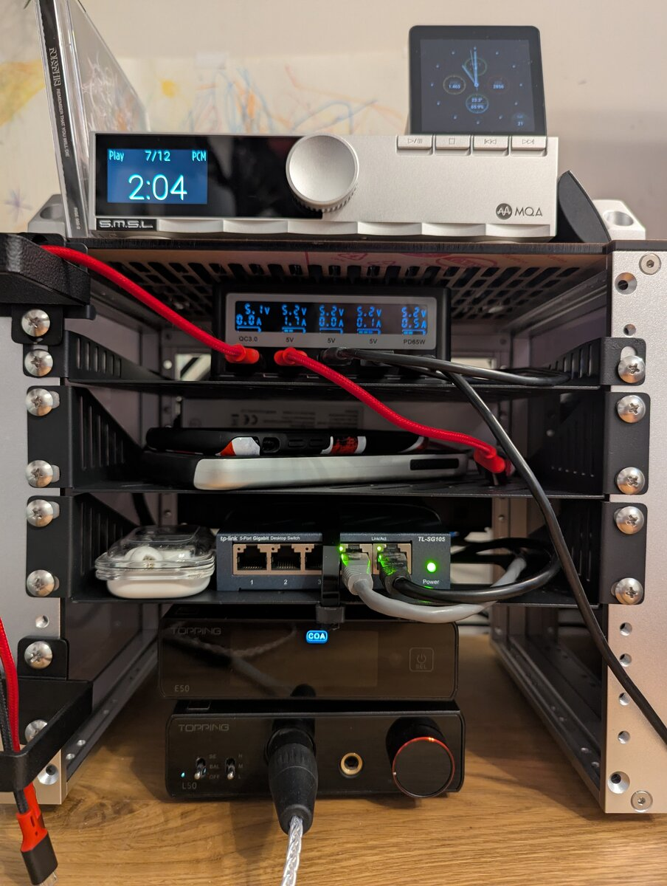
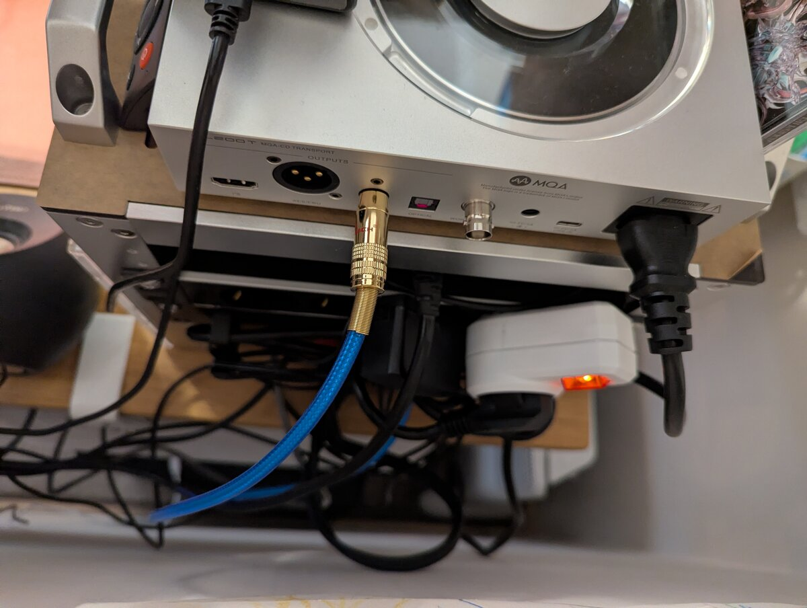

# My desk rack: DeskPi RackMate T0

> Published at 2026-02-21T11:17:15+02:00

```
    ┌─────────────────┐
    │   ●  ●  AIR     │  ← air-quality monitor
    ├─────────────────┤
    │  ╔═╗  CD        │  ← CD transport
    │  ║ ◉║  S/PDIF   │
    │  ╚═╝            │
    ├─────────────────┤
    │  ▓▓▓  USB PWR   │  ← PinePower
    ├─────────────────┤
    │  ░░░  (phones)  │  ← 1U "empty" shelf
    ├─────────────────┤
    │  ◉◉◉◉◉  LAN     │  ← 5-port switch
    ├─────────────────┤
    │  [E50] [L50]    │  ← DAC + AMP
    │   DAC   AMP     │
    └─────────────────┘
         RackMate T0
```

On my desk sits a small rack that keeps audio gear, power, and network in one place: the DeskPi RackMate T0. Here's what lives in it and how it's wired.

[DeskPi RackMate T0](https://deskpi.com/products/deskpi-rackmate-t1-rackmount-10-inch-4u-server-cabinet-for-network-servers-audio-and-video-equipment)  

[](./my-deskrack/deskrack.jpg)  

## Table of Contents

* [⇢ My desk rack: DeskPi RackMate T0](#my-desk-rack-deskpi-rackmate-t0)
* [⇢ ⇢ What's in the rack (top to bottom)](#what-s-in-the-rack-top-to-bottom)
* [⇢ ⇢ ⇢ Top: CD transport and air-quality monitor](#top-cd-transport-and-air-quality-monitor)
* [⇢ ⇢ ⇢ Power and charging: PinePower Desktop + 1U shelf](#power-and-charging-pinepower-desktop--1u-shelf)
* [⇢ ⇢ ⇢ Network: 5-port mini switch](#network-5-port-mini-switch)
* [⇢ ⇢ ⇢ Bottom: DAC and headphone amp](#bottom-dac-and-headphone-amp)
* [⇢ ⇢ ⇢ Music sources](#music-sources)
* [⇢ ⇢ ⇢ Left side: cable management](#left-side-cable-management)
* [⇢ ⇢ Next to the rack](#next-to-the-rack)
* [⇢ ⇢ Bedside: another HiFi setup](#bedside-another-hifi-setup)

## What's in the rack (top to bottom)

### Top: CD transport and air-quality monitor

At the top is the S.M.S.L PL200T, a CD transport with anti-vibration design. It outputs digital audio over coaxial S/PDIF into the DAC in the rack. On top of the transport sits a small air-quality monitor so I can keep an eye on the room.

[S.M.S.L PL200T CD Transport](https://www.smsl-audio.com/portal/product/detail/id/908.html)  

[](./my-deskrack/deskrack-cdtransport.jpg)  

A CD transport is not the same as a CD player. A CD player has a built-in DAC (digital-to-analog converter) and outputs analogue audio—you plug it into an amp or active speakers and you're done. A CD transport only reads the disc and outputs a digital signal (e.g. coaxial or optical S/PDIF). It has no DAC. You feed that digital stream into an external DAC, which then does the conversion. The idea is to separate the mechanical part (spinning the disc, reading the pits) from the conversion stage, so you can use one DAC for CDs, streaming, and other sources, and upgrade or swap the transport and the DAC independently.

In the age of streaming and files, putting on a real CD is still a pleasure. You own the disc and the sound isn't at the mercy of a subscription or a server. You pick an album, put it in, and listen from start to finish—no endless scrolling, no algorithm. The format is fixed (16-bit/44.1 kHz), so what you hear is consistent and often better than heavily compressed streams. And there's something satisfying about the ritual: handling the case, the disc, and the artwork instead of tapping a screen.

### Power and charging: PinePower Desktop + 1U shelf

Below that is the PinePower Desktop from Pine64, used as a desktop power and USB charging station for phones and other devices. The rack has one free 1U space under the PinePower where I put the devices that are charging, so cables and gadgets stay in one spot.

[PinePower Desktop (Pine64)](https://www.pine64.org)  

### Network: 5-port mini switch

Next is a compact 5-port Ethernet switch. The uplink goes to a wall socket behind the desk; the other ports feed the computer, laptop, and anything else that needs wired LAN on the desk. Next to the switch you can see my Nothing ear buds.

[Nothing ear buds](https://nothing.tech/products/ear)  

### Bottom: DAC and headphone amp

At the bottom of the rack are the Topping E50 (DAC) and Topping L50 (headphone amplifier). The E50 converts digital to analogue; the L50 drives the headphones. They drive my Hifiman Sundara headphones.

[Topping E50 DAC](https://www.tpdz.net)  
[Topping L50 Headphone Amplifier](https://www.tpdz.net)  
[Hifiman Sundara](https://hifiman.com/products/detail/sundara)  

### Music sources

* CD transport: coaxial (S/PDIF) from the S.M.S.L PL200T into the Topping E50.
* Streaming: USB from the desktop computer and/or laptop on the desk into the E50, so I can play from either machine.

### Left side: cable management

On the left of the rack are two cable holders to keep power and signal cables tidy.

## Next to the rack

Right beside the rack is my Supernote Nomad, which I use for notes and reading and have written about elsewhere on this blog. It’s the small tablet-shaped device on the right side of the rack.

[")](./my-deskrack/deskrack-supernote.jpg)  
[Supernote Nomad (product page)](https://supernote.com/pages/supernote-nomad)  

[](./my-deskrack/deskrack-frontview.jpg)  
[](./my-deskrack/deskrack-backside.jpg)  

## Bedside: another HiFi setup

I have a second setup for high-res listening next to my bed. On the nightstand sit my FiiO K13 R2R (an R2R DAC/amp) and my Denon AH-D9200 headphones. I connect the K13 to my laptop via USB and use it for high-resolution files and streaming when I'm not at the desk.

[Fiio K13 R2R](https://www.fiio.com)  
[Denon AH-D9200](https://www.denon.com)  

That's the full desk rack: CD transport and air monitor on top, PinePower and charging shelf, switch, then Topping E50 and L50 at the bottom, with the Hifiman Sundara as the main output and the Supernote Nomad sitting next to it. I hope that you found this interesting.

E-Mail your comments to `paul@nospam.buetow.org` :-)
