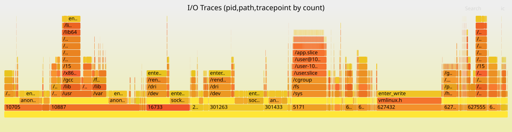

# Taskwarrior as an autonomous AI agent loop: 48 tasks in one day

> Published at 2026-02-21T23:11:13+02:00

[](./taskwarrior-autonomous-agent/ior-flamegraph.png)  

I let Ampcode autonomously complete 48 Taskwarrior tasks on my eBPF project in a single day. The agent picked up one task after another — implemented, self-reviewed, spawned sub-agent reviews, addressed comments, committed, and moved on — all without me intervening. Here is how the setup works, what the project is about, and the full skill that drives the loop.

[Ampcode — the AI coding agent used for this project](https://ampcode.com)  

## Table of Contents

* [⇢ Taskwarrior as an autonomous AI agent loop: 48 tasks in one day](#taskwarrior-as-an-autonomous-ai-agent-loop-48-tasks-in-one-day)
* [⇢ ⇢ What is ior and what does it do](#what-is-ior-and-what-does-it-do)
* [⇢ ⇢ ⇢ What is a syscall](#what-is-a-syscall)
* [⇢ ⇢ ⇢ What is eBPF](#what-is-ebpf)
* [⇢ ⇢ ⇢ What ior traces and why](#what-ior-traces-and-why)
* [⇢ ⇢ The problem: writing a full test suite by hand](#the-problem-writing-a-full-test-suite-by-hand)
* [⇢ ⇢ Before and after](#before-and-after)
* [⇢ ⇢ How the project-taskwarrior skill works](#how-the-project-taskwarrior-skill-works)
* [⇢ ⇢ ⇢ SKILL.md — the entry point](#skillmd--the-entry-point)
* [⇢ ⇢ ⇢ 00-context.md — project scoping and global rules](#00-contextmd--project-scoping-and-global-rules)
* [⇢ ⇢ ⇢ 1-create-task.md — creating tasks with full context](#1-create-taskmd--creating-tasks-with-full-context)
* [⇢ ⇢ ⇢ 2-start-task.md — fresh context per task](#2-start-taskmd--fresh-context-per-task)
* [⇢ ⇢ ⇢ 3-complete-task.md — the quality gate](#3-complete-taskmd--the-quality-gate)
* [⇢ ⇢ ⇢ 4-annotate-update-task.md — progress tracking](#4-annotate-update-taskmd--progress-tracking)
* [⇢ ⇢ ⇢ 5-review-overview-tasks.md — picking the next task](#5-review-overview-tasksmd--picking-the-next-task)
* [⇢ ⇢ The reflection and review loop](#the-reflection-and-review-loop)
* [⇢ ⇢ Measurable results](#measurable-results)
* [⇢ ⇢ A real bug found by the review loop](#a-real-bug-found-by-the-review-loop)
* [⇢ ⇢ Gotchas and lessons learned](#gotchas-and-lessons-learned)
* [⇢ ⇢ ⇢ Cost](#cost)
* [⇢ ⇢ ⇢ Syscall wrappers on amd64](#syscall-wrappers-on-amd64)
* [⇢ ⇢ ⇢ Task granularity matters](#task-granularity-matters)
* [⇢ ⇢ How to replicate this](#how-to-replicate-this)

## What is ior and what does it do

I/O Riot NG (ior) is a Linux-only tool that traces synchronous I/O system calls in real time and produces flamegraphs showing which processes spend time on which files with which syscalls. It is written in Go and C, using eBPF via libbpfgo. It is the spiritual successor of an older project of mine called I/O Riot, which was based on SystemTap and C.

[](./taskwarrior-autonomous-agent/ior-logo.png)  

[I/O Riot NG on Codeberg](https://codeberg.org/snonux/ior)  
[The original I/O Riot (SystemTap)](https://codeberg.org/snonux/ioriot)  

At the top of the blog post you see an example flamegraph produced by ior. The x-axis shows sample count (how frequent each I/O operation is), and the stack from bottom to top shows process ID, file path, and syscall tracepoint. You can immediately see which processes hammer which files with which syscalls.

### What is a syscall

A syscall (system call) is the interface between a user-space program and the Linux kernel. When a program wants to do anything that touches hardware or shared resources — open a file, read from a socket, write to disk, create a directory, check file permissions — it cannot do it directly. User-space programs run in an unprivileged CPU mode and have no access to hardware. They must ask the kernel by making a syscall.

For example, when a program calls `open("/etc/passwd", O_RDONLY)`, it triggers the `openat` syscall. The CPU switches from user mode to kernel mode, the kernel validates the request, locates the file on disk, allocates a file descriptor, and returns it to the program — or returns an error code like ENOENT if the file does not exist. Every file operation, every network packet, every process fork goes through syscalls. They are the fundamental boundary between "your code" and "the operating system."

There are hundreds of syscalls in Linux. The I/O-related ones that ior traces include:

* `openat`, `creat`, `open_by_handle_at` — opening files
* `read`, `write`, `pread64`, `pwrite64`, `readv`, `writev` — reading and writing data
* `close`, `close_range` — closing file descriptors
* `dup`, `dup2`, `dup3` — duplicating file descriptors
* `fcntl` — manipulating file descriptor properties
* `rename`, `renameat`, `renameat2` — renaming files
* `link`, `linkat`, `symlink`, `symlinkat`, `readlinkat` — creating and reading links
* `unlink`, `unlinkat`, `rmdir` — removing files and directories
* `mkdir`, `mkdirat`, `chdir`, `getdents64` — directory operations
* `stat`, `fstat`, `lstat`, `newfstatat`, `statx`, `access`, `faccessat` — file metadata
* `fsync`, `fdatasync`, `sync`, `sync_file_range` — flushing data to disk
* `truncate`, `ftruncate` — resizing files
* `io_uring_setup`, `io_uring_enter`, `io_uring_register` — async I/O

### What is eBPF

eBPF (extended Berkeley Packet Filter) is a technology in the Linux kernel that lets you run sandboxed programs inside the kernel without changing kernel source code or loading kernel modules. Originally designed for network packet filtering, it has grown into a general-purpose in-kernel virtual machine.

With eBPF, you write small C programs that the kernel verifies for safety (no infinite loops, no out-of-bounds access, no crashing the kernel) and then runs at de-facto native speed in a VM inside of the Linux Kernel. These programs can attach to tracepoints — predefined instrumentation points in the kernel that fire whenever a specific event occurs, such as a syscall being entered or exited.

ior uses eBPF to attach to the entry and exit tracepoints of every I/O-related syscall. When any process on the system calls `openat`, for example, the kernel fires the `sys_enter_openat` tracepoint, ior's BPF program captures the filename, PID, thread ID, and timestamp, and sends that data to user-space via a ring buffer. When the syscall returns, the `sys_exit_openat` tracepoint fires, and ior captures the return value and duration. This happens with near-zero overhead because the BPF program runs inside the kernel — there is no context switch to user-space for each event.

### What ior traces and why

ior pairs up syscall enter and exit events, tracks which file descriptors map to which file paths, and aggregates everything into a data structure that can be serialized to a compressed `.ior.zst` file or rendered as a flamegraph. The flamegraph shows a hierarchy of PID, file path, and syscall tracepoint, with the width proportional to how often or how long each combination occurs.

This is useful for diagnosing I/O bottlenecks: you can see at a glance that process 5171 is spending most of its time writing to `/sys/fs/cgroup/memory.stat`, or that your database is doing thousands of `fsync` calls per second on its WAL file. Traditional tools like `strace` can show you this too, but `strace` uses ptrace which has significant overhead and slows down the traced process. eBPF-based tracing is orders of magnitude faster.

## The problem: writing a full test suite by hand

The ior project needed a comprehensive test suite at two levels:

* Unit tests in `internal/eventloop_test.go` — these simulate raw BPF tracepoint data (byte slices), feed them into the event loop, and verify that enter/exit events are correctly paired, file descriptors are tracked, comm names are propagated, and filters work. No BPF, no kernel, no root required.
* Integration tests in `integrationtests/` — these launch a real `ioworkload` binary that performs actual syscalls, start ior with real BPF tracing against that process, wait for it to finish, and then parse the resulting `.ior.zst` file to verify that the expected tracepoints were captured. These require root and a running kernel with BPF support.

Both levels needed happy-path tests (does it work correctly?) and negative tests (does it handle errors like ENOENT, EBADF, EEXIST, EINVAL correctly?). Across 13 syscall categories, that is a lot of test code — roughly 93 scenarios, each with its own workload implementation and test assertions. Having the LLM to instruct each of those tasks would have taken days and writing all of this by hand would take months.

## Before and after

Before I set up the Taskwarrior skill, my workflow with Ampcode looked like this: I would manually review the agent's output, then instruct it what to do next. One task at a time, constant babysitting. The agent had no memory of what was done or what was next. Context would degrade as the conversation grew longer.

After: I front-loaded about 48 tasks into Taskwarrior with detailed descriptions and file references (Ampcode itself helped here to create the tasks as well), then told Ampcode a single instruction: "complete this task, then automatically proceed to the next ready +integrationtests task by handing off with fresh context." It ran for about 6 hours autonomously. I reviewed the commits over coffee.

The key difference is that Taskwarrior acts as persistent memory and a work queue. The agent does not need to remember what it did — the task list tells it what is done and what is next. Each task hands off to a fresh Ampcode thread, so there is no context window degradation. Ampcode's handoff mechanism — where one thread spawns a new one with a goal description — maps perfectly onto Taskwarrior's task-by-task workflow.

## How the project-taskwarrior skill works

```
    ┌──────────────────────────────────────────────────┐
    │                                                  │
    │ task add pro:ior "implement open_test.go" +agent │
    │ task add pro:ior "implement close_test.go" +agent│
    │ task add pro:ior "add negative tests" +agent     │
    │   ...  × 48                                      │
    │                                                  │
    │   ┌─────────┐   ┌──────────┐   ┌──────────┐      │
    │   │ Agent   │─▶│ Self-    │─▶│ Sub-agent│      │
    │   │ works   │   │ review   │   │ review   │      │
    │   └─────────┘   └──────────┘   └──────────┘      │
    │        │              │              │           │
    │        │         fix  │         fix  │           │
    │        │◀─────────────┘◀─────────────┘         │
    │        │                                         │
    │        ▼                                         │
    │   git commit + push                              │
    │   task <id> done                                 │
    │   ──▶ hand off to next task (fresh context)     │
    │                                                  │
    └──────────────────────────────────────────────────┘
```

The skill lives in `~/.agents/skills/project-taskwarrior/` and consists of a `SKILL.md` entry point plus six markdown files — one per action. The agent loads only the files it needs for the current action, so it does not waste context on instructions it does not need right now.

### SKILL.md — the entry point

Every Ampcode skill has a `SKILL.md` with YAML frontmatter (name, description, trigger phrases) and an overview. This is what the agent sees first when it loads the skill:

```
---
name: project-taskwarrior
description: "Manage Taskwarrior tasks scoped to the current git
  project. Use when asked to list, add, start, complete, annotate,
  or organize tasks for the project. Triggers on: tasks, todo,
  task list, pick next task, what's next."
---

# Project Taskwarrior

Taskwarrior tasks are scoped to the current git repository.
Load only the files you need for the current action so the whole
skill does not need to be in context.

## When to load what

| Action                    | Load                                  |
|---------------------------|---------------------------------------|
| Create task               | 00-context.md + 1-create-task.md      |
| Start task                | 00-context.md + 2-start-task.md       |
| Complete task             | 00-context.md + 3-complete-task.md    |
| Annotate / update task    | 00-context.md + 4-annotate-update.md  |
| Review / overview tasks   | 00-context.md + 5-review-overview.md  |

Always load 00-context.md first (project name resolution and
global rules); then load the one action file that matches what
you are doing.

## Task lifecycle (overview)

1. Create task
2. Start task
3. Annotate as you go
4. Completion criteria (best practices, compilable, all tests
   pass, negative tests where plausible)
5. Sub-agent review (fresh context)
6. Main agent addresses all review comments
7. Second sub-agent review (fresh context again) to confirm fixes
8. Commit all changes to git
9. Complete task

A task is not done until criteria are met, all review comments
are addressed, a second sub-agent review has confirmed the code,
and all changes are committed to git. Details are in
3-complete-task.md.
```

The key design decision is the table: the agent only loads the files relevant to what it is doing right now. Creating a task? Load `00-context.md` + `1-create-task.md`. Completing one? Load `00-context.md` + `3-complete-task.md`. This keeps context lean.

### 00-context.md — project scoping and global rules

This file is loaded with every action. It derives the project name from git and enforces that the agent only touches its own tasks (tagged `+agent`):

```
# Project Taskwarrior — shared context

Load this with any of the action files (1–5) when working with tasks.
It defines project scope and rules that apply to all task operations.

## Project name

Derive the project name from the git repository:

  basename -s .git \
    "$(git remote get-url origin 2>/dev/null)" 2>/dev/null \
    || basename "$(git rev-parse --show-toplevel)"

Use it as project:<name> in every task command.

## Rules that apply to all task commands

- Project and tag matching: The agent only reads, modifies, or
  creates tasks that have both project:<name> and the +agent tag.
  Do not touch any task that does not have +agent set.
- EVERY task command MUST include project:<name> — no exceptions.
  When listing or querying, also include +agent so only
  agent-managed tasks are shown. Never run a bare task without
  the project filter.
- NEVER modify, delete, complete, start, or annotate tasks from
  other projects or tasks without +agent.
- One task in progress per project. Do not start a second task
  while another is started and not completed, unless the user
  explicitly asks.
- Parallel work via sub-agents — the agent may spawn sub-agents
  to work on tasks in parallel only after the user approves.
```

### 1-create-task.md — creating tasks with full context

This is the most important file for setting up the autonomous loop. Every task must be self-contained — it must reference all files, docs, and specs needed so that an agent starting with zero prior context can work on it:

```
# Create task

## Rules for new tasks

- Create tasks in smaller chunks that fit into the context window.
  Break work into multiple tasks so that each task's scope,
  description, and required context can fit in one context window.
- Every task MUST have at least one tag for sub-project/feature/area
  (e.g. +integrationtests, +flamegraph, +bpf, +cli).
- When an agent creates a task, always add the tag +agent.
- Include references to all context required to work on the task.
  Every task must list or link everything needed: relevant files,
  docs, specs, other tasks, or project guidelines. Put these in
  the task description or in an initial annotation.

## Add a task

  task add project:<name> +<tag> +agent "Description"

## With dependency

  task add project:<name> +<tag> +agent "Description" depends:<id>

## Conventions

- Keep tasks small: each task should fit in the context window.
- Add dependencies when one task must complete before another.
- Add references to all required context so the task is
  self-contained for fresh-context work.
```

### 2-start-task.md — fresh context per task

This ensures each task gets a clean slate — no carry-over from previous work:

```
# Start task

## Start each new task with a fresh context

Work on each new task must begin with a fresh context — a new
session or a sub-agent with no prior conversation. That way the
task is executed with clear focus and no carry-over from other
work. The task itself should already contain references to all
required context; read the task description and all annotations
to get files, docs, and specs before starting.

## Mark task as started

When you begin working on a task, always mark it as started:

  task <id> start

Do this as soon as you start work on the task.

## Conventions

- Start each new task with a fresh context.
- Run task <id> start when you start working.
- Do not start a second task for the same project while one is
  already started and not done.
```

### 3-complete-task.md — the quality gate

This is the heart of the skill. It enforces compilation, testing, negative tests, self-review, and a dual sub-agent review loop before any task can be marked done:

```
# Complete task

## Completion criteria (required before "done")

A task is not considered done until all of the following are true:

- Best practices — the codebase follows the project's best
  practices.
- Compilable — all code compiles successfully.
- Tests pass — all tests pass.
- Negative tests where plausible — for any new or changed tests,
  include negative tests wherever plausible.
- All changes committed to git.

## What the review sub-agent must check

Review sub-agents (first and second review) must always:

- Unit test coverage — double-check that coverage is as desired
  for the changed or added code.
- Tests are testing real things — confirm that tests exercise
  real behavior and assertions, not only mocks. Flag tests that
  merely assert on mocks or stubs without verifying real logic.
- Negative tests where plausible — for all tests created, ensure
  there are also negative tests. If positive tests exist but no
  corresponding negative tests, flag it.

## Self-review before any sub-agent handoff

Before signing off work to sub-agents for review, the main agent
must ask itself:

- Did everything I did make sense?
- Isn't there a better way to do it?

If the answer suggests improvements, address them first. Only
then hand off to the sub-agent.

## Before marking complete

1. Self-review. Then spawn a sub-agent with fresh context.
2. Sub-agent reviews the diff, code, or deliverables and reports
   back (review comments, suggestions, issues).
3. Main agent addresses all review comments — no exceptions.
4. Self-review again. Then spawn another sub-agent (fresh context)
   to review the code again and confirm the fixes. If this second
   review finds further issues, address them and repeat.
5. Commit all changes to git.
6. Only then: task <id> done

## Conventions

- A task is not done until: best practices met, code compiles,
  all tests pass, negative tests included, all review comments
  addressed, second sub-agent review confirmed, and all changes
  committed to git.
```

### 4-annotate-update-task.md — progress tracking

```
# Annotate / update task

## Reading task context

When working on a task, always read the full context: description,
summary, and all annotations. Annotations often contain progress,
challenges, and references to files or documents.

## Annotate a task

  task <id> annotate "Note about progress or context"

While making progress, add annotations to reflect progress,
challenges, or decisions. Refer to files and documents so the
task history stays useful for later work and for the
pre-completion review.

## Modify a task

  task <id> modify +<tag>
  task <id> modify depends:<id2>
  task <id> modify priority:H
```

### 5-review-overview-tasks.md — picking the next task

```
# Review / overview tasks

## List tasks for the project

Only list tasks that have +agent. Order by priority first, then
urgency:

  task project:<name> +agent list sort:priority-,urgency-

## Picking what to work on (next task)

Order by priority first, then by urgency. Check already-started
tasks first:

  task project:<name> +agent start.any: list

If any tasks are already started, use one of those. Only if no
tasks are in progress, show the next actionable (READY) task:

  task project:<name> +agent +READY list sort:priority-,urgency-

## Blocked vs ready

  task project:<name> +agent +BLOCKED list
  task project:<name> +agent +READY list
```

## The reflection and review loop

The real unlock was not just task automation — it was instructing Ampcode to reflect on its own work and then having it reviewed by a fresh pair of eyes.

Having instructed in the skill for the agent to reflect on its own implementation ("Did everything I did make sense? Isn't there a better way?"), and then having a sub-agent with fresh context review all the changes and letting the main agent address the review comments, followed by another sub-agent reviewing the improvements again, made it a smooth ride.

The sub-agent reviews consistently caught things the main agent missed — tests that only asserted on mocks, missing edge cases, and even a real bug. Without the dual review loop, the agent tends to write tests that look correct but do not actually exercise real behavior.

## Measurable results

Here is what one day of autonomous Ampcode work produced:

* About 6 hours of autonomous work (16:13 to 22:03)
* 48 Taskwarrior tasks completed
* 47 git commits
* 87 files changed
* 12,012 lines added, 1,543 removed
* 18 integration test files
* 15 workload scenario files (one per syscall category)
* 93 test scenarios total (happy-path and negative)
* 13 syscall categories fully covered: open, read/write, close, dup, fcntl, rename, link, unlink, dir, stat, sync, truncate, and io_uring

## A real bug found by the review loop

During the negative test implementation for `close_range`, the review loop uncovered a real bug in ior's event loop. The `close_range` handler was deleting file descriptors from the internal `files` map before resolving their paths. This meant the path information was lost by the time ior tried to record it in the flamegraph. The fix was to look up the path first, then delete the fd. This bug would have been very hard to notice by reading the code — it only became apparent when a negative test expected a path in the output and got nothing.

## Gotchas and lessons learned

### Cost

I burned through about 100 USD in one day on Ampcode's token-based pricing. The dual sub-agent reviews are thorough but token-heavy — each task effectively runs three agents (main plus two reviewers), and with 48 tasks that adds up fast. Lesson learned: I am subscribing to Claude Max next. If you are going to let an agent run autonomously for hours, flat-rate pricing is the way to go.

### Syscall wrappers on amd64

Go's `syscall` package on amd64 silently delegates to `*at` variants. `os.Open()` calls `openat`, `os.Mkdir()` calls `mkdirat`, `os.Stat()` calls `newfstatat`. The agent kept writing tests expecting `enter_open` when the kernel actually sees `enter_openat`. I had to burn this into task descriptions as a permanent note: "CRITICAL: Always verify what the actual syscall is before writing test expectations." Once this was in the task context, the agent got it right every time.

### Task granularity matters

Tasks that were too broad ("add all integration tests") produced worse results than tasks scoped to a single syscall category ("implement open_test.go + workload scenarios for open, openat, creat, open_by_handle_at"). The smaller tasks fit in the context window, the agent could focus, and the review loop could meaningfully check the output. Bigger tasks led to context degradation and the agent cutting corners.

## How to replicate this

The recipe:

* Use Taskwarrior (or any task tracker the agent can query via CLI).
* Create an agent skill that teaches the agent the task lifecycle: create, start, implement, self-review, sub-agent review, fix, second review, commit, done, hand off.
* Front-load tasks with detailed descriptions and file references. Each task must be self-contained.
* Tag tasks so the agent only works on its own tasks and does not touch anything else.
* Instruct the agent to hand off to a fresh context after completing each task. In Ampcode, this is the handoff mechanism that spawns a new thread with a goal.
* Enforce a quality gate: compilation, tests, negative tests, and dual sub-agent review before marking done.
* Use flat-rate pricing if you plan to run autonomously for hours.

The skill files shown above are generic — they work for any git project and any coding agent that can run shell commands. The Taskwarrior CLI is the interface; the skill markdown is the instruction set. You can adapt them to your own project by changing the tags and the completion criteria.

[Taskwarrior — command-line task management](https://taskwarrior.org)  

Other related posts:

[2026-02-22 Taskwarrior as an autonomous AI agent loop: 48 tasks in one day (You are currently reading this)](./2026-02-22-taskwarrior-autonomous-agent-loop.md)  
[2026-02-02 A tmux popup editor for Cursor Agent CLI prompts](./2026-02-02-tmux-popup-editor-for-cursor-agent-prompts.md)  
[2023-07-17 "Software Developers Career Guide and Soft Skills" book notes](./2023-07-17-career-guide-and-soft-skills-book-notes.md)  

E-Mail your comments to `paul@nospam.buetow.org` :-)

[Back to the main site](../)  
