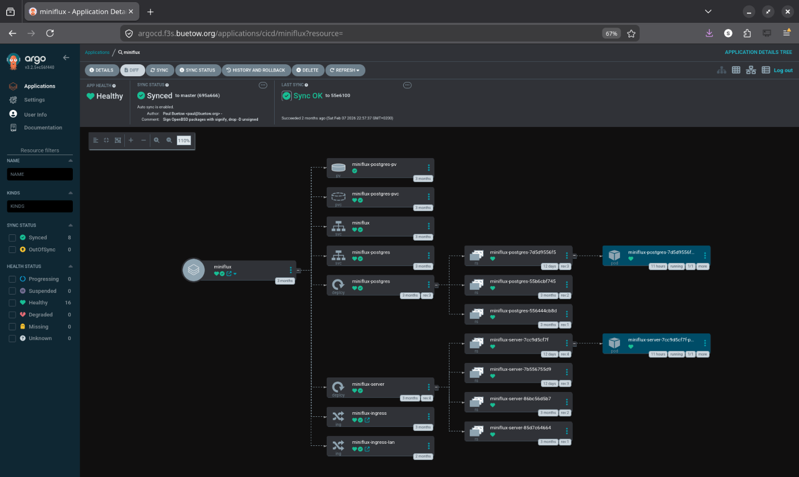
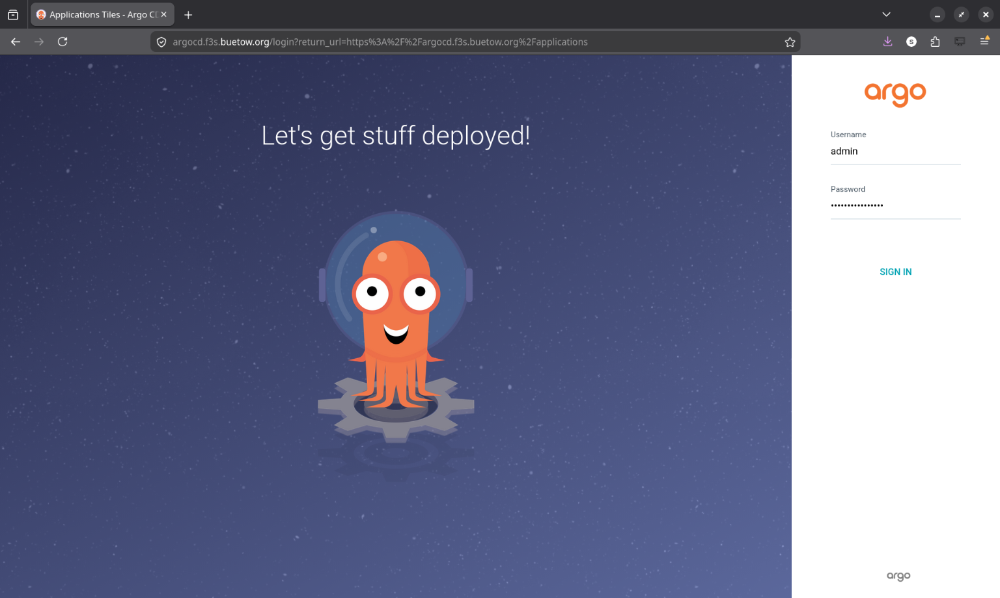
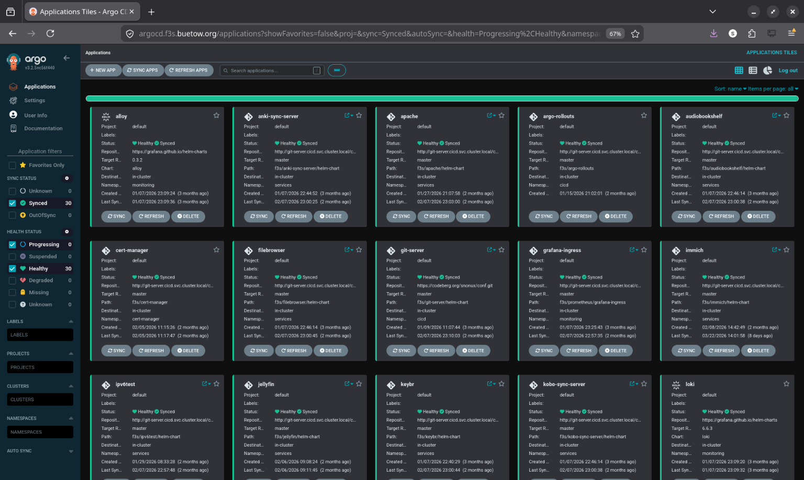

# f3s: Kubernetes with FreeBSD - Part 9: GitOps with ArgoCD

> Published at 2026-04-02T00:00:00+03:00

This is the 9th post in the f3s series about my self-hosting home lab. f3s? The "f" stands for FreeBSD, and the "3s" stands for k3s, the Kubernetes distribution I use on FreeBSD-based physical machines.

[2024-11-17 f3s: Kubernetes with FreeBSD - Part 1: Setting the stage](./2024-11-17-f3s-kubernetes-with-freebsd-part-1.md)  
[2024-12-03 f3s: Kubernetes with FreeBSD - Part 2: Hardware and base installation](./2024-12-03-f3s-kubernetes-with-freebsd-part-2.md)  
[2025-02-01 f3s: Kubernetes with FreeBSD - Part 3: Protecting from power cuts](./2025-02-01-f3s-kubernetes-with-freebsd-part-3.md)  
[2025-04-05 f3s: Kubernetes with FreeBSD - Part 4: Rocky Linux Bhyve VMs](./2025-04-05-f3s-kubernetes-with-freebsd-part-4.md)  
[2025-05-11 f3s: Kubernetes with FreeBSD - Part 5: WireGuard mesh network](./2025-05-11-f3s-kubernetes-with-freebsd-part-5.md)  
[2025-07-14 f3s: Kubernetes with FreeBSD - Part 6: Storage](./2025-07-14-f3s-kubernetes-with-freebsd-part-6.md)  
[2025-10-02 f3s: Kubernetes with FreeBSD - Part 7: k3s and first pod deployments](./2025-10-02-f3s-kubernetes-with-freebsd-part-7.md)  
[2025-12-07 f3s: Kubernetes with FreeBSD - Part 8: Observability](./2025-12-07-f3s-kubernetes-with-freebsd-part-8.md)  
[2025-12-14 f3s: Kubernetes with FreeBSD - Part 8b: Distributed Tracing with Tempo](./2025-12-14-f3s-kubernetes-with-freebsd-part-8b.md)  
[2026-04-02 f3s: Kubernetes with FreeBSD - Part 9: GitOps with ArgoCD (You are currently reading this)](./2026-04-02-f3s-kubernetes-with-freebsd-part-9.md)  

[](./f3s-kubernetes-with-freebsd-part-1/f3slogo.png)  

[](./f3s-kubernetes-with-freebsd-part-9/argocd-app-tree.png)  

## Table of Contents

* [⇢ f3s: Kubernetes with FreeBSD - Part 9: GitOps with ArgoCD](#f3s-kubernetes-with-freebsd---part-9-gitops-with-argocd)
* [⇢ ⇢ Introduction](#introduction)
* [⇢ ⇢ GitOps in a Nutshell](#gitops-in-a-nutshell)
* [⇢ ⇢ ArgoCD](#argocd)
* [⇢ ⇢ Why Bother for a Home Lab?](#why-bother-for-a-home-lab)
* [⇢ ⇢ Deploying ArgoCD](#deploying-argocd)
* [⇢ ⇢ ⇢ Accessing ArgoCD](#accessing-argocd)
* [⇢ ⇢ In-Cluster Git Server](#in-cluster-git-server)
* [⇢ ⇢ Repository Organization](#repository-organization)
* [⇢ ⇢ Migrating an App: Miniflux as Example](#migrating-an-app-miniflux-as-example)
* [⇢ ⇢ ⇢ Migration Order](#migration-order)
* [⇢ ⇢ Complex Migration: Prometheus Multi-Source](#complex-migration-prometheus-multi-source)
* [⇢ ⇢ ⇢ Sync Waves](#sync-waves)
* [⇢ ⇢ The Result](#the-result)
* [⇢ ⇢ What Changed Day-to-Day](#what-changed-day-to-day)
* [⇢ ⇢ Challenges Along the Way](#challenges-along-the-way)
* [⇢ ⇢ ⇢ Helm Release Adoption](#helm-release-adoption)
* [⇢ ⇢ ⇢ PersistentVolumes](#persistentvolumes)
* [⇢ ⇢ ⇢ Secrets](#secrets)
* [⇢ ⇢ ⇢ Grafana Not Reloading](#grafana-not-reloading)
* [⇢ ⇢ ⇢ Prometheus Multi-Source Ordering](#prometheus-multi-source-ordering)
* [⇢ ⇢ Wrapping Up](#wrapping-up)

## Introduction

In previous posts, I deployed applications to the k3s cluster using Helm charts and Justfiles--running `just install` or `just upgrade` to push changes to the cluster. That worked, but it had some drawbacks:

* No single source of truth--cluster state depends on which commands were run and when
* Every change requires manually running commands
* No easy way to tell if the cluster drifted from the desired config
* Rolling back means re-running old Helm commands
* No audit trail for who changed what

So I migrated everything to GitOps with ArgoCD. Now the Git repo is the single source of truth, and ArgoCD keeps the cluster in sync automatically.

## GitOps in a Nutshell

Describe your entire desired state in Git, and let an agent in the cluster pull that state and reconcile it continuously. Every change goes through a commit, so you get version history, collaboration, and rollback for free.

For Kubernetes specifically:

* All manifests, Helm charts, and config live in a Git repo
* ArgoCD watches that repo
* Push a change, ArgoCD applies it
* If someone manually tweaks something in the cluster, ArgoCD detects the drift and reverts it

## ArgoCD

ArgoCD is a GitOps CD tool for Kubernetes. It runs as a controller in the cluster, constantly comparing what's running against what's in Git.

[ArgoCD Documentation](https://argo-cd.readthedocs.io)  

The features I care about most for f3s:

* Automatic sync--monitors Git and applies changes to the cluster
* Application CRDs--each app is a Kubernetes custom resource
* Health checks--knows whether an app is healthy or degraded
* Web UI--visual overview of all applications and their sync status
* Sync waves and hooks--control deployment order and run post-deploy jobs
* Multi-source--combine upstream Helm charts with custom manifests

## Why Bother for a Home Lab?

Honestly, the biggest reason is disaster recovery. If the cluster dies, I can:

* Bootstrap a fresh k3s cluster
* Install ArgoCD
* Point it at the Git repo
* Everything deploys automatically

That's it. No "let me check my shell history to remember how I set this up."

It's also a great way to learn. Setting up GitOps for real--even on a small cluster--teaches you things you won't pick up from tutorials alone. Debugging sync issues, figuring out sync waves, dealing with secrets management--all stuff that's directly applicable at work too.

Beyond that: push to Git, things deploy. No SSH'ing to a workstation to run Helm commands. And if I manually tweak something while debugging and forget about it, ArgoCD reverts it back to the desired state. That's happened more than once.

## Deploying ArgoCD

ArgoCD manages everything else via GitOps, but ArgoCD itself needs a bootstrap. Chicken-and-egg problem.

The installation lives in the config repo:

[github.com/snonux/conf/f3s/argocd](https://github.com/snonux/conf/src/branch/master/f3s/argocd)  

I deployed it using Helm via a Justfile:

```sh
$ cd conf/f3s/argocd
$ just install
helm repo add argo https://argoproj.github.io/argo-helm
helm repo update
kubectl create namespace cicd
kubectl apply -f persistent-volumes.yaml
helm install argocd argo/argo-cd --namespace cicd -f values.yaml
kubectl apply -f ingress.yaml
```

Some highlights from `values.yaml`:

Persistent storage for the repo-server so cloned Git repos survive pod restarts:

```yaml
repoServer:
  volumes:
    - name: repo-server-data
      persistentVolumeClaim:
        claimName: argocd-repo-server-pvc
  volumeMounts:
    - name: repo-server-data
      mountPath: /home/argocd/repo-cache
  env:
    - name: XDG_CACHE_HOME
      value: /home/argocd/repo-cache
```

Server runs in insecure mode since TLS is terminated by the OpenBSD edge relays (same pattern as all other f3s services):

```yaml
server:
  insecure: true
configs:
  params:
    server.insecure: true
```

Dex (SSO) and notifications are disabled--overkill for a single-user home lab:

```yaml
dex:
  enabled: false
notifications:
  enabled: false
```

The admin password is auto-generated on first install and stored in `argocd-initial-admin-secret`. It's preserved across Helm upgrades, so no manual secret creation needed:

```sh
$ just get-password
# Reads from argocd-initial-admin-secret
```

### Accessing ArgoCD

After deployment, ArgoCD runs in the `cicd` namespace:

```sh
$ kubectl get pods -n cicd
NAME                                                READY   STATUS    RESTARTS   AGE
argocd-application-controller-0                     1/1     Running   0          45d
argocd-applicationset-controller-66d6b9b8f4-vhm9k   1/1     Running   0          45d
argocd-redis-77b8d6c6d4-mz9hg                       1/1     Running   0          45d
argocd-repo-server-5f98f77b97-8xtcq                 1/1     Running   0          45d
argocd-server-6b9c4b4f8d-kxw7p                      1/1     Running   0          45d
```

[](./f3s-kubernetes-with-freebsd-part-9/argocd-login.png)  

The ingress exposes both a WAN and LAN endpoint:

```yaml
# WAN access (via OpenBSD relayd)
- host: argocd.f3s.foo.zone
# LAN access (via FreeBSD CARP VIP, with TLS)
- host: argocd.f3s.lan.foo.zone
```

## In-Cluster Git Server

I didn't want ArgoCD pulling from Codeberg over the internet every time it checks for changes. If Codeberg is down (or my internet is), the cluster can't reconcile. So I set up a Git server inside the cluster itself.

[github.com/snonux/conf/f3s/git-server (at 190473b)](https://github.com/snonux/conf/src/commit/190473b/f3s/git-server)  

The git-server runs as a single pod in the `cicd` namespace with two containers sharing a PVC:

* An SSH git server (Alpine + OpenSSH + git-shell) for pushing changes from my laptop
* A CGit web UI with git-http-backend (nginx + fcgiwrap) for browsing repos and HTTP clones

ArgoCD uses the HTTP backend to clone repos. Most Application manifests point at:

```
http://git-server.cicd.svc.cluster.local/conf.git
```

For pushing, I use SSH via a NodePort (30022). The git user is locked down to git-shell--no actual shell access. SSH keys are managed through a Kubernetes Secret.

There's a chicken-and-egg situation here. The git-server's own ArgoCD Application manifest points at Codeberg (not at itself), since ArgoCD needs to bootstrap the git-server before it can use it:

```yaml
# argocd-apps/cicd/git-server.yaml
source:
  repoURL: https://github.com/snonux/conf.git
  targetRevision: master
  path: f3s/git-server/helm-chart
```

Once the pod is up, all other apps use the in-cluster URL. The dependency chain is: Codeberg -> git-server -> everything else.

The repo storage lives on NFS. Initial setup was just cloning the Codeberg repo as a bare repo into the NFS volume, then pointing my laptop's git remote at the NodePort:

```sh
$ git remote add f3s f3s-git:/repos/conf.git
$ git push f3s master
```

ArgoCD detects the change within a few minutes and syncs. No internet required. The whole thing is intentionally minimal--no database, no accounts, no webhooks. Just git over SSH for writes and HTTP for reads.

## Repository Organization

I reorganized the config repo for GitOps. Application manifests are grouped by namespace:

```
/home/paul/git/conf/f3s/
├── argocd-apps/
│   ├── cicd/                  # CI/CD tooling (2 apps)
│   │   ├── argo-rollouts.yaml
│   │   └── git-server.yaml
│   ├── infra/                 # Infrastructure (4 apps)
│   │   ├── cert-manager.yaml
│   │   ├── pkgrepo.yaml
│   │   ├── registry.yaml
│   │   └── traefik-config.yaml
│   ├── monitoring/            # Observability stack (6 apps)
│   │   ├── alloy.yaml
│   │   ├── grafana-ingress.yaml
│   │   ├── loki.yaml
│   │   ├── prometheus.yaml
│   │   ├── pushgateway.yaml
│   │   └── tempo.yaml
│   ├── services/              # User-facing applications (18 apps)
│   │   ├── anki-sync-server.yaml
│   │   ├── apache.yaml
│   │   ├── audiobookshelf.yaml
│   │   ├── filebrowser.yaml
│   │   ├── immich.yaml
│   │   ├── ipv6test.yaml
│   │   ├── jellyfin.yaml
│   │   ├── keybr.yaml
│   │   ├── kobo-sync-server.yaml
│   │   ├── miniflux.yaml
│   │   ├── navidrome.yaml
│   │   ├── opodsync.yaml
│   │   ├── pihole.yaml
│   │   ├── radicale.yaml
│   │   ├── syncthing.yaml
│   │   ├── tracing-demo.yaml
│   │   ├── wallabag.yaml
│   │   └── webdav.yaml
│   └── test/                  # Test/example applications
├── miniflux/                  # Per-app directories (unchanged)
│   ├── helm-chart/
│   │   ├── Chart.yaml
│   │   ├── values.yaml
│   │   └── templates/
│   └── Justfile
├── prometheus/
│   ├── manifests/             # Additional manifests for multi-source
│   └── Justfile
└── ...
```

The per-app directories (miniflux, prometheus, etc.) stayed the same--ArgoCD just points at the existing Helm charts. The main addition is the `argocd-apps/` tree and `manifests/` subdirectories for complex apps.

## Migrating an App: Miniflux as Example

I migrated all apps one at a time. Same procedure for each--here's miniflux as an example.

Before ArgoCD, the Justfile looked like this:

```makefile
install:
    kubectl apply -f helm-chart/persistent-volumes.yaml
    helm install miniflux ./helm-chart --namespace services

upgrade:
    helm upgrade miniflux ./helm-chart --namespace services

uninstall:
    helm uninstall miniflux --namespace services
```

Workflow: edit chart, run `just upgrade`, hope you didn't forget anything.

I created an Application manifest--this tells ArgoCD where the Helm chart lives and how to sync it:

```yaml
apiVersion: argoproj.io/v1alpha1
kind: Application
metadata:
  name: miniflux
  namespace: cicd
  finalizers:
    - resources-finalizer.argocd.argoproj.io
spec:
  project: default
  source:
    repoURL: http://git-server.cicd.svc.cluster.local/conf.git
    targetRevision: master
    path: f3s/miniflux/helm-chart
  destination:
    server: https://kubernetes.default.svc
    namespace: services
  syncPolicy:
    automated:
      prune: true
      selfHeal: true
    syncOptions:
      - CreateNamespace=false
    retry:
      limit: 3
      backoff:
        duration: 5s
        factor: 2
        maxDuration: 1m
```

Then applied it:

```sh
# 1. Apply the Application manifest
$ kubectl apply -f argocd-apps/services/miniflux.yaml
application.argoproj.io/miniflux created

# 2. Verify ArgoCD adopted the existing resources
$ argocd app get miniflux
Name:               miniflux
Sync Status:        Synced to master (4e3c216)
Health Status:      Healthy

# 3. Test that the app still works
$ curl -I https://flux.f3s.foo.zone
HTTP/2 200
```

About 10 minutes, zero downtime. ArgoCD saw that the running resources already matched the Helm chart in Git and just adopted them.

After that, the Justfile is just utility commands--no more install/upgrade/uninstall:

```makefile
status:
    @kubectl get pods -n services -l app=miniflux-server
    @kubectl get pods -n services -l app=miniflux-postgres
    @kubectl get application miniflux -n cicd \
        -o jsonpath='Sync: {.status.sync.status}, Health: {.status.health.status}'

sync:
    @kubectl annotate application miniflux -n cicd \
        argocd.argoproj.io/refresh=normal --overwrite

logs:
    kubectl logs -n services -l app=miniflux-server --tail=100 -f

restart:
    kubectl rollout restart -n services deployment/miniflux-server

port-forward port="8080":
    kubectl port-forward -n services svc/miniflux {{port}}:8080

psql:
    kubectl exec -it -n services deployment/miniflux-postgres -- psql -U miniflux
```

New workflow: edit chart, commit, push. ArgoCD picks it up within a few minutes. Run `just sync` if you're impatient.

### Migration Order

I started with the simplest services (miniflux, wallabag, radicale, etc.)--apps with straightforward Helm charts and no complex dependencies. This let me validate the pattern before touching anything critical.

After that: infrastructure apps (registry, cert-manager, pkgrepo, traefik-config), then the monitoring stack (tempo, loki, alloy, and finally prometheus--the most complex one), and last the CI/CD tools (git-server, argo-rollouts).

## Complex Migration: Prometheus Multi-Source

Prometheus was the tricky one--it combines an upstream Helm chart with a bunch of custom manifests (recording rules, dashboards, persistent volumes, a post-sync hook to restart Grafana).

ArgoCD's multi-source feature made this manageable:

```yaml
apiVersion: argoproj.io/v1alpha1
kind: Application
metadata:
  name: prometheus
  namespace: cicd
spec:
  sources:
    # Source 1: Upstream Helm chart
    - repoURL: https://prometheus-community.github.io/helm-charts
      chart: kube-prometheus-stack
      targetRevision: 55.5.0
      helm:
        releaseName: prometheus
        valuesObject:
          kubeEtcd:
            enabled: true
            endpoints:
              - 192.168.2.120
              - 192.168.2.121
              - 192.168.2.122
          # ... hundreds of lines of config

    # Source 2: Custom manifests from Git
    - repoURL: http://git-server.cicd.svc.cluster.local/conf.git
      targetRevision: master
      path: f3s/prometheus/manifests

  syncPolicy:
    automated:
      prune: false  # Manual pruning--too risky for the monitoring stack
      selfHeal: true
    syncOptions:
      - ServerSideApply=true
```

The `prometheus/manifests/` directory has 13 files. Each one has a sync wave annotation that controls when it gets deployed:

```
f3s/prometheus/manifests/
├── persistent-volumes.yaml              # Wave 0
├── grafana-restart-rbac.yaml            # Wave 0
├── additional-scrape-configs-secret.yaml # Wave 1
├── grafana-datasources-configmap.yaml   # Wave 1
├── freebsd-recording-rules.yaml         # Wave 3
├── openbsd-recording-rules.yaml         # Wave 3
├── zfs-recording-rules.yaml             # Wave 3
├── argocd-application-alerts.yaml       # Wave 3
├── epimetheus-dashboard.yaml            # Wave 4
├── zfs-dashboards.yaml                  # Wave 4
├── argocd-applications-dashboard.yaml   # Wave 4
├── node-resources-multi-select-dashboard.yaml # Wave 4
├── prometheus-nodeport.yaml             # Wave 4
└── grafana-restart-hook.yaml            # Wave 10 (PostSync)
```

### Sync Waves

By default, ArgoCD deploys everything at once in no particular order. Fine for simple apps, but Prometheus breaks--a PVC can't bind if the PV doesn't exist yet, and a PrometheusRule can't be created if the CRD hasn't been registered.

Sync waves fix this. You slap an annotation on each resource:

```yaml
annotations:
  argocd.argoproj.io/sync-wave: "3"
```

ArgoCD deploys all wave 0 resources first, waits until they're healthy, then moves to wave 1, waits again, and so on. Resources without the annotation default to wave 0.

For the Prometheus stack, the waves look like this:

* Wave 0: PersistentVolumes, RBAC--infrastructure that everything else depends on
* Wave 1: Secrets, ConfigMaps--config that Prometheus and Grafana need at startup
* Wave 3: PrometheusRule CRDs--recording rules for FreeBSD, OpenBSD, ZFS, ArgoCD (the operator from wave 0 needs to be running first)
* Wave 4: Dashboard ConfigMaps and nodeport config
* Wave 10: PostSync hook--a Job that runs after all waves complete

ArgoCD also supports lifecycle hooks (`PreSync`, `Sync`, `PostSync`) that run Jobs at specific points. The Grafana restart hook runs after every sync so Grafana picks up updated datasources and dashboards:

```yaml
apiVersion: batch/v1
kind: Job
metadata:
  name: grafana-restart-hook
  namespace: monitoring
  annotations:
    argocd.argoproj.io/hook: PostSync
    argocd.argoproj.io/hook-delete-policy: BeforeHookCreation
    argocd.argoproj.io/sync-wave: "10"
spec:
  template:
    spec:
      serviceAccountName: grafana-restart-sa
      restartPolicy: OnFailure
      containers:
        - name: kubectl
          image: bitnami/kubectl:latest
          command:
            - /bin/sh
            - -c
            - |
              kubectl wait --for=condition=available --timeout=300s \
                deployment/prometheus-grafana -n monitoring || true
              kubectl delete pod -n monitoring \
                -l app.kubernetes.io/name=grafana --ignore-not-found=true
  backoffLimit: 2
```

## The Result

All 30 applications across 5 namespaces, synced and healthy:

```sh
$ argocd app list
NAME                      CLUSTER                         NAMESPACE    PROJECT  STATUS  HEALTH   SYNCPOLICY
alloy                     https://kubernetes.default.svc  monitoring   default  Synced  Healthy  Auto-Prune
anki-sync-server          https://kubernetes.default.svc  services     default  Synced  Healthy  Auto-Prune
apache                    https://kubernetes.default.svc  services     default  Synced  Healthy  Auto-Prune
argo-rollouts             https://kubernetes.default.svc  cicd         default  Synced  Healthy  Auto-Prune
audiobookshelf            https://kubernetes.default.svc  services     default  Synced  Healthy  Auto-Prune
cert-manager              https://kubernetes.default.svc  infra        default  Synced  Healthy  Auto-Prune
filebrowser               https://kubernetes.default.svc  services     default  Synced  Healthy  Auto-Prune
git-server                https://kubernetes.default.svc  cicd         default  Synced  Healthy  Auto-Prune
grafana-ingress           https://kubernetes.default.svc  monitoring   default  Synced  Healthy  Auto-Prune
immich                    https://kubernetes.default.svc  services     default  Synced  Healthy  Auto-Prune
ipv6test                  https://kubernetes.default.svc  services     default  Synced  Healthy  Auto-Prune
jellyfin                  https://kubernetes.default.svc  services     default  Synced  Healthy  Auto-Prune
keybr                     https://kubernetes.default.svc  services     default  Synced  Healthy  Auto-Prune
kobo-sync-server          https://kubernetes.default.svc  services     default  Synced  Healthy  Auto-Prune
loki                      https://kubernetes.default.svc  monitoring   default  Synced  Healthy  Auto-Prune
miniflux                  https://kubernetes.default.svc  services     default  Synced  Healthy  Auto-Prune
navidrome                 https://kubernetes.default.svc  services     default  Synced  Healthy  Auto-Prune
opodsync                  https://kubernetes.default.svc  services     default  Synced  Healthy  Auto-Prune
pihole                    https://kubernetes.default.svc  services     default  Synced  Healthy  Auto-Prune
pkgrepo                   https://kubernetes.default.svc  infra        default  Synced  Healthy  Auto-Prune
prometheus                https://kubernetes.default.svc  monitoring   default  Synced  Healthy  Auto
pushgateway               https://kubernetes.default.svc  monitoring   default  Synced  Healthy  Auto-Prune
radicale                  https://kubernetes.default.svc  services     default  Synced  Healthy  Auto-Prune
registry                  https://kubernetes.default.svc  infra        default  Synced  Healthy  Auto-Prune
syncthing                 https://kubernetes.default.svc  services     default  Synced  Healthy  Auto-Prune
tempo                     https://kubernetes.default.svc  monitoring   default  Synced  Healthy  Auto-Prune
traefik-config            https://kubernetes.default.svc  infra        default  Synced  Healthy  Auto-Prune
tracing-demo              https://kubernetes.default.svc  services     default  Synced  Healthy  Auto-Prune
wallabag                  https://kubernetes.default.svc  services     default  Synced  Healthy  Auto-Prune
webdav                    https://kubernetes.default.svc  services     default  Synced  Healthy  Auto-Prune
```

[](./f3s-kubernetes-with-freebsd-part-9/argocd-apps-list.png)  

## What Changed Day-to-Day

The practical difference is pretty big:

* Single source of truth--clone the repo, look at `argocd-apps/`, and you know exactly what's running. No more `helm list` or guessing.
* Push and forget--edit a Helm value, commit, push. ArgoCD picks it up within a few minutes. No SSH, no `just upgrade`.
* Self-healing--I've tweaked things manually for debugging, forgotten about it, and ArgoCD quietly reverted it. That's saved me from some confusing "why is this behaving differently?" moments.
* Rollback = git revert--`git revert HEAD && git push` and ArgoCD syncs back to the previous state.
* Disaster recovery--bootstrap k3s, install ArgoCD, apply the Application manifests, wait. The cluster rebuilds itself. I haven't had to do this for real yet, but I've tested it and it works.
* Drift detection--the ArgoCD UI shows immediately if something is out of sync. Much better than running `kubectl` commands and comparing output manually.

## Challenges Along the Way

### Helm Release Adoption

When ArgoCD tries to manage resources already deployed by Helm, it can get confused. Fix: make sure the Application manifest matches the current Helm values exactly. ArgoCD then recognizes the resources and adopts them.

### PersistentVolumes

PVs are cluster-scoped, and many of my Helm charts created them with `kubectl apply` outside of Helm. For simple apps I moved PV definitions into the Helm chart templates. For complex apps like Prometheus, I used the multi-source pattern with PVs in a separate `manifests/` directory at sync wave 0.

### Secrets

Secrets shouldn't live in Git as plaintext. For now, I create them manually with `kubectl create secret` and reference them from Helm charts. ArgoCD doesn't manage the secrets themselves. Works, but isn't fully declarative--External Secrets Operator is on the list.

### Grafana Not Reloading

After updating datasource ConfigMaps, Grafana wouldn't notice until the pod was restarted. The PostSync hook (the Grafana restart Job in sync wave 10) handles this automatically now.

### Prometheus Multi-Source Ordering

Without sync waves, Prometheus resources deployed in random order and things broke. PVs before PVCs, secrets before the operator, recording rules after the CRDs. Adding sync wave annotations to everything in `prometheus/manifests/` fixed it.

## Wrapping Up

The migration took a couple of days, doing one or two apps at a time. The result: 30 applications across 5 namespaces, all managed declaratively through Git. Push a change, it deploys. Break something, `git revert`. Cluster dies, rebuild from the repo.

All the config lives here:

[github.com/snonux/conf/f3s](https://github.com/snonux/conf/src/branch/master/f3s)  

ArgoCD Application manifests organized by namespace:

[github.com/snonux/conf/f3s/argocd-apps](https://github.com/snonux/conf/src/branch/master/f3s/argocd-apps)  

I can't imagine going back to running Helm commands manually.

Other *BSD-related posts:

[2026-04-02 f3s: Kubernetes with FreeBSD - Part 9: GitOps with ArgoCD (You are currently reading this)](./2026-04-02-f3s-kubernetes-with-freebsd-part-9.md)  
[2025-12-14 f3s: Kubernetes with FreeBSD - Part 8b: Distributed Tracing with Tempo](./2025-12-14-f3s-kubernetes-with-freebsd-part-8b.md)  
[2025-12-07 f3s: Kubernetes with FreeBSD - Part 8: Observability](./2025-12-07-f3s-kubernetes-with-freebsd-part-8.md)  
[2025-10-02 f3s: Kubernetes with FreeBSD - Part 7: k3s and first pod deployments](./2025-10-02-f3s-kubernetes-with-freebsd-part-7.md)  
[2025-07-14 f3s: Kubernetes with FreeBSD - Part 6: Storage](./2025-07-14-f3s-kubernetes-with-freebsd-part-6.md)  
[2025-05-11 f3s: Kubernetes with FreeBSD - Part 5: WireGuard mesh network](./2025-05-11-f3s-kubernetes-with-freebsd-part-5.md)  
[2025-04-05 f3s: Kubernetes with FreeBSD - Part 4: Rocky Linux Bhyve VMs](./2025-04-05-f3s-kubernetes-with-freebsd-part-4.md)  
[2025-02-01 f3s: Kubernetes with FreeBSD - Part 3: Protecting from power cuts](./2025-02-01-f3s-kubernetes-with-freebsd-part-3.md)  
[2024-12-03 f3s: Kubernetes with FreeBSD - Part 2: Hardware and base installation](./2024-12-03-f3s-kubernetes-with-freebsd-part-2.md)  
[2024-11-17 f3s: Kubernetes with FreeBSD - Part 1: Setting the stage](./2024-11-17-f3s-kubernetes-with-freebsd-part-1.md)  
[2024-04-01 KISS high-availability with OpenBSD](./2024-04-01-KISS-high-availability-with-OpenBSD.md)  
[2024-01-13 One reason why I love OpenBSD](./2024-01-13-one-reason-why-i-love-openbsd.md)  
[2022-10-30 Installing DTail on OpenBSD](./2022-10-30-installing-dtail-on-openbsd.md)  
[2022-07-30 Let's Encrypt with OpenBSD and Rex](./2022-07-30-lets-encrypt-with-openbsd-and-rex.md)  
[2016-04-09 Jails and ZFS with Puppet on FreeBSD](./2016-04-09-jails-and-zfs-on-freebsd-with-puppet.md)  

E-Mail your comments to `paul@nospam.buetow.org` :-)

[Back to the main site](../)  
