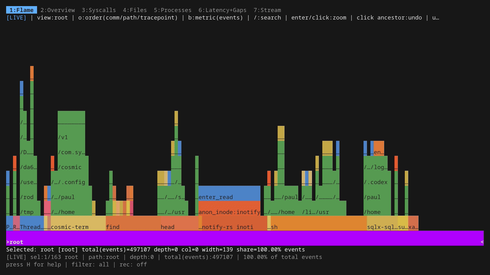

# Unveiling I/O Riot NG — Part 3: under the hood

> Published at 2026-05-16T18:00:00+03:00

This is the third and final post in the series. Part 1 is the demo-driven tour: what ior looks like, how the dashboard tabs work, how the live flamegraph reads, how filtering and recording behave. Part 2 covers the install dance for Rocky Linux 9 and the "compile once, run everywhere" portability story (eBPF, CO-RE, libbpfgo, static linking). This one is the part you read when you've got ior running and want to know what's actually in the data: the per-event schema, the safeguard that keeps syscall coverage current as new kernels ship, the integration test harness that proves it stays current, async-syscall caveats, and what to do with the parquet output once it's on disk.

[](./unveiling-ior-ng/00-hero-flamegraph.png)  

[I/O Riot NG on Codeberg](https://codeberg.org/snonux/ior)  

[2026-05-08 Unveiling I/O Riot NG v1.0.0 — Part 1: a guided tour](./2026-05-08-unveiling-ior-ng-part-1.md)  
[2026-05-11 Unveiling I/O Riot NG — Part 2: install and compile once, run everywhere](./2026-05-11-unveiling-ior-ng-part-2.md)  
[2026-05-17 Unveiling I/O Riot NG v1.0.0 — Part 3: under the hood (You are currently reading this)](./2026-05-17-unveiling-ior-ng-part-3.md)  

## Table of Contents

* [⇢ Unveiling I/O Riot NG — Part 3: under the hood](#unveiling-io-riot-ng--part-3-under-the-hood)
* [⇢ ⇢ What ior actually captures per event](#what-ior-actually-captures-per-event)
* [⇢ ⇢ ⇢ Async syscalls and what "latency" means for them](#async-syscalls-and-what-latency-means-for-them)
* [⇢ ⇢ Keeping up with new syscalls](#keeping-up-with-new-syscalls)
* [⇢ ⇢ ⇢ The integration test harness keeps the classifier honest](#the-integration-test-harness-keeps-the-classifier-honest)
* [⇢ ⇢ Querying a parquet trace with ClickHouse](#querying-a-parquet-trace-with-clickhouse)
* [⇢ ⇢ Asking an AI to do the reading for you](#asking-an-ai-to-do-the-reading-for-you)
* [⇢ ⇢ What's new in v1.1.0](#what-s-new-in-v110)
* [⇢ ⇢ Wrapping up](#wrapping-up)

## What ior actually captures per event

Every traced syscall produces one row of structured data. The schema is what the parquet file (and the in-memory ring buffer behind the dashboard) stores, and it covers all the dimensions you'd want for a post-mortem:

* `seq`: monotonically increasing sequence number, useful for joining/ordering across analysis tools.
* `time_ns`: wall-clock timestamp at syscall entry, in nanoseconds since boot.
* `latency_ns`: how long the syscall took, measured from `sys_enter_X` to `sys_exit_X` of the matching pair.
* `gap_ns`: wall-clock interval since the previous syscall on the same TID (the userspace-side breathing room; see Part 1's Latency+Gaps tab section for the caveat about what "gap" actually means).
* `comm`: the program's `task->comm` string at the time of the syscall (16 chars max, that's a kernel limit, hence truncations like "notify-rs inoti" in the demo screenshots).
* `pid`, `tid`: process and thread IDs.
* `syscall`: the syscall name, e.g. `read`, `openat`, `mkdir`.
* `fd`: the file descriptor passed in (or returned by `open*`).
* `ret`: the syscall return value: number of bytes for read/write, the new fd for open*, 0 or a negative errno otherwise. This is also where exit codes for failed calls live; anything `< 0` is a `-errno`.
* `bytes`: the byte count classified by direction. Bytes read for read-class syscalls, bytes written for write-class syscalls, bytes transferred for `sendfile`/`splice`/`copy_file_range`. Lets you answer "who is hogging disk throughput?" in one query.
* `file`: the file path, where the kernel knows it. From `openat` it's the literal path argument; from `read`/`write` on an existing fd it's resolved via the fd-to-path map ior maintains in BPF.
* `is_error`: boolean shortcut, true iff `ret < 0`. Saves you a `WHERE` clause in 90% of queries.
* `filter_epoch`: bookkeeping for the global filter UI; you can ignore it for offline analysis.

Aggregations the dashboard derives from this raw row stream — counts per syscall/comm/path, rolling rates, per-syscall latency histograms, gap histograms, top-N tables — are all just GROUP BYs over those columns.

### Async syscalls and what "latency" means for them

ior attaches to enter+exit tracepoints for every file-I/O syscall, including the asynchronous ones (`io_uring_enter`, `io_uring_register`, `aio_*`, `sync_file_range`, and so on). Coverage is the same as for blocking syscalls: enter event, exit event, latency = exit − enter.

The catch is that for an async syscall, that latency doesn't mean what you'd intuitively expect. The whole point of an async submission is that the kernel returns immediately while the actual work (the read, the write, the fsync) runs in the background and reports completion later through a different channel (a `cqe` for io_uring, a signal or `aio_suspend` poll for POSIX AIO). So when ior tells you `io_uring_enter` took 4 µs, that's the time spent inside the kernel function ferrying submission queue entries, not the time the storage device spent doing the I/O. Those completions land separately, often on a different thread, and their timing isn't paired with the original enter event. Don't read the latency histogram for `io_uring_enter` as "io_uring is fast"; it's a different question entirely.

The flip side is that ior's per-row throughput numbers (`bytes` summed over a window) still hold for async ops, because the kernel reports the byte count at submission for the cases where it's known up front. So "what processes are dispatching the most async I/O" is a fine question to ask. "How long do those async I/Os actually take" is one ior cannot currently answer; you'd want a per-completion tracepoint pair to do that, which is on the someday-maybe list.

## Keeping up with new syscalls

One of the persistent problems with the original 2017 I/O Riot was that the syscall coverage was a hand-maintained list. Every kernel release added new entry points; some of them were file I/O, some weren't, and there was no automated way to spot the new arrivals. After a couple of years the list had silently rotted. Entire syscalls were missing from traces, and which ones was difficult to detect because nothing flagged them.

The new ior solves this with a code generator that runs against the kernel itself. `mage generate` reads every `/sys/kernel/tracing/events/syscalls/*/format` file on the host (which is the kernel's authoritative, runtime-correct list of every syscall it knows about), parses each one, and runs it through a classifier that decides what kind of file I/O surface it is: fd-based, path-based, dup-style, fcntl-style, async-completion, and so on. The recognized ones get a generated BPF handler emitted into `internal/c/generated_tracepoints.c`; the unrecognized ones get a comment line like `/// Ignoring sys_enter_X sys_exit_X as possibly not file I/O related` in the same file.

The safeguard piece is that the list of ignored syscalls is also extracted into a checked-in audit file (`internal/c/generated_tracepoints_result.txt`) and `mage generate` diffs the new run against the committed copy. If a future kernel adds a syscall ior hasn't seen before, that diff will show it, and a strict-mode regen will fail the build until a human reviews the new entry. So either the new syscall is genuinely not file-I/O (drop a one-line ignore rule, commit the diff) or it is (extend the classifier, commit the new handler). Either way it's not a silent miss.

The current numbers are 234 active tracepoint handlers (117 enter+exit pairs) and 249 ignored syscalls, all enumerated in that one generated file. Compared to the old I/O Riot, where coverage was "however much of the kernel I happened to remember to type out", that's a meaningful step forward.

(I hit this safeguard in practice during the Rocky Linux 9 install in Part 2: the committed audit was generated against a newer kernel, and the strict diff against Rocky's 5.14 refused to overwrite it. The `IOR_FORCE_GENERATE=1` env var skips the strict check and regenerates against the live kernel, which is the right thing on a fresh build host.)

### The integration test harness keeps the classifier honest

The codegen catches "did the kernel grow a new syscall I haven't seen?" but it can't catch "is the handler I generated actually emitting the right `bytes` value for `pwritev2`?" That second question is what `integrationtests/` exists for, and it's the part of the project that gives me the most confidence when bumping kernel versions or rewriting the BPF C side.

The shape is straightforward. A small standalone Go binary, `ioworkload`, performs deterministic syscalls of one kind (a controlled number of `openat`s on a known path, exactly N `read`s of exactly M bytes, an `fcntl` sequence, an `io_uring` submission with a known shape, etc.). The harness runs ior against `ioworkload`'s PID with `-flamegraph -name <scenario>`, lets it run to completion, and parses the resulting `.ior.zst` aggregate. Each test file in `integrationtests/` (`open_test.go`, `read_test.go`, `mmap_test.go`, `iouring_test.go`, `pidfd_test.go`, `copy_file_range_test.go`, and friends) asserts that ior saw exactly what the workload did: counts, byte totals, error rates, file paths.

`mage integrationTest` builds both binaries and runs the suite in parallel up to `INTEGRATION_PARALLEL` (default `NumCPU * 2`). `mage integrationTestSerial` does the same one at a time, which is the right knob when triaging a flake. They need root because of `CAP_BPF`, and they self-skip when not root.

What this buys, in practice: when CO-RE field offsets shift under me, when libbpfgo bumps a major version, when a new kernel quietly changes which syscalls bookkeep `bytes` at submission vs. completion, the suite's the thing that goes red first (not that I believe the kernel would introduce such a breaking change, so maybe this is a bad example). The codegen safeguard tells me "the kernel surface changed". The integration harness tells me "and here's specifically what ior is now getting wrong about it". That's much better than the old "wait for the next time I notice the flamegraph looks weird" workflow.

## Querying a parquet trace with ClickHouse

The schema is flat and stable: `seq, time_ns, gap_ns, latency_ns, comm, pid, tid, syscall, fd, ret, bytes, file, is_error, filter_epoch`. ClickHouse Local reads parquet directly without a server, which makes it a perfect post-mortem tool — point it at the file and run SQL:

[ClickHouse Local — single-binary SQL over Parquet/CSV, no server needed](https://clickhouse.com/docs/operations/utilities/clickhouse-local)  

```sh
clickhouse local --query "
  SELECT comm, syscall, count() AS n,
         formatReadableSize(sum(bytes)) AS total
  FROM file('trace.parquet', Parquet)
  GROUP BY comm, syscall
  ORDER BY n DESC
  LIMIT 10
" --format PrettyCompactNoEscapes
```

```
    ┌─comm────────────┬─syscall─┬─────n─┬─total──────┐
 1. │ notify-rs inoti │ read    │ 42005 │ 732.31 KiB │
 2. │ cosmic-term     │ statx   │ 10898 │ 0.00 B     │
 3. │ cosmic-term     │ read    │ 10103 │ 4.02 MiB   │
 4. │ surface-eDP-1   │ ioctl   │  8452 │ 0.00 B     │
 5. │ cosmic-term     │ close   │  4918 │ 0.00 B     │
 6. │ cosmic-term     │ openat  │  4537 │ 0.00 B     │
 7. │ cosmic-term     │ ioctl   │  3556 │ 0.00 B     │
 8. │ tokio-runtime-w │ read    │  1976 │ 4.04 MiB   │
 9. │ cosmic-comp     │ read    │  1118 │ 6.63 KiB   │
10. │ systemd-oomd    │ read    │  1085 │ 111.97 KiB │
    └─────────────────┴─────────┴───────┴────────────┘
```

The fields you actually want for performance work are `latency_ns` and `gap_ns`. P99 by syscall, only the ones that landed in error:

```sh
clickhouse local --query "
  SELECT syscall, count() AS n,
         round(quantile(0.5)(latency_ns)/1000,  1) AS p50_us,
         round(quantile(0.99)(latency_ns)/1000, 1) AS p99_us
  FROM file('trace.parquet', Parquet)
  WHERE is_error = 1
  GROUP BY syscall
  ORDER BY p99_us DESC
" --format PrettyCompactNoEscapes
```

```
    ┌─syscall────┬─────n─┬─p50_us─┬─p99_us─┐
 1. │ statx      │  1216 │    2.2 │   16.4 │
 2. │ newfstatat │    69 │    1.7 │   16.4 │
 3. │ open       │     1 │   16.1 │   16.1 │
 4. │ mkdir      │   306 │    3.9 │   11.7 │
 5. │ readlink   │    11 │    1.5 │   10.4 │
 6. │ newstat    │    44 │    2.5 │    8.4 │
 7. │ unlinkat   │   347 │      1 │    6.2 │
 8. │ openat     │   380 │    2.1 │    5.8 │
 9. │ access     │     2 │      5 │    5.5 │
10. │ read       │ 23597 │    0.5 │    5.4 │
11. │ ioctl      │   901 │      1 │    5.3 │
12. │ writev     │     1 │    0.7 │    0.7 │
    └────────────┴───────┴────────┴────────┘
```

Real output, by the way: those rows are from a 30-second `ior -parquet trace.parquet` capture on the laptop I'm typing this on. `notify-rs inoti…` is the inotify thread of some Rust app I had open; `cosmic-term` is the COSMIC desktop's terminal emulator. The slowest p99 errors are the directory-walking syscalls (statx, newfstatat, mkdir) at ~16 µs, bog standard.

Same trick works in DuckDB (`duckdb -c "SELECT ... FROM 'trace.parquet'"`), pandas, polars, anything that reads Parquet. The point of streaming Parquet rather than ior's native `.ior.zst` format is exactly this: once it's on disk, you're in the standard data-tools ecosystem.

[DuckDB — single-binary embedded SQL, also reads Parquet directly](https://duckdb.org/)  

## Asking an AI to do the reading for you

Parquet is great if you already have an angle of attack. Sometimes you don't. You just want to know "what's hammering this box right now, and is any of it interesting?" That's where pasting a chunk of trace into an LLM and asking it to look turns out to be a surprisingly effective first pass. ior's `-plain` mode emits CSV, which is exactly the format AI assistants are best at chewing through:

```sh
sudo ior -plain -duration 15 > iotrace.csv
```

The CSV has a one-line ASCII banner at the top followed by the column header `durationToPrevNs,durationNs,comm,pid.tid,name,ret,notice,file` and one row per syscall. (Inside the row the `comm@pid.tid`, `name=>ret` and `file%(fd,flags)` sub-encodings keep the column count low; any half-decent assistant will figure those out unprompted.)

Hand the file to an AI with a prompt like:

> Here is 15 seconds of file-I/O syscall trace from my Fedora laptop captured with `ior -plain`. Tell me which processes are dominant, which syscalls are the noisiest, where the wall-clock time is going, and flag anything suspicious — high error rates, pointless retries, weird hot files. Use the CSV columns as documented.

What I got back on the trace I captured while writing this section (260,547 rows, 15 s, idle COSMIC desktop with htop and a tmux session open) was the following — reproduced verbatim, just to show you what the shape of the answer looks like:

```
TOP COMMANDS BY EVENT COUNT
  htop              130,500 events,  243.9 ms total,   8,855 errors
  notify-rs inoti    49,346 events,   42.1 ms total,  24,610 errors
  cosmic-term        39,534 events,   76.4 ms total,   2,590 errors
  systemd-oomd        5,857 events,   10.0 ms total,     947 errors
  surface-eDP-1       3,535 events,  127.0 ms total,     317 errors  ← high µs/event

TOP SYSCALLS BY TOTAL TIME (ms)
  read     241.3 ms over 122,767 calls    (avg 1.97 µs)
  ioctl    138.0 ms over   8,416 calls    (avg 16.4 µs)
  openat    91.8 ms over  39,684 calls    (avg 2.31 µs)
  statx     19.2 ms over  12,441 calls
  getdents  17.6 ms over   6,770 calls

ERROR RATES THAT STOOD OUT
  mkdir       100.0%   (345/345)   — cosmic-term recreating config dirs that already exist (EEXIST)
  newfstatat   84.3%   (1,816/2,153) — systemd-oomd statting /proc/<pid>/ns/pid for already-gone processes
  read         24.3%   (29,816/122,767) — almost all on anon_inode:inotify and [eventfd], i.e. EAGAIN on
                                          non-blocking fds. Normal, but it's a quarter of all reads.

NOISIEST PATHS (per ENOENT)
  174× /var/lib/flatpak/exports/share/cosmic/com.system76.CosmicTheme.Mode/v1
  174× /usr/local/share/cosmic/com.system76.CosmicTheme.Mode/v1
  174× /home/paul/.local/share/flatpak/exports/share/cosmic/com.system76.CosmicTheme.Mode/v1
  → cosmic-term walks the XDG search path on every redraw. ENOENT-spam, not a perf bug, but worth filing.

WHAT'S ACTUALLY EXPENSIVE
  • htop is the loudest tenant by event count but cheap per-event (~1.9 µs).
    It walks /proc/*/{task,stat,maps,statm} every refresh — expected.
  • surface-eDP-1 is the sleeper: ~36 µs/event, almost entirely DRM ioctls
    on /dev/dri/renderD128 + /dev/dri/card1. That's the GPU compositor path.
  • 24% of read() calls returning -EAGAIN is normal for an event-loop heavy
    desktop (inotify + eventfd on every Tokio runtime), but if you're chasing
    syscall overhead, batching those would matter.

NOTHING SUSPICIOUS — no unexpected processes, no surprise paths outside /proc,
/sys, /dev/dri, ~/.config and the Cosmic/Flatpak search dirs.
```

Two things this is unreasonably good at. First, joining the dots between `comm`, `syscall` and `path` columns to give you a one-paragraph "this is what your machine is doing", the kind of summary that would take you ten ClickHouse queries to assemble by hand. Second, flagging things that are statistically weird without you having to know what to look for: the 100%-error `mkdir` was the EEXIST loop in cosmic-term, the 84%-error `newfstatat` was systemd-oomd racing process exits, the surface-eDP-1 outlier was the only entry on the list with high per-event latency.

A few caveats worth knowing before you rely on this:

* The CSV file gets big fast. Fifteen seconds of an idle desktop produced 260k rows / ~25 MB of CSV; on a busy server you'll want to either trim with `-comm`/`-path`/`-pid` filters at capture time or hand the AI a `head -100000` slice. Most assistants will hit context limits well before the file ends.
* The model is reading text, not running SQL. It will round, it will sometimes miscount the long tail, and it cannot tell you a true p99 from a 250k-row sample without writing code. Treat the output as a lead-generator: it points you at suspects, then you confirm with ClickHouse on the parquet file.
* For deeper questions ("what changed between these two traces?", "which pids dominate during the 12:34 spike?") an agentic assistant that can run shell commands does much better. It'll write the awk/clickhouse query itself, run it, and feed the result back into its own analysis.

The combination that's worked best for me in practice: capture parquet with `-parquet`, also capture a `-plain` CSV slice for the AI to read, ask the AI for a triage pass, then drill into the suspects with ClickHouse on the parquet file. Triage and ground-truth, in that order.

## What's new in v1.1.0

One v1.1.0 change is directly relevant to the syscall-coverage story above: probe attach is now tolerant of missing tracepoints. The codegen safeguard still flags new arrivals at build time, but when the resulting binary lands on a kernel that lacks one of its handlers (because the syscall is newer than the host kernel, or the tracepoint name was renamed under it), ior logs a one-line warning per missing probe and keeps attaching the rest, instead of failing startup with a hard error. Codegen keeps the list honest going forward; the runtime change makes the binary forgiving going backward. The new `ior.el8` build (Part 2's `mage buildDockerEl8` target, for RHEL/Rocky/Alma 8 hosts on 4.18 kernels) leans on this directly — it ships handlers for tracepoints that only exist on newer kernels, and now just skips them at attach instead of aborting.

## Wrapping up

That's the bottom of the stack. For the dashboard surface (what ior looks like, how the seven tabs behave, how filtering and recording work in practice) Part 1 is the demo-driven tour with all the GIFs. For the install dance and the why-the-binary-is-portable story (eBPF, CO-RE, static linking), Part 2 is the install + portability companion.

[Source on Codeberg](https://codeberg.org/snonux/ior)  

E-Mail your comments to `paul@nospam.buetow.org` :-)

Other related posts are:

[2026-05-17 Unveiling I/O Riot NG v1.0.0 — Part 3: under the hood (You are currently reading this)](./2026-05-17-unveiling-ior-ng-part-3.md)  
[2026-05-11 Unveiling I/O Riot NG — Part 2: install and compile once, run everywhere](./2026-05-11-unveiling-ior-ng-part-2.md)  
[2026-05-08 Unveiling I/O Riot NG v1.0.0 — Part 1: a guided tour](./2026-05-08-unveiling-ior-ng-part-1.md)  
[2018-06-01 Realistic load testing with I/O Riot for Linux](./2018-06-01-realistic-load-testing-with-ioriot-for-linux.md)  

[Back to the main site](../)  
