# Running LLMs by myself - Part 1: Hyperstack and vLLM

> Published at 2026-10-06T23:20:00+03:00

The `gt` calculator was built almost entirely with self-hosted LLMs running on rented Hyperstack VMs, and I ended that post with a promise: "I will write another blog post at some point about my setup and what I learned from self-hosting models on Hyperstack." This is that post.

[2026-06-01 `gt` calculator - a calculator built with local LLMs](./2026-06-01-gt-calculator.md)  

Here's my setup, what I learned about inference, and the numbers from using it. I still haven't bought the hardware. This is the first of two parts. The second one is about the pi coding agent, the harness I use with these models.

[2026-10-06 Running LLMs by myself - Part 1: Hyperstack and vLLM (You are currently reading this)](./2026-10-06-running-llms-by-myself-part-1.md)  
[2026-10-07 Running LLMs by myself - Part 2: The pi coding agent](./2026-10-07-running-llms-by-myself-part-2.md)  

[](./running-llms-by-myself/logo.svg)  

## Table of Contents

* [⇢ Running LLMs by myself - Part 1: Hyperstack and vLLM](#running-llms-by-myself---part-1-hyperstack-and-vllm)
* [⇢ ⇢ Why rent instead of buy](#why-rent-instead-of-buy)
* [⇢ ⇢ The setup at a glance](#the-setup-at-a-glance)
* [⇢ ⇢ What decides if this works](#what-decides-if-this-works)
* [⇢ ⇢ How the inference works](#how-the-inference-works)
* [⇢ ⇢ ⇢ CUDA: how vLLM uses the GPU](#cuda-how-vllm-uses-the-gpu)
* [⇢ ⇢ ⇢ What vLLM is](#what-vllm-is)
* [⇢ ⇢ ⇢ Prefix caching: the big one for agentic coding](#prefix-caching-the-big-one-for-agentic-coding)
* [⇢ ⇢ ⇢ Speculative decoding: 2.7× faster decode](#speculative-decoding-27-faster-decode)
* [⇢ ⇢ The VMs and the models](#the-vms-and-the-models)
* [⇢ ⇢ ⇢ Why starting a model takes minutes](#why-starting-a-model-takes-minutes)
* [⇢ ⇢ ⇢ MoE vs dense, and quantization](#moe-vs-dense-and-quantization)
* [⇢ ⇢ ⇢ Why this is the daily driver](#why-this-is-the-daily-driver)
* [⇢ ⇢ ⇢ Reasoning: what it is and the effort levels](#reasoning-what-it-is-and-the-effort-levels)
* [⇢ ⇢ Inside the VM](#inside-the-vm)
* [⇢ ⇢ The numbers](#the-numbers)
* [⇢ ⇢ What it costs, and do I buy the hardware?](#what-it-costs-and-do-i-buy-the-hardware)
* [⇢ ⇢ Wrapping up](#wrapping-up)

## Why rent instead of buy

The main motivation was a question I wanted to answer before spending money: should I buy hardware to run my own LLMs? A new RTX 5090 with 32 GB VRAM costs a few thousand dollars, and a 128 GB DGX Spark is now reported at $6,950, up from $4,699 in February and $3,999 at launch (thanks to the RAM-ocalypse, NVIDIA now even sells a 64 GB DGX Spark, starting at $4,999). Anyways, before putting either on my desk, I wanted to know what it feels like to have a 27B model (and the occasional 120B one) as a daily coding and planning partner. So I rented instead: Hyperstack VMs with A100 80 GB GPUs, spun up when I need them, torn down when I don't.

[Hyperstack](https://www.hyperstack.cloud/)  

A few months in, the setup has grown into a small toolchain I call `hypr`. One Ruby script manages the whole lifecycle (create the VM, open a WireGuard tunnel, start vLLM with the model of choice), and I can run two VMs at the same time, each with its own model and its own pi coding agent in a tmux pane. For example, Qwen3.8 27B works on one project in pane 0 while Gemma 4 31B works on another in pane 1, and can get a 2nd opinion from a different model this way. But often, I simply only run Qwen3.8 on only one VM without the second since that's enough for most of my uses since that model is now soo good that it can do both: Coding and has a lot of good general knowledge. So there is no need anymore to have two models running side-by-side.

[hypr on GitHub](https://github.com/snonux/hypr)  
[Pi coding agent](https://pi.dev)  

## The setup at a glance

Everything starts on my laptop. `ruby hyperstack.rb --vm 1 create` (or `--vm both` for two VMs in parallel) provisions a Hyperstack VM (Ubuntu 24.04 with CUDA and Docker preinstalled, one A100 80 GB PCIe GPU), sets up a WireGuard tunnel to it, and starts the model in a vLLM Docker container. About ten minutes later the model is serving on an OpenAI-compatible API, reachable over the tunnel.

[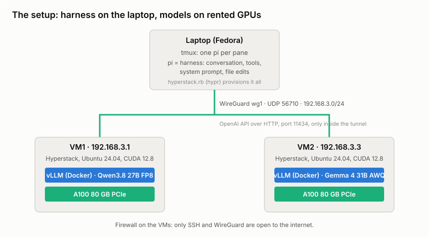](./running-llms-by-myself/architecture.svg)  

The WireGuard tunnel is the interesting bit. A single `wg1` interface on my laptop (Fedora Linux, by the way!) routes traffic to both VMs. The firewall on the Hyperstack VMs only lets in SSH and the WireGuard port, so the vLLM port (11434) is only reachable through the tunnel. There's no other authentication: no proxy, no load balancer, no API keys. The API isn't exposed to the internet at all, and the tunnel is the security boundary.

`hypr` is a Ruby script with a small TOML config per VM. The commands that matter:

* `create` / `delete` — provision or destroy a VM (WireGuard + vLLM included)
* `status` — VM, tunnel and model state
* `test` — end-to-end inference check over the tunnel
* `watch` — live dashboard: GPU, throughput, KV cache per VM
* `model switch <preset>` — replace the serving container with another model on the same VM
* `--no-speculative` — start without speculative decoding (on by default for my Qwen3.8 preset, more below)

## What decides if this works

Before the walkthrough, a short glossary of the things that matter when you run LLMs yourself. The bigger topics get their own section below, come back later in this post, or are covered in part 2:

* VRAM — the GPU's memory (or unified memory on Apple silicon or a DGX Spark). Holds the weights plus the KV cache.
* KV cache — the model's working memory for everything in the context. Grows with context length and lives in VRAM.
* Memory bandwidth — Speed is often limited by memory bandwidth. "Fits" (VRAM) and "feels fast" are different questions.
* Token generation speed (decode tok/s) — the speed you feel while the agent "types".
* Prefill speed (prompt tok/s) — how fast the prompt is read in. Decides how long you wait for the first token.
* Parameter count vs quantization — bigger and less quantized is usually better, but costs VRAM. Newer small models can beat older big ones. It's highly dependent on the model, though.
* MoE vs dense — MoE models only use a small part of their parameters per token. Faster, but not smaller. Quality depends on the particular models, not just this architecture choice. But usually dense models are a bit "smarter" but "slower" (at least after my own experience).
* Context vs weights — weights and cached context share the same memory budget.
* LLM reasoning level — Makes the LLM "think harder" in exchange for more tokens.
* Tool-calling reliability — without working tool calls, you are back to copy-paste chat.
* Harness overhead — the system prompt, tool schemas and extensions eat context before you type a word.
* Runtime — plug-and-play (Ollama, LM Studio) vs knobs and throughput (vLLM). hypr picks the second.

The next section explains how inference works: VRAM, the KV cache, prefill, decode and the runtime. MoE, quantization and reasoning come with the models after that, and the harness topics (system prompt, tool calling) get their own post, the second part of this series.

## How the inference works

I wanted to understand where the time and memory go. This is what I learned.

### CUDA: how vLLM uses the GPU

Running an LLM is mostly one kind of work: huge numbers of multiplications and additions on the model's weights. A CPU does these a few at a time. A GPU does thousands of them at once, which is why the model lives there.

CUDA is NVIDIA's toolkit for making a GPU do that work. The division of labour in my setup is simple:

* The CPU runs vLLM itself. It accepts requests, groups them into batches and decides what to compute next.
* CUDA is the messenger. Through it, vLLM hands the GPU small programs called kernels (nothing to do with the Linux kernel). Each one does a single job, like multiplying two matrices.
* The GPU runs those kernels on the weights and the cached context, which both sit in its own memory (the VRAM).

[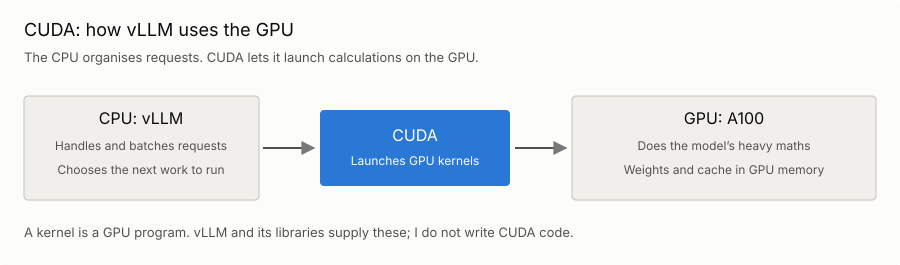](./running-llms-by-myself/cuda.svg)  

I don't write any CUDA code for this. vLLM and the libraries under it (PyTorch, mostly) bring the kernels along. The only CUDA-related thing I touch is one Docker flag: `--gpus all` lets the vLLM container use the VM's GPU and its NVIDIA driver.

The word kernel comes back later: when vLLM starts, it compiles kernels for this particular GPU, and that is one reason a model takes minutes to load.

### What vLLM is

vLLM is an open-source inference engine: the program that takes a model's weights and turns prompts into tokens at high throughput. Ollama does the same job packaged for convenience: one command pulls a quantized model and it's serving. vLLM is the lower-level engine you run yourself, in Docker, with flags, and tune per model. Ollama optimizes for "make it run"; vLLM optimizes for throughput, context length, and batching, and exposes the knobs (`--max-model-len`, `--gpu-memory-utilization`, `--enable-prefix-caching`) so you can spend the VRAM the way your workload needs it.

An LLM request has two phases:

* Prefill — the model processes the prompt, doing work on many tokens together. Long prompts can be split into chunks. This phase makes good use of the GPU's parallel computing power.
* Decode — generating the answer, normally one token at a time. Every new token depends on the previous ones. For a few concurrent conversations, reading the model weights and cached context can be the bottleneck. This is the phase you watch while the agent "types".

[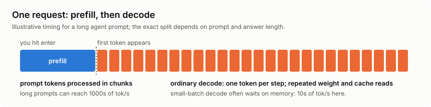](./running-llms-by-myself/prefill-decode.svg)  

The two phases show up as very different numbers. Prefill can process thousands of tokens per second; ordinary decode in my setup produces tens per conversation. During prefill, many tokens share the work of reading weights from GPU memory. During decode, that cost returns at each step. Batching conversations and speculative decoding (below) can get more tokens out of each pass. Prefill and any queueing affect the wait for the first token; decode affects how quickly the answer arrives after that.

One more knob that is good to know about is the temperature: it controls how adventurous the model is when it picks the next token during decode. I currently have no temperature setting in my hypr setup, though.

The key data structure is the KV cache. Full-attention layers reuse key and value tensors from earlier tokens instead of recomputing the whole history for each new token. Their cache grows with the context. My models also have layers that work differently: Qwen3.8-27B has 48 Gated DeltaNet layers with recurrent state and 16 full-attention layers; Gemma 4 mixes sliding-window and global attention. So the exact memory cost depends on the LLM architecture.

The context window is a length limit, while the cache is the memory used to serve requests within that limit. A request needs room for both its prompt and its generated answer, including thinking tokens. Spare cache memory does not raise the configured or supported context limit.

[Qwen3.8-27B architecture and model card](https://huggingface.co/Qwen/Qwen3.8-27B)  
[vLLM: cache management for hybrid models](https://docs.vllm.ai/en/latest/design/hybrid_kv_cache_manager/)  

```
VRAM = model weights + KV/state cache pool + runtime overhead + headroom

--gpu-memory-utilization 0.92   → vLLM may use 92% of the 80 GB
--max-model-len 262144          → max context: 262,144 tokens (the "262K")
```

At startup, vLLM loads the weights, then budgets runtime memory and a pool of cache blocks within the allowed VRAM. That is why `nvidia-smi` (a CLI for NVIDIA cards) shows ~72–75 GiB "used" even when nothing is running. The pool is preallocated, not busy.

[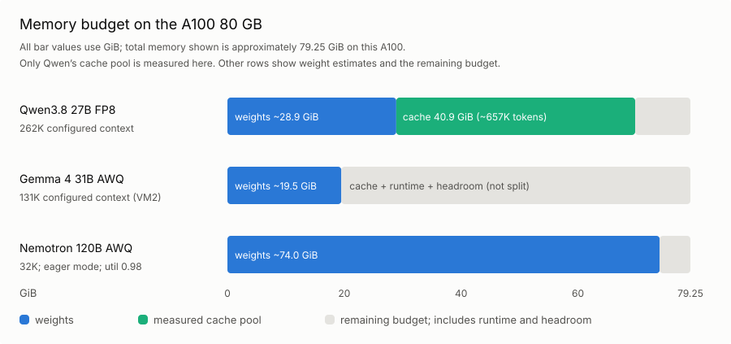](./running-llms-by-myself/vram-budget.svg)  

### Prefix caching: the big one for agentic coding

`--enable-prefix-caching` lets vLLM retain reusable cache blocks between requests until it needs to evict them. If a new request shares a prefix with a previous one (same system prompt, same conversation history), matching cached blocks can skip prefill and therefore speed up the total time until the first token. Evicted blocks and an incomplete final block may still need work.

For a coding agent this is important. Every turn of a coding agent session resends the system prompt plus the entire conversation. Without prefix caching, that whole context is re-prefilled on every single turn. With it, most of the prompt arrives already computed. My current sessions sit at an 80–97% hit rate (numbers below).

[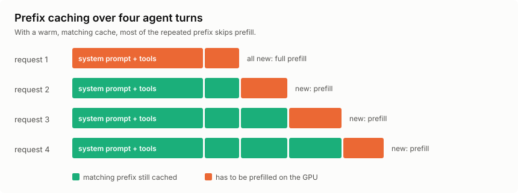](./running-llms-by-myself/prefix-cache.svg)  

vLLM's cache can retain prefixes from several conversations. Ollama has prefix reuse too.

[Ollama's prefix-matching cache implementation](https://raw.githubusercontent.com/ollama/ollama/v0.5.7/llama/runner/cache.go)  
[Ollama: Flash Attention and parallel requests](https://docs.ollama.com/faq)  
[Ollama: configuring context length](https://docs.ollama.com/context-length)  

Ollama is still nicer if I just want a model serving quickly. For several coding agents, I prefer vLLM's batching and cache controls.

### Speculative decoding: 2.7× faster decode

There's one more decode trick, and it turned out to be the biggest speedup in this whole setup: speculative decoding. The idea is to guess the next few tokens cheaply and let the big model check all the guesses in one go.

[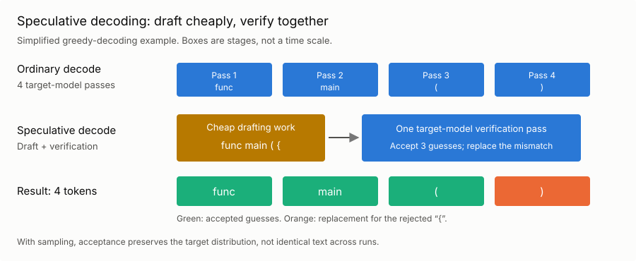](./running-llms-by-myself/speculative.svg)  

Here's a simplified example using greedy decoding, where the model always picks its highest-scoring token:

* A cheap predictor drafts a few tokens. It might be a compatible smaller model or a built-in multi-token prediction (MTP) head.
* The main model checks the draft positions together in one verification pass.
* Matching guesses are accepted until the first mismatch, where the main model supplies the replacement. If every guess matches, it can also supply a bonus token.

[vLLM: speculative decoding and its guarantees](https://docs.vllm.ai/en/latest/features/speculative_decoding/)  

Why can this be faster? Several draft positions share a read of the main model's weights. At small batch sizes, checking those extra positions can be relatively cheap. Drafting and verification still cost time and memory, though, and rejected guesses waste work. The speedup depends on how often the guesses are accepted. Predictable bits of code, such as boilerplate and repeated identifiers, are a useful case to try.

With several agents already batched, there may be less spare capacity for speculation. So I measured both cases.

Qwen3.8's config has `mtp_num_hidden_layers: 1`, so the model ships its own MTP head, and vLLM supports it. In vLLM, it's one flag: `--speculative-config '{"method": "mtp", "num_speculative_tokens": 3}'`. I added it to the Qwen3.8 preset in hypr. It's on by default now, and `--no-speculative` on `create` or `model switch` turns it off again.

To see if it pays off, I benchmarked it on the A100: six Go coding prompts with up to 700 output tokens each, thinking off, first one conversation at a time and then three in parallel. I ran it without speculative decoding and with 2, 3 and 4 drafted tokens. The chart shows sampling at temperature 0.7 and `top_p=0.8`:

[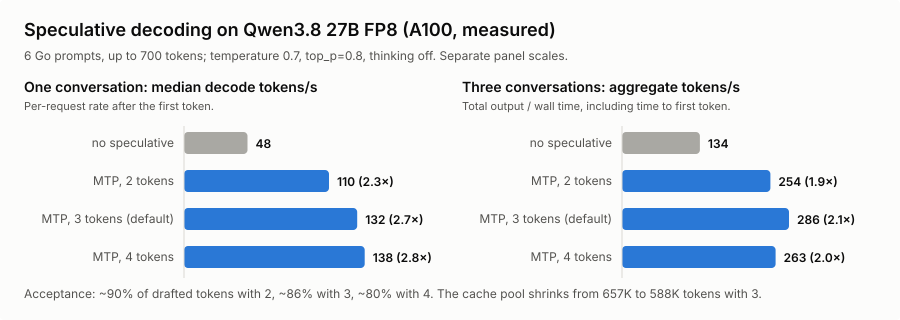](./running-llms-by-myself/speculative-benchmark.svg)  

That's a lot more than I expected. Median decode speed for a single conversation went from 48 to 132 tokens per second with 3 drafted tokens, 2.7 times as fast. This excludes the wait for the first token. Three conversations together went from 134 to 286 tokens per second, counting all wall time including that wait. About 86% of the drafted tokens were accepted: roughly 2.6 accepted guesses plus one target-supplied token per verification step. The MTP head did well on these prompts.

I went with 3 drafted tokens for now. It had the best total throughput with three sampled conversations in this run. Four won with greedy decoding, and even with sampling its per-request decode speed was slightly higher. But its median wait for the first token rose to 1.21 seconds with three sampled conversations; with three drafts it stayed around 0.4 seconds. I only ran six prompts per case, without repeated trials, so this isn't a settled optimum.

The memory cost was about 10% of the KV cache pool: 657K down to 588K tokens, still enough for more than two full 262K contexts.

These were short prompts with thinking off. I haven't measured the speedup in long coding sessions or with thinking on. Even the baseline was faster than the ~40 tokens per second from my recorded work morning (see "The numbers" below). 

[Qwen3.8 FP8 configuration](https://huggingface.co/Qwen/Qwen3.8-27B-FP8/blob/main/config.json)  
[vLLM's Qwen3.8 recipe, including MTP](https://recipes.vllm.ai/Qwen/Qwen3.8-27B)  

## The VMs and the models

Both VMs are `n3-A100x1` flavors: one A100 80 GB PCIe, 28 vCPUs, 120 GB RAM, in a Canadian region. When the A100 flavor is sold out, I manually change the config to `n3-H100x1`. It also has 80 GB of GPU memory, but its hardware, price and performance differ; it is not the machine behind the A100 measurements below.

The default model on VM1 is `Qwen/Qwen3.8-27B-FP8`, a dense 27B model with a native 262K context window, FP8-quantized. As of writing, that is also my main model in this setup, and the throughput and startup observations below are from that setup. VM2 runs `Gemma 4 31B` (AWQ 4-bit) by default, so I can work on two projects in parallel with two different models and compare how they behave.

Each VM's TOML config defines named presets, so switching models does not mean reprovisioning. The memory figures below are approximate weight footprints, not total vLLM allocations. The context lengths are my configured limits, not necessarily the models' native limits:

* `qwen38-27b` — Qwen3.8 27B FP8 (default), ~29 GiB weights, 262K context
* `qwen36-27b` — Qwen3.6 27B FP8, ~29 GiB weights, 262K context
* `gemma4-31b` — Gemma 4 31B IT (AWQ-4bit), ~19.5 GiB weights, 131K context on VM2 where it is the default (32K in VM1's preset)
* `nemotron-super` — Nemotron-3-Super 120B (AWQ 4-bit, Mamba+MoE, 12B active), ~74 GiB weights, 32K context
* `qwen36-35b-a3b` — Qwen3.6-35B-A3B MoE (AWQ 4-bit, 3B active), ~23 GiB weights, 65K context; runs with a quantized KV cache (`turboquant_k8v4`) and chunked prefill disabled
* `qwen3-coder-30b` — Qwen3-Coder-30B-A3B (MoE, AWQ), ~17 GB weights, 65K context
* `deepseek-r1-32b` — DeepSeek-R1-Distill-Qwen-32B (AWQ), ~18 GB weights, 32K context
* `devstral` — Devstral-Small-2507 (AWQ-4bit), ~14 GB weights, 32K context

`ruby hyperstack.rb --vm 1 model switch nemotron-super` stops the running container, starts a new one with the preset's flags, and waits for readiness. The weights are cached on the VM's ephemeral NVMe disk after the first download, but a switch still takes minutes (see below).

Two details:

* These observations used `vllm/vllm-openai:nightly`. I haven't recorded the exact image digest here, so this is a snapshot of that run, not a reproducible benchmark of today's nightly. Use a pinned, compatible release or digest when reproducing it.
* My Nemotron AWQ preset uses 32K (not 1M) context, disables prefix caching and CUDA graph capture (`--enforce-eager`), and raises `--gpu-memory-utilization` to 0.98. These are the settings I used to fit it on one A100, where weights take most of the memory. That tension between model size and context length is the core of VRAM budgeting (see the VRAM chart above).

### Why starting a model takes minutes

Loading a model onto the GPU sounds like "copy 29 GiB from disk to VRAM". That part is actually fast. My provisioning timings and vLLM logs give this approximate breakdown:

[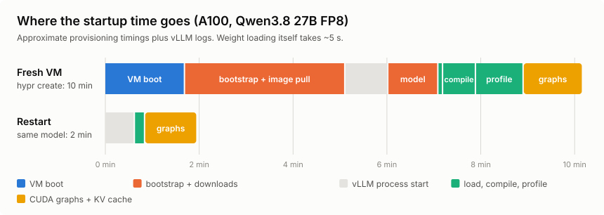](./running-llms-by-myself/startup-timeline.svg)  

On a fresh VM, `hypr create` took about 10 minutes in total:

* VM boot — ~1.5 minutes until Hyperstack hands over a running VM.
* Bootstrap — ~3.5 minutes for packages, WireGuard, the firewall and pulling the vLLM Docker image (about 9 GB compressed).
* vLLM start — ~1 minute for Python, the API server and the engine to come up.
* Weights — ~1 minute to download 29 GiB from Hugging Face, then 5 seconds to load them into VRAM.
* torch.compile — ~40 seconds to compile the model's GPU kernels for this GPU.
* Profiling run — ~1 minute for a dummy pass at the maximum batch size.
* CUDA graphs and KV cache — ~1.3 minutes to allocate the KV cache pool and capture CUDA graphs.

The last three steps prepare the GPU work. Compilation combines and optimises operations, profiling estimates the memory needed during inference, and CUDA graph capture records launch sequences that can be replayed with less CPU overhead. My log reported a 40.9 GiB cache pool and 86 captured graphs.

A restart of the same container is faster: about 2 minutes. The weights are already on disk, and the compiled kernels come from vLLM's on-disk compile cache (0.55 seconds instead of about 40). But the CUDA graphs are captured again on every start (~1 minute), and the Python and API startup doesn't get faster either.

That's why switching models ad hoc is painful. `model switch` takes at least 2 minutes for a model that was already used on this VM, and more for a new one (download plus a cold compile). On top of that, every running agent session loses its prefix cache and has to prefill its whole context again. So instead of switching back and forth, I run two VMs with two different models loaded. Switching between them is then just picking the other provider in pi (`Ctrl+L`), and it's instant.

### MoE vs dense, and quantization

A dense model uses all of its parameters for every token. A mixture-of-experts (MoE) model is split into many "experts", and a small router picks only a few of them per token. So only a small active set does the work, e.g. 3B active out of 35B total.

[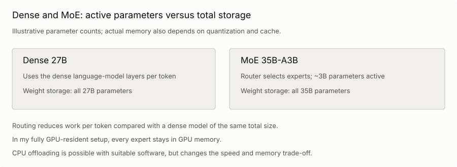](./running-llms-by-myself/moe-vs-dense.svg)  

Reading fewer weights per token can make small-batch decode faster than on a dense model of the same total size. How much faster depends on the routing, kernels and batching, too. In my fully GPU-resident setup, all experts stay in VRAM because the router can choose different ones for the next token. Offloading experts to CPU memory is possible in other setups, but changes the performance trade-off.

Several presets are MoEs (Nemotron-3-Super, `qwen36-35b-a3b`, `qwen3-coder-30b`). Only the active parameters do the work per token, which is why Nemotron can be 120B total with 12B active and still decode at a usable speed. But in this setup all 120B parameters still have to fit into VRAM, and that's why it barely fits once the context is capped. The `qwen36-35b-a3b` preset only fits into ~23 GiB because it's also 4-bit quantized.

Quantization is how the rest of the list fits. FP8 stores the quantized weights in 8 bits (a 27B model is ~27 GB of weights, plus some overhead). AWQ uses 4-bit weights for the quantized layers, plus scales and any layers kept at higher precision. It reduces the footprint; the quality and speed trade-off depends on the model and kernels. FP8 on the 27B is my daily driver: good quality, 28.9 GiB of weights, and 40.9 GiB left for the KV cache. vLLM reports that as 657,281 tokens, enough for about 2.5 full 262K contexts at the same time. I haven't compared these presets against quantization-aware training (QAT) variants on my own tasks. QAT makes lower precision part of training rather than only applying it afterwards.

### Why this is the daily driver

The official model card benchmarks Qwen3.8-27B against its predecessor, Qwen's own closed-weight Qwen3.7-Plus, a 30B-class competitor, and the frontier Opus 4.6 Max. Here are selected coding and general-reasoning rows as a chart:

[")](./running-llms-by-myself/benchmarks.svg)  

It beats its direct predecessor on every row, and the rows that match how I use it are the interesting ones: on SWE-bench Pro (agentic coding) the 27B dense model scores 61.7, ahead of Opus 4.6 Max's 53.4 and Muse Glimmer's 51.2; on terminal coding it runs 73.0 to Qwen3.6's 63.4; on competitive coding (90.3) it even edges Opus (88.8). Those results made it worth trying as a coding partner on one rented A100.

These are vendor-reported scores, and a couple of the benchmarks are Qwen's own. For SWE-bench Pro, Qwen corrected some tasks and re-evaluated the other models with Claude Code, but retained the previously reported Opus score. That makes 61.7 versus 53.4 an uneven comparison. The table also doesn't establish the score of my FP8 checkpoint running through pi.

[Qwen's benchmark table and evaluation notes](https://huggingface.co/Qwen/Qwen3.8-27B#benchmark-results)  

Simon Willison tried the model on a DGX Spark and an M5 Max MacBook the week it shipped. His experience of overthinking matches mine: the model defaults to `xhigh` reasoning effort.

[Qwen 3.8 27B is excellent, but it defaults to wildly overthinking things (Simon Willison)](https://simonwillison.net/2026/Aug/16/qwen-38-27b/)  

### Reasoning: what it is and the effort levels

Reasoning models "think" before they answer. They write out their thoughts first, usually between `<think>` and `</think>` tags, and only then produce the answer or tool call. They were trained (mostly with reinforcement learning) to work through a problem step by step in that scratchpad, and for tricky tasks the answers get noticeably better.

For the inference engine, thinking tokens are completely normal output tokens. They're decoded one by one at decode speed, and they fill the KV cache like everything else. vLLM's reasoning parser (`--reasoning-parser qwen3` in my presets) only splits them from the answer, so pi can show them separately. They are the greyed-out text in the pi screenshots in part 2.

[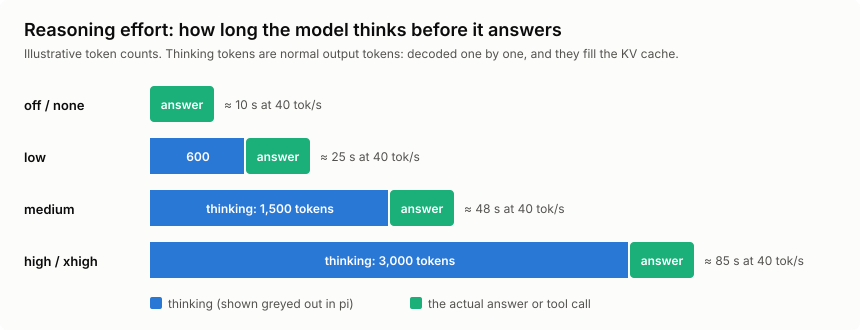](./running-llms-by-myself/reasoning.svg)  

Many models offer reasoning effort levels: off, low, medium, high, and sometimes xhigh. The model was trained to think shorter or longer depending on the level. How the level reaches the model depends on the model and the API:

* A chat template flag — Qwen's `enable_thinking` switches thinking on or off.
* A line in the system prompt — e.g. `Reasoning: high` for OpenAI's open-weight gpt-oss models.
* An API parameter — `reasoning_effort` in OpenAI-style APIs, which the provider translates for the model.

And not every model supports it:

* Models without a dedicated thinking mode do not expose this control.
* Reasoning models such as DeepSeek-R1-Distill do not offer the same supported thinking on/off switch as hybrid models.
* Hybrid models, like Qwen3-32B, Qwen3.6 and Qwen3.8, can switch thinking on and off. Qwen3.8 supports `low`, `medium` and `xhigh`, with `xhigh` as the default.

Here's a catch I only found while writing this post. pi shows "medium" as the thinking level in its footer. But with the `qwen-chat-template` compatibility setting I use, pi sends `enable_thinking: true` or `false` to vLLM without a reasoning effort. So low, medium and high all just mean "on", and Qwen3.8 then thinks at its own default, `xhigh`. That fits the overthinking I've been seeing. pi also asks the chat template to keep the thinking of earlier turns in the history (`preserve_thinking`), so the thinking keeps taking up context later, too. And for Gemma and Nemotron, my pi config marks the models as non-reasoning, so pi's level does nothing there at all. For Nemotron, that's a config gap on my side: its chat template can enable thinking independently of pi's setting. The reasoning parser only separates that output; it does not turn thinking on.

I haven't done a clean on-vs-off comparison on my own tasks yet. But the math is simple: at ~40 tokens per second, 2,000 thinking tokens are 50 seconds before the first word of the answer. For agent turns where I already know what the change should look like, that's mostly wasted time and context. Worth a dedicated experiment later. For now, I live with the default and interrupt the model when it spirals.

Pi's separate `qwen` compatibility path can also send `reasoning_effort` when configured for it. The on/off behaviour above comes from my compatibility setting.

[Pi's thinking-parameter handling](https://github.com/earendil-works/pi/blob/main/packages/ai/src/api/openai-completions.ts)  

## Inside the VM

Once the tunnel is up, the VM is just another machine on your network, and I mostly work on it over its WireGuard address rather than the public IP:

```fish
$ ssh ubuntu@192.168.3.1
ubuntu@hyperstack1:~$ hostname
hyperstack1
```

The entire "AI service" from the inside is one Docker container:

```
$ docker ps
CONTAINER ID   IMAGE                      COMMAND                  CREATED       STATUS       PORTS     NAMES
aa1845729f93   vllm/vllm-openai:nightly   "vllm serve --model …"   2 hours ago   Up 2 hours             vllm_qwen38_27b
```

The interesting part of the container's log is the `Engine 0` line vLLM emits every ten seconds, the same line the `watch` dashboard parses. This snapshot is from later in the day than the numbers further down:

```
$ docker logs --tail 4 vllm_qwen38_27b 2>&1 | grep "Engine 0"
(APIServer pid=1) INFO 09-13 08:56:54 [loggers.py:311] Engine 000: Avg prompt
throughput: 0.0 tokens/s, Avg generation throughput: 53.6 tokens/s, Running:
2 reqs, Waiting: 0 reqs, GPU KV cache usage: 59.3%, Prefix cache hit rate: 96.9%
(APIServer pid=1) INFO 09-13 08:57:14 [loggers.py:311] Engine 000: Avg prompt
throughput: 0.0 tokens/s, Avg generation throughput: 48.3 tokens/s, Running:
1 reqs, Waiting: 0 reqs, GPU KV cache usage: 33.3%, Prefix cache hit rate: 96.9%
```

Follow it live with `docker logs -f vllm_qwen38_27b 2>&1 | grep "Engine 0"`, or watch the hardware side with `nvidia-smi --query-gpu=temperature.gpu,utilization.gpu,power.draw --format=csv -l 5`.

## The numbers

I kept 474 log samples from about 80 minutes of work on the A100, running Qwen3.8-27B-FP8 with a 262K context limit. Here's one:

```
Engine 000: Avg prompt throughput: 253.8 tokens/s, Avg generation
throughput: 35.9 tokens/s, Running: 1 reqs, Waiting: 0 reqs,
GPU KV cache usage: 5.0%, Prefix cache hit rate: 81.1%
```

`ruby hyperstack.rb watch` combines these ten-second log intervals with `nvidia-smi` in a dashboard that refreshes every two seconds:

[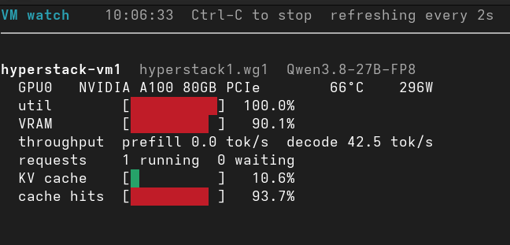](./running-llms-by-myself/watch-dashboard.png)  

* One conversation generated about 40 tok/s. Two or three together reached about 100–110 tok/s total. That was before I turned on speculative decoding. A separate short-prompt benchmark showed 2.7× single-conversation decode speed and 2.1× aggregate throughput with three conversations.
* The busiest ten-second prompt window averaged about 3,000 tok/s. That's an interval average, including gaps, not peak prefill speed.
* Cache usage was around 16% for much of the morning and reached 40%. Prefix-cache hit rates ranged from 80% to 97%.
* The GPU drew about 80 W idle and up to 299 W during a burst, with temperatures from 57°C to 66°C.

The surprise was running three agents in three tmux panes against one GPU. I didn't notice a slowdown. Batching shares weight reads across conversations, although each still adds compute and cache work.

A few dashboard details caught me out. VRAM stays near 90% even when idle because vLLM reserves the cache pool. The separate KV-cache bar shows how much of that pool is in use. Neither bar tells me how close one conversation is to its 262K limit. `running` includes prefill as well as decode, and 100% GPU utilisation means a kernel was running throughout the sample, not that every compute unit was fully used.

[NVIDIA: GPU utilisation](https://docs.nvidia.com/deploy/nvidia-smi/index.html)  

Short turns sometimes finished in 10–15 seconds; long answers and thinking took longer. My old Ollama setup felt slower, but its settings differed, including a 32K context limit. I wouldn't call that a benchmark.

## What it costs, and do I buy the hardware?

The A100 costs $1.35/hour on demand, billed per minute. The H100 fallback is $2.50/hour. Reserved prices start at $0.95 and $1.75 respectively (September 2026). The compute alone would cost $972 for a 30-day month. Hyperstack also lists a public-IP charge of $0.00672043/hour; with one billed IP, that comes to about $976.84. I delete mine when I'm done.

The per-token calculations below use the $1.35/hour compute rate. They exclude the public IP and any additional storage.

[Hyperstack pricing](https://www.hyperstack.cloud/gpu-pricing)  

That recorded morning, before speculative decoding, used about $1.78 of compute for 79 minutes and produced roughly 250K output tokens. Charging the rounded compute cost to output gives about $7.12 per million tokens, including prompt processing and time spent waiting on tools.

Speculative decoding made the tokens cheaper in my short-prompt benchmark. Counting the compute time for the whole run:

* One conversation went from 46.9 to 123 tok/s: $8.00 down to $3.05 per million output tokens, about 62% cheaper.
* Three conversations went from 133.5 to 286.3 tok/s total: $2.81 down to $1.31 per million, about 53% cheaper.

Those runs had thinking off and included the wait for the first token, but no tool calls or idle gaps between coding turns. I haven't measured the savings over a full work session yet. The VM still costs $1.35/hour either way.

[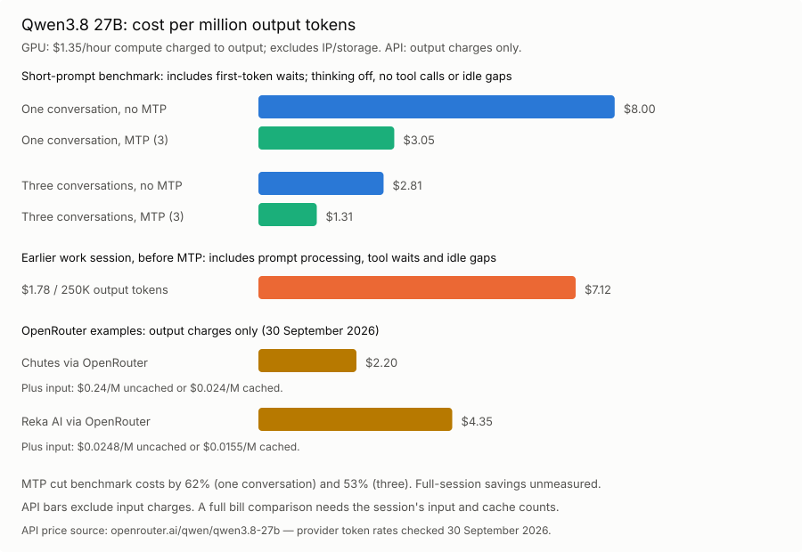](./running-llms-by-myself/cost-per-token.svg)  

For an API comparison, OpenRouter lists these prices for Qwen3.8 27B on 30 September 2026, per million tokens:

* Chutes: $2.20 output, $0.24 uncached input, $0.024 cached input.
* Reka AI: $4.35 output, $0.0248 uncached input, $0.0155 cached input.

The chart shows their output charges; input costs come on top. My GPU bars charge all the compute time to output, including prefill and waits, but exclude the IP and storage charges. I still can't price the full work session through an API: the earlier 11M input-token estimate needs checking because current vLLM logs exclude cache hits from prompt throughput.

[OpenRouter's Qwen3.8 provider prices, checked 30 September 2026](https://openrouter.ai/qwen/qwen3.8-27b)  
[vLLM's token accounting](https://raw.githubusercontent.com/vllm-project/vllm/main/vllm/v1/metrics/loggers.py)  

Buying still doesn't appeal to me:

* An RTX 5090 has 32 GB. My FP8 model with a full 262K context won't fit. Its bandwidth is close to the A100 PCIe's (1,792 versus 1,935 GB/s); memory capacity is the problem here. Lower precision or CPU offloading would change what I could run.
* A DGX Spark has 128 GB, but is now reported at $6,950, after $4,699 in February. The new 64 GB model starts at $4,999, available from 23 October. Its 273 GB/s bandwidth makes ordinary single-stream decode a concern. The advertised 200B model capacity assumes quantization and enough room left for runtime memory.

[RTX 5090 specifications](https://www.gainward.com/main/product/vga/pro/p01225/p01225_datasheet_129567a1dad803604.pdf)  
[A100 specifications](https://www.nvidia.com/en-us/data-center/a100/)  
[DGX Spark price change, February 2026](https://forums.developer.nvidia.com/t/2-23-2026-price-change-announcement/361713)  
[DGX Spark 64 GB at $4,999, 128 GB at $6,950, checked 6 October 2026](https://www.implicator.ai/nvidia-adds-64gb-dgx-spark-at-4-999-as-128gb-model-climbs-to-6-950/)  
[DGX Spark specifications](https://www.nvidia.com/en-eu/products/workstations/dgx-spark/)  

Spark does run CUDA and vLLM, with a compatible ARM container. I could use the same Hugging Face serving approach there; it isn't limited to GGUF or LM Studio.

[Running vLLM on DGX Spark](https://build.nvidia.com/spark/vllm)  

A $5,000 machine, like the 64 GB Spark, equals about 3,704 hours at the A100 compute rate. At four hours every day, that's two and a half years. The 128 GB Spark at $6,950 is about 5,148 hours, or three and a half years. All of that is before electricity, resale value and performance differences. Buying could pay off. I'm just not ready to bet on which machine I'll still want by then.

## Wrapping up

I'll keep renting for now. I still want a GPU on my desk, partly for privacy and partly because I like owning the tools I use. A rented VM is still somebody else's hardware. Perhaps replacing my ThinkPad will be the excuse; perhaps I'll wait for a faster unified-memory box.

I'd keep my cloud subscriptions either way. In my daily work, Opus 5.5 handles the big, messy tasks better. The self-hosted models are useful when I'm closely involved: studying code, writing a test, making a small change, being more in-the-loop. That's how I built `gt`, and it's how I enjoy using them.

The provisioner, model presets and pi extensions are all here:

[hypr on GitHub](https://github.com/snonux/hypr)  

Read the next post of this series:

[Running LLMs by myself - Part 2: The pi coding agent](./2026-10-07-running-llms-by-myself-part-2.md)  

Other related posts:

[2026-10-07 Running LLMs by myself - Part 2: The pi coding agent](./2026-10-07-running-llms-by-myself-part-2.md)  
[2026-10-06 Running LLMs by myself - Part 1: Hyperstack and vLLM (You are currently reading this)](./2026-10-06-running-llms-by-myself-part-1.md)  
[2026-06-01 `gt` calculator - a calculator built with local LLMs](./2026-06-01-gt-calculator.md)  
[2025-08-05 Local LLM for Coding with Ollama on macOS](./2025-08-05-local-coding-llm-with-ollama.md)  

E-Mail your comments to `paul@nospam.buetow.org` :-)

[Back to the main site](../)  
