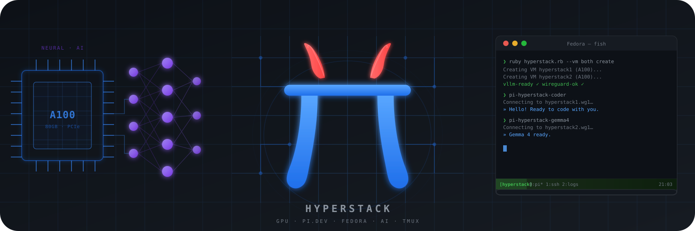
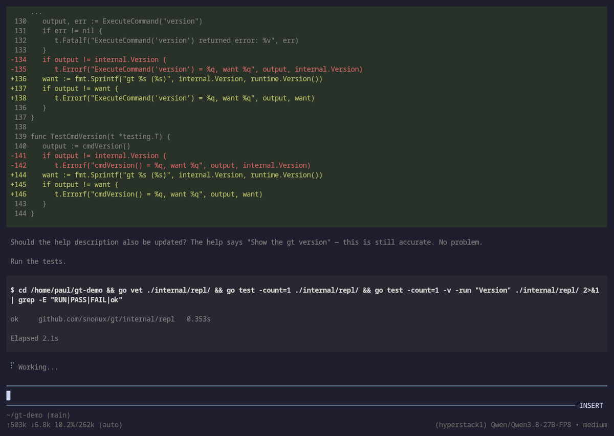
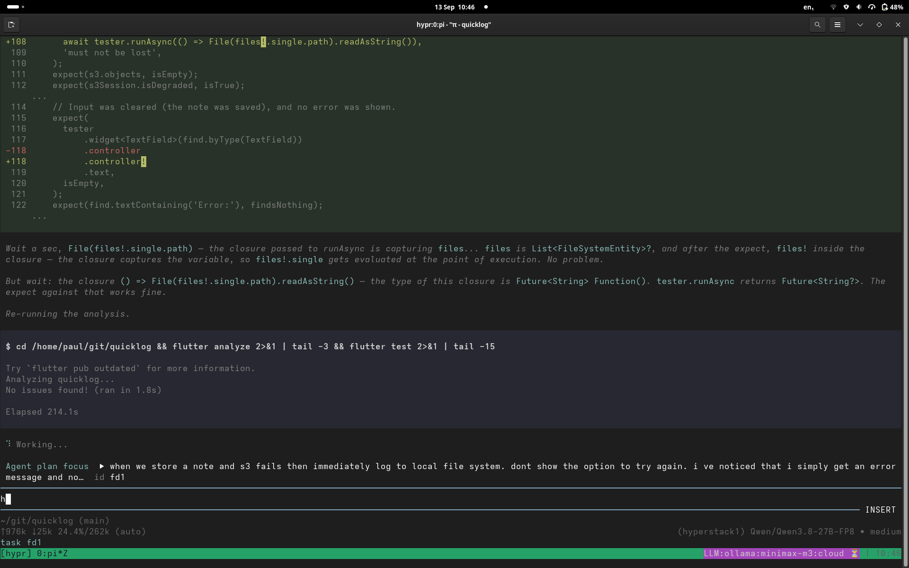
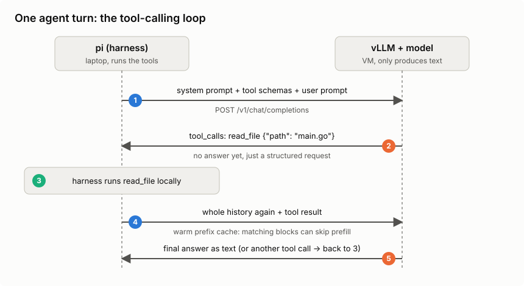
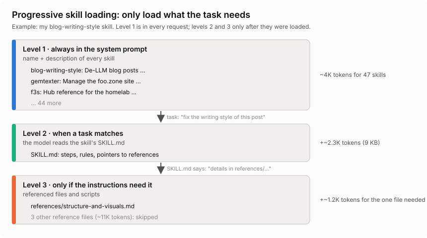

# Running my own LLMs - Part 2: The pi coding agent

> Published at 2026-10-07T22:16:10+03:00

This is the second blog post about running my own LLMs. The first part was about the model side: renting Hyperstack VMs, vLLM, how the inference works and what it all costs. This part is about the other half, the pi coding agent I actually type into.

[2026-10-06 Running my own LLMs - Part 1: Hyperstack and vLLM](./2026-10-06-running-my-own-llms-part-1.md)  
[2026-10-07 Running my own LLMs - Part 2: The pi coding agent (You are currently reading this)](./2026-10-07-running-my-own-llms-part-2.md)  

[](./running-my-own-llms/logo.svg)  

## Table of Contents

* [⇢ Running my own LLMs - Part 2: The pi coding agent](#running-my-own-llms---part-2-the-pi-coding-agent)
* [⇢ ⇢ LLM vs harness](#llm-vs-harness)
* [⇢ ⇢ How pi talks to vLLM](#how-pi-talks-to-vllm)
* [⇢ ⇢ The system prompt and harness overhead](#the-system-prompt-and-harness-overhead)
* [⇢ ⇢ How tool calling works](#how-tool-calling-works)
* [⇢ ⇢ Tool calling on the wire](#tool-calling-on-the-wire)
* [⇢ ⇢ Skills, commands and MCP servers](#skills-commands-and-mcp-servers)
* [⇢ ⇢ Why the harness makes the model look smart (or dumb)](#why-the-harness-makes-the-model-look-smart-or-dumb)
* [⇢ ⇢ The extensions](#the-extensions)
* [⇢ ⇢ What the extensions cost](#what-the-extensions-cost)
* [⇢ ⇢ Tool calling in practice](#tool-calling-in-practice)
* [⇢ ⇢ What I trust it with (and what I don't)](#what-i-trust-it-with-and-what-i-don-t)
* [⇢ ⇢ Wrapping up](#wrapping-up)

## LLM vs harness

I say "the model edited my file" all the time, but that's not really what happens. Two different programs are involved:

* The LLM — the model weights, served by vLLM on the VM. Text goes in, text comes out. It has no memory between requests, can't see my files and can't run anything.
* The harness — pi, running on my laptop. It keeps the conversation, builds the system prompt, offers tools to the model, runs the tools the model asks for, edits the files, and shows it all in the terminal.

Claude Code, Codex, OpenCode and Cursor are harnesses, too. They usually come bundled with their vendor's model, which blurs the line. With a self-hosted setup the line is very visible: the model is on a VM in Canada, the harness is on my laptop, and the only thing between them is HTTP over WireGuard.

So the model decides what to do, and the harness does it. That's why I can swap the model under pi with one keystroke without changing anything else. It's also why the same model can feel smart in one harness and dumb in another. The harness decides what the model gets to see, and that has a huge effect on how good "the LLM" seems. More on that once the system prompt, tools and skills are explained.

## How pi talks to vLLM

Pi speaks the OpenAI chat completions API, and vLLM serves exactly that on `:11434`, so pi points straight at the VM over the tunnel, with no translation proxy in between.

The repo ships a `pi/` directory that I symlink to `~/.pi`. It defines providers in `models.json`, one per VM, plus a single-VM variant:

* `hyperstack1` → `http://hyperstack1.wg1:11434/v1` — Qwen3.8 27B FP8
* `hyperstack2` → `http://hyperstack2.wg1:11434/v1` — Gemma 4 31B AWQ
* `hyperstack` → `http://hyperstack1.wg1:11434/v1` — single-VM variant, same endpoint as VM1

Every preset from the TOML configs is registered under its provider, so after a `model switch` I can just tell pi to use the new model ID, or hit `Ctrl+L` in the TUI to switch models mid-session without restarting.

Fish abbreviations keep the day-to-day short:

```fish
abbr pi-hyperstack-coder  pi --model hyperstack1/Qwen/Qwen3.8-27B-FP8
abbr pi-hyperstack-gemma4 pi --model hyperstack2/cyankiwi/gemma-4-31B-it-AWQ-4bit
```

My standard setup is a tmux session with one pi per pane: `pi-hyperstack-coder` on Qwen3.8 in pane 0, `pi-hyperstack-gemma4` in pane 1, each working on a different project against its own VM. When one model gets stuck on a task, I hand the same problem to the other pane and compare.

Here is what a session looks like in practice. I asked Qwen3.8 on VM1 to add a `version` command to the REPL of `gt`, and then to include the Go runtime version in its output. The screenshot shows the Go diff for the tests, followed by the test run. The footer shows the model and how much of the 262K context the session has used so far:

[](./running-my-own-llms/pi-go-edit.png)  

And one from an earlier session: diff on top, the model's reasoning in the middle, shell output at the bottom:

[](./running-my-own-llms/pi-coding-agent.png)  

## The system prompt and harness overhead

Pi puts a system prompt in front of the conversation. It tells the model what it's there for, how to use the tools, and which project rules apply.

This is the start of the built-in system prompt from the pi version I used for these sessions, trimmed a little. Current upstream pi builds it in named sections, so the exact layout below is a snapshot of my setup:

```
You are an expert coding assistant operating inside pi, a coding agent
harness. You help users by reading files, executing commands, editing
code, and writing new files.

Available tools:
- read: Read file contents
- bash: Execute bash commands (ls, grep, find, etc.)
- edit: Make precise file edits with exact text replacement, including
  multiple disjoint edits in one call
- write: Create or overwrite files

Guidelines:
- Use read to examine files instead of cat or sed.
- Use edit for precise changes (edits[].oldText must match exactly)
- Use write only for new files or complete rewrites.
- Be concise in your responses
- Show file paths clearly when working with files
```

In that version, the project context (`AGENTS.md` or `CLAUDE.md`) came next, followed by the skills, then the date and working directory:

```
<project_context>
Project-specific instructions and guidelines:
<project_instructions path="/home/paul/git/hypr/AGENTS.md">
...
</project_instructions>
</project_context>

The following skills provide specialized instructions for specific tasks.
Use the read tool to load a skill's file when the task matches its description.

<available_skills>
  <skill>
    <name>solid-principles</name>
    <description>This skill should be used when the user asks to "check SOLID violations", "audit class design", ...</description>
    <location>/home/paul/.agents/skills/solid-principles/SKILL.md</location>
  </skill>
  ...
</available_skills>

Current date: 2026-09-30
Current working directory: /home/paul/git/hypr
```

Putting the stable instructions first gives prefix caching more to reuse. The layout has changed since these sessions; current upstream's system-prompt builder no longer adds the date shown here.

[Pi's system-prompt builder](https://github.com/earendil-works/pi/blob/main/packages/coding-agent/src/core/system-prompt.ts)  

You never type it, but it's resent with every request and takes up KV cache like everything else. So do all the tool definitions (bash, read, edit, `web_search`, ...), skill descriptions (more on skills below), and project instructions such as an `AGENTS.md`. With dozens of tools, that's thousands of tokens before you've typed a word. While those definitions stay the same and the cache blocks are still there, vLLM can reuse that prefix as explained in part 1.

## How tool calling works

The model doesn't run anything itself. The harness sends it a list of tool schemas (name, description, JSON arguments) along with the prompt. When the model wants to act, it outputs a structured call such as `read_file {"path": "main.go"}` instead of prose. The harness runs the tool, appends the result to the conversation, and asks the model again. That repeats until the task is done.

A malformed call or the wrong tool choice can stop that loop.

[](./running-my-own-llms/agent-loop.svg)  

## Tool calling on the wire

So what does this look like on the wire? Since vLLM speaks the OpenAI chat completions API, the whole agent loop is ordinary HTTP. Here's one turn, trimmed down. First, the harness (pi) sends the conversation plus the tool schemas:

```
POST http://hyperstack1.wg1:11434/v1/chat/completions
{
  "model": "Qwen/Qwen3.8-27B-FP8",
  "messages": [
    {"role": "system", "content": "You are a coding agent. Use the tools..."},
    {"role": "user",   "content": "What does main.go do?"}
  ],
  "tools": [{
    "type": "function",
    "function": {
      "name": "read_file",
      "description": "Read a file from the project",
      "parameters": {
        "type": "object",
        "properties": {"path": {"type": "string"}},
        "required": ["path"]
      }
    }
  }]
}
```

The model doesn't answer the question yet. It answers with a tool call instead of text. This is the real (trimmed) response from Qwen3.8 on VM1:

```
{
  "role": "assistant",
  "content": null,
  "tool_calls": [{
    "id": "chatcmpl-tool-996eae953d7c06fa",
    "type": "function",
    "function": {"name": "read_file", "arguments": "{\"path\": \"main.go\"}"}
  }]
}
```

The API returns `arguments` as a JSON string. With the `qwen3_coder` parser that hypr sets for Qwen, the model generates tagged function and parameter text, and vLLM turns it into that JSON. A malformed call can still break parsing. The harness validates the arguments, runs the tool locally, and sends everything back with the result appended:

```
"messages": [
  {"role": "system",    "content": "You are a coding agent. Use the tools..."},
  {"role": "user",      "content": "What does main.go do?"},
  {"role": "assistant", "tool_calls": [{"id": "chatcmpl-tool-996e...", ... "read_file" ...}]},
  {"role": "tool",      "tool_call_id": "chatcmpl-tool-996e...", "content": "package main\n\nfunc main() {..."}
]
```

By the way, vLLM reported 292 prompt tokens for that first request, with just one short system prompt and one tool. pi's real system prompt with all its tools is a lot bigger.

Now the model has the file contents in its context and can answer in plain text (or request another tool call, and the loop goes on). Two things I found interesting here. In this text-only workflow, the model sees text going in and text coming out, so "calling a tool" is just a special output format it was trained to produce. And every round trip resends the whole history, including all tool results, so the context (and the KV cache) grows with every step. That is why agentic work is so prefix-cache-heavy.

For automatic tool selection in my setup, vLLM needs `--enable-auto-tool-choice` and a matching `--tool-call-parser`, here `qwen3_coder`. hypr sets these per preset. A wrong parser can leave raw text where the agent expects a tool call. Named and required tool calling also have structured-output paths that work without enabling automatic tool selection.

[vLLM tool calling](https://docs.vllm.ai/en/latest/features/tool_calling/)  

## Skills, commands and MCP servers

Pi has prompt templates and skills. I initially thought of them as manual versus automatic prompts, but there is some overlap:

* Prompt templates expand text when I invoke them. Slash commands can also run extension code, as `/handoff` and `/plan` do in my setup.
* Skills are folders with a `SKILL.md` and, sometimes, scripts or references. The model can choose one, or I can load it myself with `/skill:name`.

Pi lists the skills available for automatic selection in the system prompt. A skill with `disable-model-invocation: true` stays out of that list; I have to invoke it myself. For the advertised skills, loading works in three steps:

* Level 1 — names, descriptions and paths of the advertised skills go into the system prompt.
* Level 2 — the full `SKILL.md` enters the conversation when the model reads it or I invoke `/skill:name`.
* Level 3 — files the `SKILL.md` points to, like reference docs or scripts. Only read if the instructions for the task at hand need them.

[](./running-my-own-llms/skill-loading.svg)  
[Pi skills and explicit invocation](https://github.com/earendil-works/pi/blob/main/packages/coding-agent/docs/skills.md)  

Those advertised descriptions cost context on every request, even for skills I never use. Levels 2 and 3 cost nothing until they're loaded. But once the model has read a `SKILL.md` or a reference file, it's a tool result in the conversation, and it stays in the context (and the KV cache) for the rest of the session, until a compaction or a `/handoff` throws it out. My solid-principles skill is a good example: its `SKILL.md` is ~1.2K tokens, and the one reference file a single-principle check needs (say `srp.md`) is another ~1K. The other four reference files (~5K tokens) stay on disk unless a task asks for them. Loading everything up front would cost ~7K tokens, which is almost a quarter of a 32K preset.

I have 45 skills and 21 commands in my pi setup. The skill descriptions alone are ~17 KB of text. With names, paths and tags, the whole list is about 25 KB, roughly 6K tokens in every request. On the 262K daily driver, that's fine. On a 32K preset, it's almost a fifth of the context gone before I've typed a word.

The bigger downside of too many skills isn't even the tokens, though. The model has to pick the right skill from the list, and with many similar descriptions, it picks the wrong one or none at all. Big frontier models handle that pretty well. Smaller self-hosted models get confused much more easily. So fewer, clearly distinct skills work better, especially with local models.

MCP (Model Context Protocol) connects a harness to tools and resources from another process or service, say a database or a browser. Current upstream pi supports MCP over stdio and HTTP. It can expose tools directly, load their definitions through tool search, or let the model call them through code. Connecting a server with dozens of tools doesn't have to put all their schemas into every request.

I don't use MCP in this setup. CLI tools and skills cover what I need so far. Mario Zechner's earlier post explains that approach, though its description of pi predates the current MCP support.

[Pi's current MCP support](https://github.com/earendil-works/pi/blob/main/packages/coding-agent/docs/mcp.md)  
[What if you don't need MCP? (Mario Zechner)](https://mariozechner.at/posts/2025-11-02-what-if-you-dont-need-mcp/)  

## Why the harness makes the model look smart (or dumb)

Pi decides which project details the model gets to see and which tools it can use. A few things matter in practice:

* Context selection — which files, logs and search results the harness feeds in. The model can't fix code it has never seen.
* System prompt and tool descriptions — clear instructions and well-named tools mean fewer wrong tool calls.
* Tool design — a precise "replace this exact snippet" edit tool is much easier for a model than rewriting a whole file.
* Feedback loops — running tests, `go vet` or the compiler and feeding the errors back lets the model fix its own mistakes.
* Context hygiene — compaction, `/handoff` and sub-agents keep the context short, and models get worse as the context fills up.
* Tolerance for quirks — the right chat template, tool-call parser and small repairs (like `nemotron-tool-repair`) keep one broken call from derailing a session.
* Settings — reasoning effort, temperature and the context limit are configured on the harness or provider side, not in the weights.

The screenshot above is a good example. Qwen3.8 didn't just write the `version` command. It looked at how the other builtins are registered, added a matching help entry, and ran `go vet` and the tests before saying it was done. The model did the thinking, but it could only do that because pi gave it file reading, editing and a shell, and fed the test output back into the context.

This also matters for benchmarks. Scores like SWE-bench are measured with a specific agent setup around the model. Put the same weights into a different harness, and you get different results, sometimes a lot better or worse. So when a self-hosted model disappoints, it's worth checking the harness side (tools, context, parser, settings) before blaming the weights.

## The extensions

Pi has no built-in plan mode or sub-agents, and it doesn't ask for approval before every tool call. Current upstream does have project-trust prompts before loading project extensions and other resources.

[Pi's project trust and tool permissions](https://github.com/earendil-works/pi/blob/main/packages/coding-agent/docs/security.md)  

I use TypeScript extensions from the `hypr` repo for the rest. These are the ones I use daily:

* `web-search` — `web_search` and `web_fetch` tools backed by DuckDuckGo (no API key), so the agent looks things up instead of guessing from training data.
* `inline-bash` — `!{cmd}` in a prompt expands the command's output before it reaches the model; that is how `git status`, logs, and `nvidia-smi` output end up inside a question.
* `ask-mode` — `/ask` flips the session into a read-only investigation mode: understand the codebase and read logs with editing tools disabled and shell commands filtered. This is a convenience mode, not an enforced read-only filesystem; its command filter can still allow writes. Before I let a model near code I don't fully know, this is the first call: `/ask why does the tunnel setup regenerate keys on the second run?`
* `loop-scheduler` — `/loop` re-sends a prompt on an interval and `/watch` fires when the agent goes idle or a response contains a substring. The two forms I actually use: `/loop 10m check the VM status and warn me if KV cache usage is above 80%` for the periodic check, and the reactive `/watch contains ERROR => summarize the latest error and propose a fix`. That is how I babysit long builds and flaky services.
* `handoff` — `/handoff <goal>` compacts the session into a self-contained prompt for a fresh one, so a long-lived agent does not drown in its own history.
* `fresh-subagent` — the `subagent` tool and `/subagent` command run a self-contained task in a clean `pi` process with its own log file, while the main session stays focused: `/subagent review the last commit and list the risks` gives me the verdict without the digging.
* `btw` — a mid-task question that must not derail the context: `/btw which file owns the SSH host key bootstrap logic?` The answer appears in a temporary overlay and stays out of the session history.
* `agent-plan-mode` — `/plan` separates planning from execution: a read-only planning mode, a numbered plan, then the plan converted into real tasks before anything gets built. That is how the multi-step work in this repo stays on rails.
* `modal-editor` — an in-TUI modal editor for composing long prompts without fighting the line editor.
* `session-name` — labels a session with something more useful than the first prompt line.

The long tail is smaller: `nemotron-tool-repair` fixes the malformed tool calls the Nemotron models occasionally emit, and `prompt-history` quietly records the last 500 prompts.

For the record: `handoff`, `inline-bash`, `session-name`, and `reload-runtime` are upstream pi examples installed locally; the rest are my own (created with the help of LLMs).

## What the extensions cost

Tools exposed directly to the model add their definitions to its input, just as advertised skills add their descriptions. Deferred tools only add their full definitions when loaded. I haven't measured the exact token bill of the full extension set, but it isn't free. On the 27B FP8 daily driver the full set is fine. On the smaller AWQ presets with 32K context, I'd start with fewer tools and add them when needed, since fewer tools also means fewer chances for a small model to pick the wrong one or mangle the arguments. That's a hypothesis, though. I haven't measured it.

## Tool calling in practice

I haven't compared tool-call reliability systematically across the preset list, so no failure-rate table from me. What I know from daily use: the Nemotron models occasionally emit malformed tool calls, which is why `nemotron-tool-repair` exists. It patches the broken calls so the session continues instead of stalling.

## What I trust it with (and what I don't)

The `gt` calculator was the proof case, a real project built almost entirely on this stack. Day to day I also use it for ops babysitting via `/loop` and `/watch`: check the VM, watch a build, poke me when something smells wrong. That is work I trust it with.

Vendor SWE-bench numbers are not my session success rate. Hit-and-miss still happens. When a turn starts looping or the model gets lost in its own plan, I bounce the hard bit to a hosted frontier model and bring the answer back.

It's good enough that I built a real project on it and keep using it every day. But I still have to babysit it.

## Wrapping up

That was the harness side of my setup. The pi extensions, together with the provisioner and the model presets from part 1, are all here:

[hypr on GitHub](https://github.com/snonux/hypr)  

Read the previous post of this series:

[Running my own LLMs - Part 1: Hyperstack and vLLM](./2026-10-06-running-my-own-llms-part-1.md)  

Other related posts:

[2026-10-07 Running my own LLMs - Part 2: The pi coding agent (You are currently reading this)](./2026-10-07-running-my-own-llms-part-2.md)  
[2026-10-06 Running my own LLMs - Part 1: Hyperstack and vLLM](./2026-10-06-running-my-own-llms-part-1.md)  
[2026-06-01 `gt` calculator - a calculator built with local LLMs](./2026-06-01-gt-calculator.md)  
[2025-08-05 Local LLM for Coding with Ollama on macOS](./2025-08-05-local-coding-llm-with-ollama.md)  

E-Mail your comments to `paul@nospam.buetow.org` :-)

[Back to the main site](../)  
