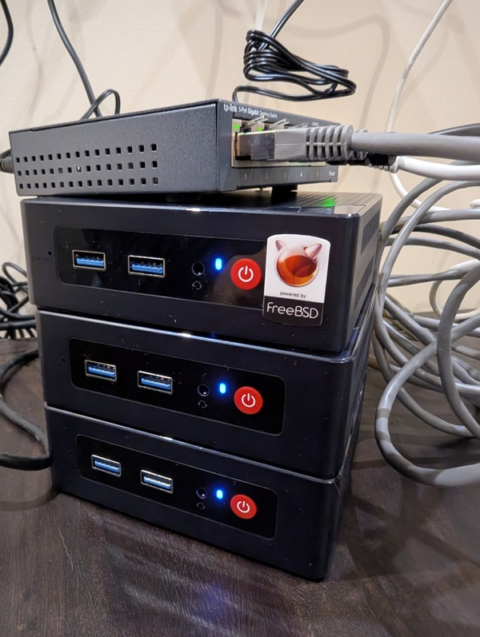
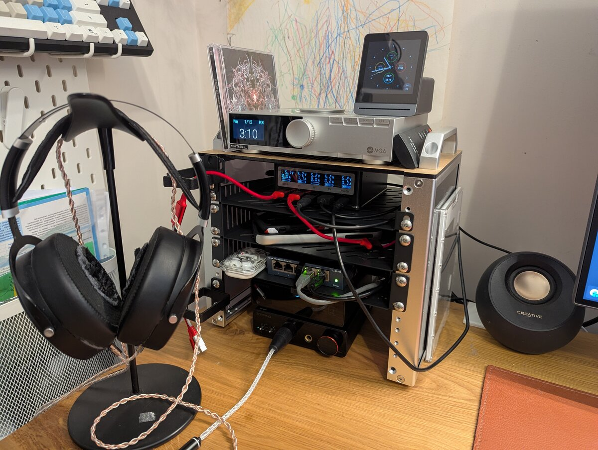
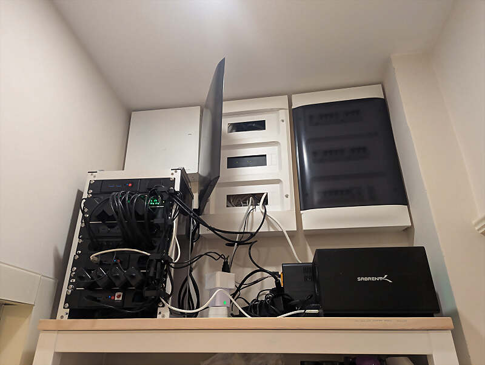
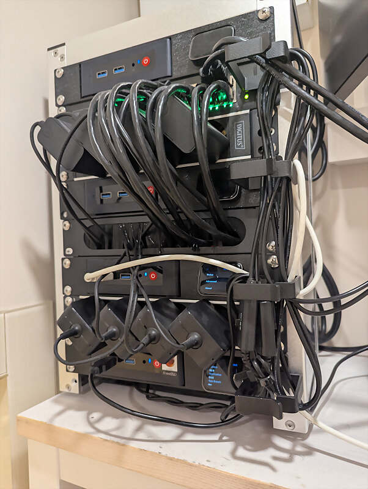
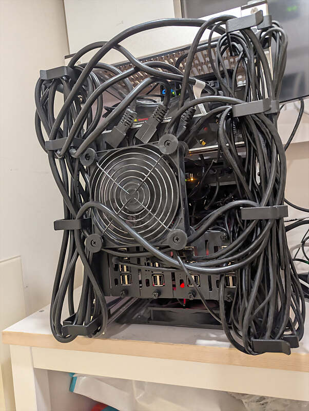
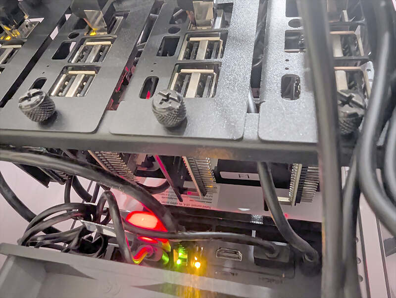
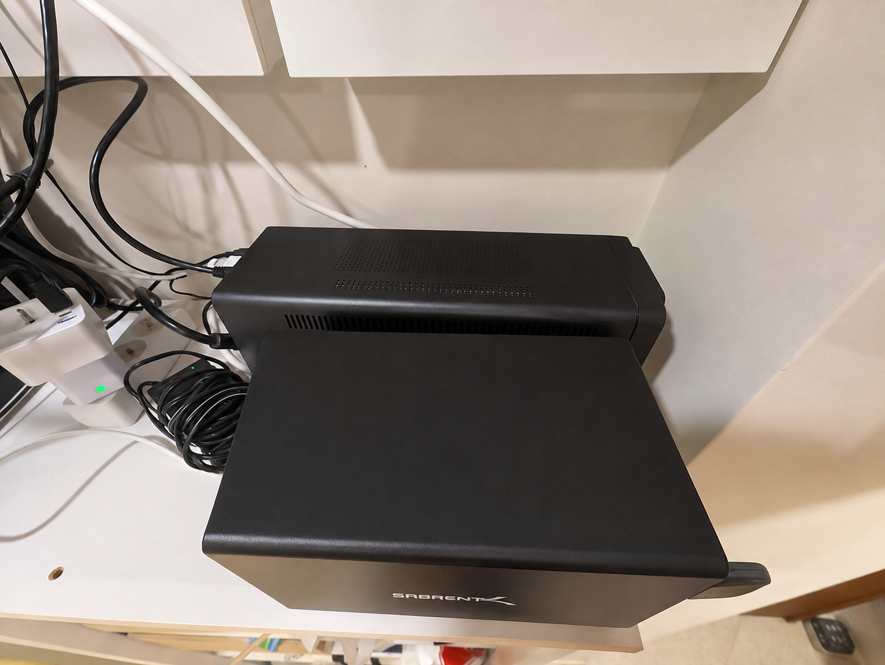
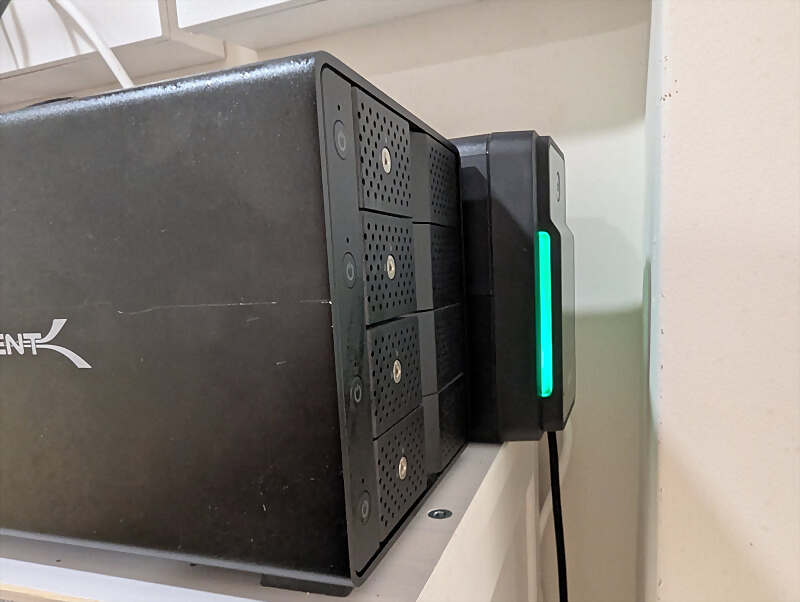

# f3s: Kubernetes with FreeBSD - Part 10: A New Home

This is the 10th post in the f3s series about my self-hosting home lab. f3s? The "f" stands for FreeBSD, and the "3s" stands for k3s, the Kubernetes distribution I use on FreeBSD-based physical machines.

[2024-11-17 f3s: Kubernetes with FreeBSD - Part 1: Setting the stage](./2024-11-17-f3s-kubernetes-with-freebsd-part-1.md)  
[2024-12-03 f3s: Kubernetes with FreeBSD - Part 2: Hardware and base installation](./2024-12-03-f3s-kubernetes-with-freebsd-part-2.md)  
[2025-02-01 f3s: Kubernetes with FreeBSD - Part 3: Protecting from power cuts](./2025-02-01-f3s-kubernetes-with-freebsd-part-3.md)  
[2025-04-05 f3s: Kubernetes with FreeBSD - Part 4: Rocky Linux Bhyve VMs](./2025-04-05-f3s-kubernetes-with-freebsd-part-4.md)  
[2025-05-11 f3s: Kubernetes with FreeBSD - Part 5: WireGuard mesh network](./2025-05-11-f3s-kubernetes-with-freebsd-part-5.md)  
[2025-07-14 f3s: Kubernetes with FreeBSD - Part 6: Storage](./2025-07-14-f3s-kubernetes-with-freebsd-part-6.md)  
[2025-10-02 f3s: Kubernetes with FreeBSD - Part 7: k3s and first pod deployments](./2025-10-02-f3s-kubernetes-with-freebsd-part-7.md)  
[2025-12-07 f3s: Kubernetes with FreeBSD - Part 8: Observability](./2025-12-07-f3s-kubernetes-with-freebsd-part-8.md)  
[2025-12-14 f3s: Kubernetes with FreeBSD - Part 8b: Distributed Tracing with Tempo](./2025-12-14-f3s-kubernetes-with-freebsd-part-8b.md)  
[2026-04-02 f3s: Kubernetes with FreeBSD - Part 9: GitOps with ArgoCD](./2026-04-02-f3s-kubernetes-with-freebsd-part-9.md)  

[](./f3s-kubernetes-with-freebsd-part-1/f3slogo.png)  

## Table of Contents

* [⇢ f3s: Kubernetes with FreeBSD - Part 10: A New Home](#f3s-kubernetes-with-freebsd---part-10-a-new-home)
* [⇢ ⇢ DeskPi RackMate T0 and T1](#deskpi-rackmate-t0-and-t1)
* [⇢ ⇢ What's in the rack (front)](#what-s-in-the-rack-front)
* [⇢ ⇢ What's in the rack (back)](#what-s-in-the-rack-back)
* [⇢ ⇢ Cable management and heat](#cable-management-and-heat)
* [⇢ ⇢ JetKVM](#jetkvm)
* [⇢ ⇢ The Raspberry Pis](#the-raspberry-pis)
* [⇢ ⇢ ⇢ Powering the rack up and down from a watch](#powering-the-rack-up-and-down-from-a-watch)
* [⇢ ⇢ USB NAS and backups](#usb-nas-and-backups)
* [⇢ ⇢ Shelly Plug and fan control](#shelly-plug-and-fan-control)
* [⇢ ⇢ Wrapping up](#wrapping-up)

## DeskPi RackMate T0 and T1

The f3s cluster outgrew it's original design. The original setup looked like this:

[](./f3s-kubernetes-with-freebsd-part-2/3beelinks.jpg)  

A while back I wrote about the DeskPi RackMate T0 sitting on my desk — a cute 4U setup for audio gear and a switch. The actual compute stuff lived elsewhere behind my TV.

[My desk rack: DeskPi RackMate T0](./2026-02-22-my-desk-rack.md)  

[](./my-deskrack/deskrack.jpg)  

For my f3s cluster I now got the bigger sibling: an 8U DeskPi RackMate T1, a 10-inch mini server cabinet. It's now sitting on top of a shelf right next to my apartment entrance, sitting under the electricity main box and the internet router.

[DeskPi RackMate T1 (10 inch, 8U)](https://deskpi.com/products/deskpi-rackmate-t1-2)  

[](./f3s-kubernetes-with-freebsd-part-10/rack-overview.jpg)  

## What's in the rack (front)

The front is where the action is. From top to bottom:

```
┌─────────────────────────┐
│  [JetKVM]  [f3]         │  ← f3 Beelink + JetKVM
├─────────────────────────┤
│     [16-port Switch]    │  ← DIGITUS 1 Gbit/s
├─────────────────────────┤
│   [4 Power: Beelinks]   │  ← power strip
├─────────────────────────┤
│  [JetKVM]  [f2]         │  ← f2 Beelink + JetKVM
├─────────────────────────┤
│     [Cable Brush]       │  ← cable pass-through
├─────────────────────────┤
│  [JetKVM]  [f1]         │  ← f1 Beelink + JetKVM
├─────────────────────────┤
│    [4 Power: Pis]       │  ← power strip
├─────────────────────────┤
│  [JetKVM]  [f0]         │  ← f0 Beelink + JetKVM
└─────────────────────────┘
        RackMate T1
          (front)
```

`f3` sits at the top. It's not part of the k3s cluster — I run FreeBSD on the bare metal there plus a Rocky Linux bhyve VM for agent workloads. Below that is the 16-port DIGITUS gigabit switch. Then a 4-socket power strip feeding the Beelinks. `f2` is the next compute node, then a 1U brush panel for cables, then `f1`, another power strip for the Raspberry Pis, and finally `f0` at the bottom.

[DIGITUS](https://www.digitus.info)  

[](./f3s-kubernetes-with-freebsd-part-10/rack-front.jpg)  

A silent USB fan sits on the floor (and at the back) blowing air up from the bottom (and the back). More on cooling later.

## What's in the rack (back)

The back is messier, by design. I left open space for cable routing.

The Beelinks and the Pis are shallow, so they only eat the front half of the cabinet. The rear rails hold a completely separate set of gear behind them — that's why the two diagrams don't line up row for row. Same eight Us, different stuff bolted to each side.

```
┌─────────────────────────┐
│                         │
│    [Open: cables]       │  ← 2U cable access
│                         │
├─────────────────────────┤
│  [4 Power + switch]     │  ← 1U power (2 strips + switch)
├─────────────────────────┤
│                         │
│      [USB Fan]          │  ← 2U fan across, cable access when fan removed
│                         │
├─────────────────────────┤
│                         │
│  [Pi0][Pi1][Pi2][Pi3]   │  ← 2U 4× Raspberry Pi 3
│                         │
├─────────────────────────┤
│    [Open: cables]       │  ← 1U cable access
└─────────────────────────┘
        RackMate T1
          (back)
```

[](./f3s-kubernetes-with-freebsd-part-10/rack-back.jpg)  

## Cable management and heat

These were by far the hardest parts of this build.

Cables in a 10-inch rack are a pain. Power bricks, HDMI leads (for the JetKVM), USB cables, Ethernet — everything is longer than it needs to be for this tiny cabinet. I ended up adding cable holders on the outside of the rack for all the cables. It's not pretty when you look at it, but it works!

Heat was the other battle. The Beelink S12 Pro boxes are small and not built for stacking. The internal fans are tiny — nothing server-grade. Stacked directly on top of each other they'd cook, and I know that because I cooked them once already, back when I rearranged the whole setup. So I had to leave gaps between units for air circulation. The bottom fan pushes cool air up, the back fan pulls hot air out, and the gaps let air actually move across the heatsinks.

The fans are basically silent. The Beelinks themselves sometimes still run warm and their internal fans spin up louder than the external ones — I've seen up to 94°C under real workload (photo processing in the Immich app running in the k3s cluster). That's on the warm side but still within spec: the Intel N100 only starts throttling near 100°C. Still, I'd rather know about it, so there's now a Prometheus alerting rule that fires when the hottest core stays at or above 90°C for five minutes.

## JetKVM

Each Beelink has its own JetKVM — a tiny USB-powered KVM-over-IP device. You plug it into HDMI and USB on the target machine, and it gives you full remote control down to the BIOS level.

[JetKVM](https://jetkvm.com)  

[](./f3s-kubernetes-with-freebsd-part-10/jetkvm.png)  

This is huge for a homelab. When a FreeBSD box won't boot or you need to mess with UEFI settings, you don't want to drag a monitor and keyboard over. You open the JetKVM web UI and you're there.

The rack mounts for the Beelink + JetKVM rows had to be 3D printed. I found a nice seller on Etsy who printed them for me. I needed four JetKVMs in total, but the the JetKVM had run out of stock. I could only get three directly. The fourth one I had to import from Japan to complete the setup.

## The Raspberry Pis

The four Pi 3s live in the back, mounted on a custom 3D-printed tray.

`pi0` and `pi1` run NetBSD 11 in an HA pair, serving static content like `snonux.foo` and a few other sites. They also host random personal stuff I share with family — photos, files, etc.

[](./f3s-kubernetes-with-freebsd-part-10/rack-back-rpis.jpg)  

Both Pis are wired into the WireGuard mesh so the OpenBSD relay VMs on the internet-facing hosts can route traffic to them. I wrote about the mesh setup earlier in this series.

[Part 5: WireGuard mesh network](./2025-05-11-f3s-kubernetes-with-freebsd-part-5.md)  

`pi2` and `pi3` run Rocky Linux with Pi-hole in Docker. I point my DNS at them and surf without ads.

[Pi-hole](https://pi-hole.net)  

### Powering the rack up and down from a watch

On top of the web serving, `pi0` and `pi1` run a small CGI application that lets me remotely power down and power up (via Wake-on-LAN) all the Beelink computers, and switch the USB fans on and off. It's authenticated with API keys and uses transport encryption. I can trigger it from my watch or anything else that can hit an HTTP endpoint. More on that setup in a later post.

## USB NAS and backups

On the shelf next to the rack sits a Sabrent USB enclosure with four 2TB drives. I run it as a backup ZFS pool, connected to `f1` which handles all the backup jobs.

[Sabrent](https://sabrent.com)  

[](./f3s-kubernetes-with-freebsd-part-10/usb-backup-nas.jpg)  

Every quarter I import the pool and copy important data to it — not just from the f3s cluster, but from everything else too. I also keep separate external USB drives for offsite storage, and I upload encrypted incremental ZFS snapshots to AWS S3 Glacier Deep Archive.

The backup setup itself is worth a full post. I'll write that up at some point — some things are going to change in the next couple of months as I refine the flow.

Also on the shelf is the APC Back-UPS from part 3 of this series. It keeps the switch and the NAS alive during short outages. Now it also powers my fibre router, so when the power goes out, my internet keeps working too.

[Part 3: The UPS](./2025-02-01-f3s-kubernetes-with-freebsd-part-3.md)  

[](./f3s-kubernetes-with-freebsd-part-10/ups-closeup.jpg)  

## Shelly Plug and fan control

The USB fans hang off a Shelly Plug M Gen3 — one of those smart power plugs running embedded Linux. What makes it useful here is that it speaks plain HTTP on the local network, so I don't need the vendor cloud or an app to talk to it. A shell script on the Pis can flip the fans with a single request, which is exactly what the CGI application above does.

[Shelly Plug M Gen3](https://www.shelly.com/products/shelly-plug-m-gen3-white)  

## Wrapping up

The whole thing is located in a corner I never used much. It doesn't take up space elswhere anymore and I can walk up to it with a small ladder when I need physical access.

It's not enterprise-grade, but it doesn't need to be. Off the TV area, cool enough, and I can reach it without moving furniture. Good enough.

Other *BSD-related posts:

[2026-04-02 f3s: Kubernetes with FreeBSD - Part 9: GitOps with ArgoCD](./2026-04-02-f3s-kubernetes-with-freebsd-part-9.md)  
[2025-12-14 f3s: Kubernetes with FreeBSD - Part 8b: Distributed Tracing with Tempo](./2025-12-14-f3s-kubernetes-with-freebsd-part-8b.md)  
[2025-12-07 f3s: Kubernetes with FreeBSD - Part 8: Observability](./2025-12-07-f3s-kubernetes-with-freebsd-part-8.md)  
[2025-10-02 f3s: Kubernetes with FreeBSD - Part 7: k3s and first pod deployments](./2025-10-02-f3s-kubernetes-with-freebsd-part-7.md)  
[2025-07-14 f3s: Kubernetes with FreeBSD - Part 6: Storage](./2025-07-14-f3s-kubernetes-with-freebsd-part-6.md)  
[2025-05-11 f3s: Kubernetes with FreeBSD - Part 5: WireGuard mesh network](./2025-05-11-f3s-kubernetes-with-freebsd-part-5.md)  
[2025-04-05 f3s: Kubernetes with FreeBSD - Part 4: Rocky Linux Bhyve VMs](./2025-04-05-f3s-kubernetes-with-freebsd-part-4.md)  
[2025-02-01 f3s: Kubernetes with FreeBSD - Part 3: Protecting from power cuts](./2025-02-01-f3s-kubernetes-with-freebsd-part-3.md)  
[2024-12-03 f3s: Kubernetes with FreeBSD - Part 2: Hardware and base installation](./2024-12-03-f3s-kubernetes-with-freebsd-part-2.md)  
[2024-11-17 f3s: Kubernetes with FreeBSD - Part 1: Setting the stage](./2024-11-17-f3s-kubernetes-with-freebsd-part-1.md)  
[2024-04-01 KISS high-availability with OpenBSD](./2024-04-01-KISS-high-availability-with-OpenBSD.md)  
[2024-01-13 One reason why I love OpenBSD](./2024-01-13-one-reason-why-i-love-openbsd.md)  
[2022-10-30 Installing DTail on OpenBSD](./2022-10-30-installing-dtail-on-openbsd.md)  
[2022-07-30 Let's Encrypt with OpenBSD and Rex](./2022-07-30-lets-encrypt-with-openbsd-and-rex.md)  
[2016-04-09 Jails and ZFS with Puppet on FreeBSD](./2016-04-09-jails-and-zfs-on-freebsd-with-puppet.md)  

E-Mail your comments to `paul@nospam.buetow.org` :-)

[Back to the main site](../)  
